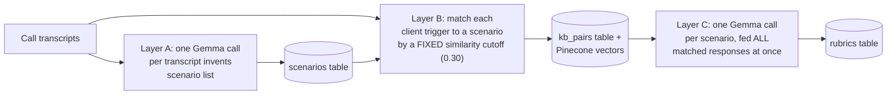
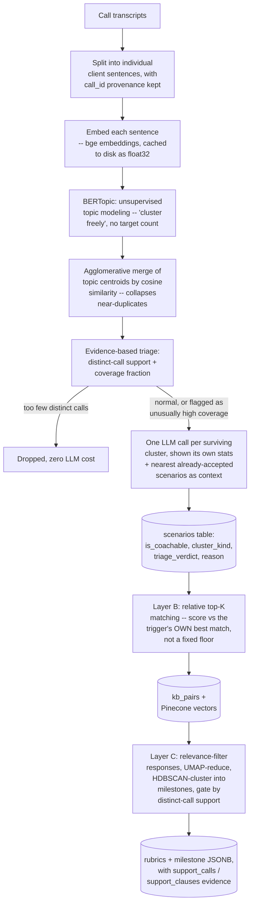
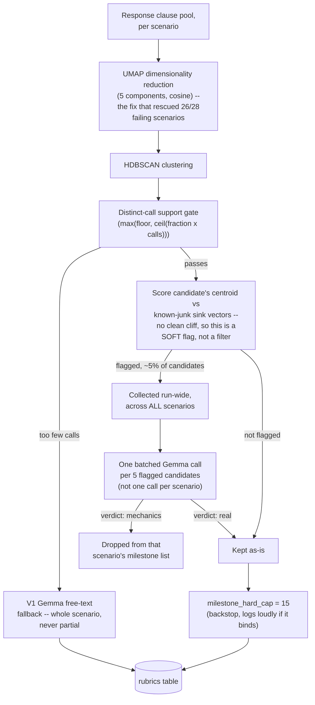
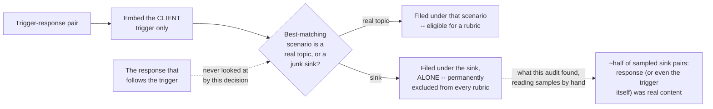
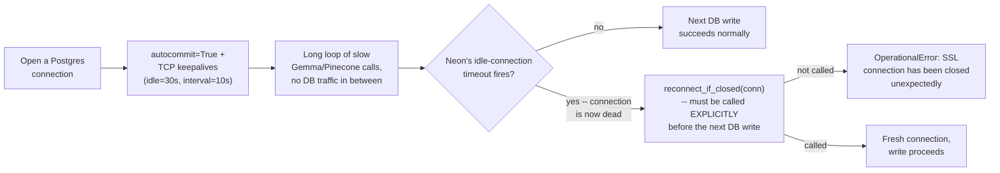
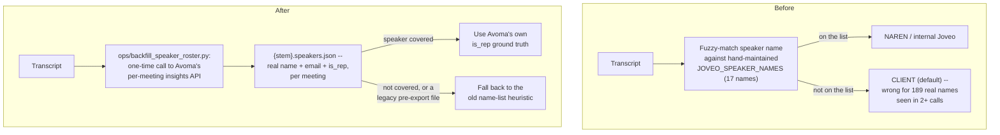
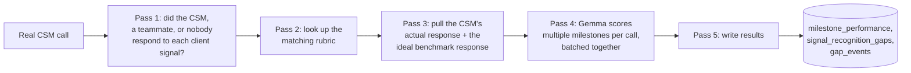
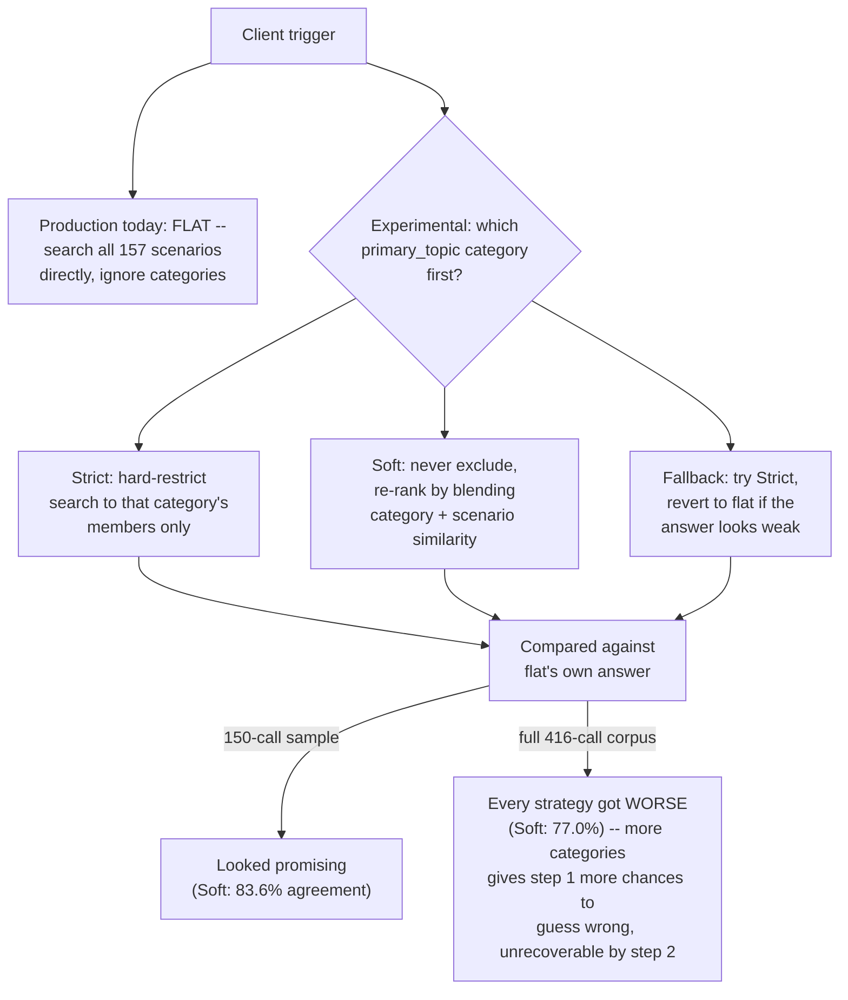
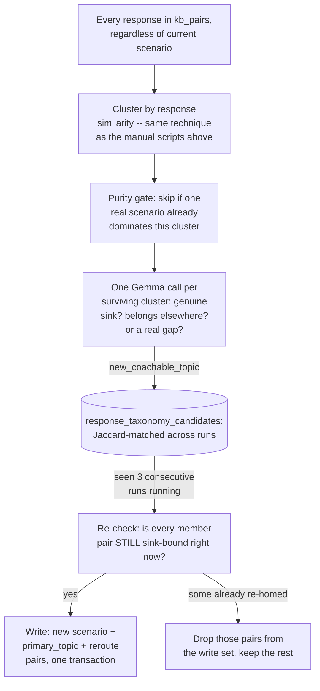

# Brain Pipeline — Problems Faced and How We Fixed Them (V1 → Current)

This is a plain-language history of the Brain pipeline: what it does, what went wrong at each stage, why, and how it got fixed. It's written for anyone on the team, not just ML engineers — technical terms are explained inline the first time they show up.

**What Brain does, in one paragraph:** Brain reads customer-success call transcripts and builds three things from them: (1) a **taxonomy of scenarios** — the recurring situations that come up in calls (e.g. "client asks about integration with their ATS"), (2) a **knowledge base of trigger→response pairs** — real examples of a client saying something and the CSM (Customer Success Manager) responding, and (3) **coaching rubrics** — a checklist of "milestones" a good response to each scenario should hit, used later to grade real CSM calls (that grading pipeline is a separate tool called **Ego Trap**).

---

## Timeline at a glance

| Version | Date | What changed |
|---|---|---|
| V1 | pre-2026-07-27 | Ask Gemma (the LLM) to do everything directly — identify topics, match pairs, write rubrics |
| Speaker-role fix | 2026-07-27 | Replaced a hand-maintained "who works at Joveo" name list with Avoma's own per-meeting speaker data |
| V2 | 2026-07-27 → 07-29 | Rewrite: cluster the data with math first, only ask Gemma to judge the survivors |
| V2 + reliability fixes | 2026-07-06 → 07-31 | Fixed crashes, silent data corruption, and one Ego Trap scoring bug |
| V2 + primary-topic hierarchy | 2026-07-30 → 08-02 | Added a "parent category" layer above scenarios, found and fixed two new bugs in it |
| V2 audit pass | 2026-07-28 | Read real samples of Layer B's matching and re-validated a Layer B threshold against the true production taxonomy; found one real content-loss issue not yet fixed (see "Open findings" below) |
| Response-taxonomy auto-pass | 2026-08-07 → 08-08 | Built a permanent, automatic version of the manual "graduate a homeless topic" fix; hit and fixed a known connection-drop bug again in the wild; ran it for real and rescued 164 pairs into 4 new real scenarios |
| **Pool unit: the taxonomy is built from fragments** | **2026-08-14 → 08-15** | **Tested whether the SCENARIOS are sound, which four earlier efforts had assumed. Two thirds fail a random-null test. Cause: Layer A groups sentence fragments while Layer B matches whole turns, so 59% of the pool carries no subject. Fix built and shipped OFF; also moved to the Gemini backend and validated against Layer D** |
| **The ceiling measurement** | **2026-08-11** | **Graded the expert against his own rubrics to find out whether the CSM's 3.1% means anything. It doesn't: the scorer barely tells a matched rubric from a random one. Found the real defect — the rubrics are bimodal, and contingent moves are being graded as mandatory** |

---

## V1 — The original, Gemma-direct pipeline

### How it worked

V1 had no clustering or math-based filtering at all. Every decision was made by asking Gemma directly, once, and trusting the answer.



### Problems found in V1

**1. The matching cutoff was a fixed number, and fixed numbers don't scale.**
Layer B decided whether a client's question "matched" a scenario using a similarity score (a 0-to-1 number for "how close in meaning are these two pieces of text") and a hardcoded cutoff of 0.30. As the number of scenarios grew, that fixed number stopped being useful — at 149 scenarios, 70% of trigger-response pairs cleared 0.30 against *nearly every scenario at once*. So Layer C (the rubric writer) ended up training on a near-random pile of responses instead of ones that actually matched. **Fixed by**: switching to a *relative* rule — "how close is this to the trigger's own single best match" — instead of one fixed number for everyone (see V2 below).

**2. A hard cap on scenario count merged the wrong things together.**
An early control tried to keep the scenario list from growing forever by capping it at 150 and merging the *rarest* ones together, using keyword overlap to decide what to merge. This was backwards: the actual duplicates were things like nine slightly different ways of saying "yeah, got it" — all very *common*, not rare — and keyword-overlap can't even tell "Perfect, alright then" and "yeah that makes sense" are the same thing, since they don't share any words. So the cap ate real, rare, legitimate topics instead of merging the junk. **Fixed by**: deleting the cap entirely and merging by actual meaning (embedding similarity) instead of a target count (see V2 below).

**3. A rule assumed "if it shows up in most calls, it must be filler."**
An early rule said: if a topic appears in most calls, auto-reject it as generic chit-chat (not real coaching content). Turns out that's wrong — a genuinely important business topic (like "what's your budget?") also comes up in most calls. This rule couldn't tell the two apart and would have deleted real content. **Fixed by**: turning "shows up a lot" into a *flag for a human/LLM review* instead of an automatic rejection (see V2 below).

**4. Scenario count and rubric count silently didn't match.**
One early run produced 149 scenarios but only 148 rubrics — one scenario quietly ended up with no rubric and nothing noticed or complained. **Fixed by**: adding a mandatory "what happened to this scenario" status field, and a final check that raises an error if any scenario's status was never set (see V2 below).

V1's code still exists in `Brain/v1/` today — it's kept as a fallback for Layer C when a scenario has too few responses to cluster properly.

---

## V2 — The rewrite: cluster first, ask Gemma to judge only the survivors

**This was not a single rewrite — it was four iterations, each triggered by evidence from the previous one.** That's the important interview point: V2 didn't ship once and stay fixed; every stage below was a hypothesis, tested against the real 416-call corpus, sometimes wrong, sometimes right, always decided by *reading the actual output*, not just counting it.

### The core idea

Instead of asking an LLM to invent the whole scenario list from scratch (V1), V2 uses unsupervised topic modeling (**BERTopic**, which itself composes UMAP for dimensionality reduction + HDBSCAN for density-based clustering + c-TF-IDF for keyword extraction) to find natural groupings in the raw client-utterance embedding space first. Only then does it spend an LLM call per *surviving cluster* — "is this a real coaching scenario, or just filler?" — instead of per raw utterance. That's the central cost/quality lever: judging ~150-200 clusters is affordable enough to attach real evidence to each decision; judging ~40,000-74,000 raw utterances never would be.



### Iteration 1 — Evidence-Triage Clustering (design spec, 2026-07-27)

Starting point: a 412-transcript run under the old design produced 149 scenarios / 148 rubrics / 4,605 kb_pairs with three structural defects — the taxonomy over-segmented on backchannel (9+ near-duplicate acknowledgment scenarios), rubrics with up to 95 milestones whose count tracked raw pair volume instead of distinct strategic content, and 70% of trigger-response pairs matching *all 149 scenarios at once*.

Before designing a fix, the existing bug report itself was checked against real data and found to be subtly wrong in three places — worth calling out because "validate the diagnosis before you build the fix" is itself the lesson:

- **A proposed clause-level content filter didn't even catch its own worst-case example.** A garbled mid-thought ASR (automatic speech recognition) fragment like *"Marriage, right, where you have the highest case, and and you know"* clears a naive non-stopword-count filter (5 content tokens) and isn't embedding-similar to any known backchannel reference set either — it's neither short nor generic, just garbled. Conclusion: clause-level filtering can only ever be a cheap pre-filter, never the primary defense against noise.
- **The Layer C "recurring" rule was silently unenforced.** The rubric-generation prompt asserted "only include milestones seen in 2+ responses," but the code path never tracked *which call or response* each clause came from — so two adjacent clauses from a single response in a single call satisfied "recurring" just as well as a move repeated across 50 calls. The rule wasn't being violated by a bug; it had never been implemented at all.
- **The existing `MAX_CLUSTERS=150` cap did the opposite of its intent.** It called BERTopic's `reduce_topics(nr_topics=150)`, which repeatedly merges the *least frequent* topic into its nearest neighbor by **c-TF-IDF keyword overlap** (a class-based TF-IDF score over cluster keywords, not semantic similarity) until hitting the count. Three compounding flaws: (1) it merges the rare tail first, but backchannel/acknowledgment clusters are among the *largest* in the corpus, so they're last in line and never reached; (2) keyword overlap can't detect that *"Perfect. Alright then"* and *"yeah that makes sense"* are the same behavior, since they share almost no vocabulary; (3) a target count is not a correctness criterion — it halts at N whether duplication remains or not, so it either leaves real duplicates alive or destroys real distinctions, and can't tell which case it's in. *(Confirmed by measurement, not just by reading the code: the original run finished at 149 scenarios — one **under** the 150 cap — which left it genuinely ambiguous whether the merge branch had ever triggered at all. Re-running the same corpus with the cap removed produced **241** raw clusters, proving it did fire and had silently absorbed ~91 of them.)*

**Core principle adopted:** *cluster freely, then triage clusters against evidence.* Every threshold becomes a property of the data distribution (a fraction of calls, a cosine distance, a relative margin) — never a raw count of outputs and never a curated list — specifically so that adding more transcripts re-derives every bound instead of invalidating it.

**What shipped:** a new pure module `shared/cluster_evidence.py` (functions: `support_stats` — computes per-cluster distinct-call-count, coverage fraction, and cohesion; `merge_by_similarity` — agglomerative clustering with average linkage over cosine distance between centroids; `triage` — the evidence-only routing function), plus provenance tracking (`call_id` threaded through both the client-clause pool and the response-clause pool, which had both been silently dropping it), plus a Gemma prompt redesign so each cluster's adjudication call is shown its own stats *and* the nearest already-accepted scenarios by centroid cosine (so it can recognize "this is the 9th acknowledgment variant" instead of judging in a vacuum).

### Iteration 1, same-day amendment — calibration immediately falsified two assumptions in the original design

This is the part worth knowing cold for an interview: the *first* calibration pass against the real 416-call corpus (73,771 client clauses) showed the original design's own starting constants were wrong, within the same day.

- **A "safety floor" threshold turned out to be inert at this scale.** `MIN_CALL_SUPPORT` was meant to filter thin clusters, but across the entire calibration sweep it dropped 0–3 clusters out of 231 — because BERTopic's own `min_cluster_size` (≈50 clauses at this corpus size) already guarantees every surviving cluster spans many calls. Lesson: a threshold can look reasonable on paper and still be doing zero real work — you only find out by sweeping it against real data.
- **Two supposedly-independent knobs turned out to be coupled.** `merge_cosine_threshold` (how aggressively to merge near-duplicate clusters) and `ubiquity_ceiling` (the coverage fraction above which a cluster looks like generic filler) interact: merging harder unions the member call-sets of surviving clusters, which mechanically *raises* their coverage and pushes more of them over the ceiling. Measured directly: merge=0.70 → 34 clusters, 53% flagged as high-coverage; merge=0.85 → 168 clusters, 40% flagged; merge=0.88 → 198 clusters, 36% flagged. You cannot tune one without re-checking the other.
- **The merge threshold could not be chosen from cluster counts — only from reading what each setting actually merged.** The sweep table reports how many clusters survive at each setting, and by that measure `0.80` looked perfectly sensible (119 clusters, a plausible-sized taxonomy). Printing the *member topics of each merge group* showed it was quietly wrong: at 0.80, one group had fused campaigns + sales team + brand + markets + vendors into a single "scenario," and another had fused job boards + career sites + résumés + job descriptions. Real, distinct business topics being destroyed — invisible in any count. At `0.85` the same inspection showed the intended behaviour: the true duplicate families collapsed (thanks/appreciate, okay/fine/alright, calendar + scheduling, email + Slack, city/country/region) while distinct topics stayed apart. **Why it fails in that direction:** a cluster's "centre" is the average of all its sentences, and averaging thousands of conversational sentences drags every centre toward a generic "people talking" direction. So as the bar is loosened, unrelated big topics start looking similar to each other *before* the genuine duplicates finish merging. A dedicated `--merge-detail` mode was added to print group members and samples, because this is a judgement no number can make. **Lesson: for a merge threshold, "how many survived" is the wrong question; "what got merged" is the only one that separates a good setting from a destructive one.**
- **The coverage ceiling was then set off the actual distribution, and the result justified the review-flag design outright.** Measured across 171 merged clusters: median coverage 20%, p75 = 35%, p90 = 56%, p95 = 64%, max = 74%. The original guess of 25% sat *below the 75th percentile* — it would have flagged well over a third of the taxonomy, which is why ~50% kept coming back as "mechanics." Setting it at **60%** (between p90 and p95) flags 15 of 171 clusters — a genuine audit minority. Reading those 15 settled the argument: 11 were junk (thanks/appreciate 73%, greetings 68%, okay/fine 64%, nice/good/great 64%, yeah/yes/yep 64%, don't-know 61%, weekday names 67%, month names 69%, and so on) — but **4 were real business topics, and the single highest-coverage cluster in the entire corpus was budget/spend/cost at 74%**, alongside client/customer/sales at 72% and API/XML/SFTP integration at 64%. Under the original "high coverage ⇒ filler" rule, *budget and cost* — arguably the most coachable topic in the dataset — would have been deleted for being too common.
- **A ~50% "mechanics" rate at every single operating point in the sweep was not a plausible result.** That's the tell that a signal is measuring the wrong thing — a real business topic (like "what's your budget?") legitimately shows up in most calls too, and pure coverage can't distinguish "ubiquitous because it's filler" from "ubiquitous because it's core." **Resolution:** `triage()` was changed to a three-way verdict (`scenario_candidate` / `needs_review` / `insufficient_evidence`) instead of a boolean accept/reject. High coverage now only produces `needs_review` — a routing flag that sends the cluster to the LLM *with its coverage stats attached* — never an automatic rejection. Only `insufficient_evidence` (too few distinct calls) is ever decided without spending an LLM call. This is the single most-reused design pattern across the whole V2 era: **turn a noisy binary signal into a soft review flag routed to a judge, rather than a hard filter** — it reappears twice more below.
- **Also found the same day: the same corpus kept producing a different number of clusters every run** (241, then 231, then 226, then 237). Reproducibility is a precondition for calibrating anything at all — if the input keeps moving, no threshold measurement means anything. The first suspect was the embedding cache storing vectors as float16 (half-precision), on the theory that UMAP/HDBSCAN's neighbor-graph construction amplifies rounding at tie-break boundaries. The cache was switched to float32 — **and the count changed again anyway**, which disproved that as the whole story.

  The actual cause is two things compounding. First, the embedding model runs on the GPU, and GPU matrix multiplication doesn't sum in a guaranteed order, so re-embedding the identical text from scratch yields vectors that differ in their last bits — enough for UMAP/HDBSCAN to land somewhere slightly different. Second, the clause pool contains the *same sentence many times over* (people repeat themselves constantly), and the encoder embeds every occurrence separately, so even within a single run one string could end up with several near-but-not-quite-identical vectors — while the cache stores exactly one vector per unique string.

  **So what actually pins the result is a warm cache, not the data type.** Once every unique clause has one stored vector, runs stop drifting — later confirmed when the clustering geometry (237 raw topics → 171 merged → 158 scenarios) reproduced *exactly* across two independent production runs. The float32 switch was still necessary (it removed a real source of noise and made stored vectors bit-exact), just not sufficient on its own. A guard was also added so that a leftover float16 row from the old build is treated as a **cache miss** and re-embedded, rather than being silently read back as a half-length, garbage vector.

**Net result of iteration 1** (first production run, 2026-07-28): 158 scenarios (85 coachable / 66 mechanics / 7 logistics), 4,605 kb_pairs, 85 rubrics, zero reconciliation gaps (every scenario ends with an explicit non-null `rubric_status` — `rubric_generated` / `skipped_not_coachable` / `skipped_insufficient_responses` / `failed` — with a hard assertion at the end of the run that raises if any scenario's status is unset, which is what makes a silent "149 scenarios but 148 rubrics" gap structurally impossible now).

### Iteration 1, tooling — the two things that made everything above measurable

Neither of these is a data-quality fix. They're the reason every number in this document exists, and both were built *before* any threshold was chosen.

**1. Every threshold moved into one config file, with a loader that fails loudly.** Thresholds had been scattered as constants across the layer modules, so tuning meant editing code, and it was easy to change one copy of a value while missing another. They now all live in `Brain/tuning.yaml`, grouped by layer, each with a comment saying what it controls and which direction is more aggressive. The loader (`shared/tuning.py`) validates the file against a typed schema and **raises on an unknown or missing key instead of falling back to a default**. That last part matters more than it sounds: the failure mode of a silent default is that you fix a typo'd key like `min_call_suport`, observe no change in behaviour, and conclude *the threshold doesn't matter* — when in reality your edit was never read. A config file whose entire purpose is "change values without touching code" has to make a typo impossible to miss.

**2. A zero-cost calibration harness (`calibration/dry_run_layer_a.py`).** It runs the real clustering over the real corpus, applies the real merge and triage logic, and prints what the taxonomy *would* be — with **zero LLM calls and zero database writes**. Two design details do the actual work:

   - `--sweep` performs the expensive clustering **once**, then evaluates ~40 threshold combinations against that single result. Merge, support, and coverage are all cheap set operations *downstream* of clustering, so there is no reason to re-cluster per candidate value. This is what turned "pick a threshold, run the pipeline for hours, find out it was wrong" into a minutes-long loop.
   - Combined with the embedding cache, every run after the first skips encoding all 73,771 clauses.

   The payoff was immediate and *negative*, which is exactly the point: the first sweep showed the design's own starting thresholds would produce 186 scenarios — barely better than the 149 the rewrite existed to fix — and that the coverage signal was condemning half the taxonomy. Both problems were caught before spending a single Gemma call, and both became the amendments recorded above.

**A related change in the same spirit:** `min_call_support` had been an absolute count ("a cluster must appear in at least 4 distinct calls"). It became a *fraction of the corpus* with an absolute floor for small datasets — `max(floor, ceil(fraction × total_calls))`. Same reasoning as everywhere else in this document: an absolute 4 means something completely different at 40 calls than at 416, so it quietly stops doing its job as the dataset grows. (As recorded above, it turned out to be inert at this corpus size either way — but inert *and* self-scaling is strictly better than inert *and* frozen.)

### Iteration 1, calibrating Layers B and C without spending anything (2026-07-27)

Layer A could be calibrated cheaply because its clustering needs no LLM. Layers B and C looked like they couldn't: Layer C's input is response pools, which come from Layer B's matching, which needs Layer A's *labelled* taxonomy — and the labels are exactly the part that costs LLM calls. Paying for a full 416-transcript run just to discover a threshold was wrong would mean paying for it twice.

Two moves made a zero-cost dry run possible anyway (`calibration/dry_run_layer_bc.py`):

- **Stand-in scenario descriptions.** A cluster's top keywords substitute for the LLM-written description, embedded through the *same* code path production uses. The wording isn't what the LLM would write, but the relative similarity behaviour is representative — which is all a threshold sweep needs.
- **Call the real functions, don't reimplement them.** The harness invokes production's own matching and relevance-filtering functions directly. A reimplementation would only ever prove that *the copy* behaves well.

**The trap, hit immediately:** the first version of the sweep disagreed with production's own output — production reported 99.7% of pairs matching a single scenario, the sweep said 14%. Neither was broken. Production **short-circuits**: if a pair's best match is a junk "sink" cluster, it's filed there alone and never reaches the margin logic at all. The sweep hadn't modelled that, so it was measuring a code path that doesn't exist. **Lesson: a measurement harness that skips a production short-circuit reports numbers production can never produce — and it looks perfectly plausible while doing it.** Worth stressing that this was caught only because the harness was run *against* production's real output on a small sample first, rather than trusted on its own.

**What the dry run then found, before any spend:**

- **The relative margin was still far too permissive.** Switching from a fixed cutoff to a relative one (iteration 1) was the right *shape* of fix, but the value hadn't been measured. At `0.85`, **63.7% of pairs hit the cap of 3 scenarios** — meaning the margin wasn't doing the filtering at all, the hard cap was. The reason is visible in the data: best-match similarity sits in a very narrow band (10th percentile 0.496 → 90th percentile 0.613, a spread of only 0.117), so a cutoff at 85% of the best match falls below almost everything. It was recalibrated to **0.95**. *A relative threshold is scale-invariant, but it is not spread-invariant — it still needs measuring against how tightly the similarities actually cluster.* This number was calibrated against the *dry run's* pseudo-taxonomy (~156 clusters, no real sinks yet), which is a superseded population once production actually ran — so it was re-derived a second time later, directly against the real 158-scenario taxonomy with real `is_coachable` flags and the sink short-circuit mirrored exactly. The re-derivation reproduced production's own observed match-width split (63% one match / 19% two / 18% at the cap) almost exactly, confirming 0.95 still holds against the real data, not just the dry run's stand-in.
- **Reassuringly, the taxonomy itself was discriminating properly:** the top 10 scenarios held 32.7% of all pairs and the largest single scenario 9.6% — a world away from the original "70% of pairs match all 149 scenarios."
- **Layer C was over-filtering badly, and the dry run predicted it before production did.** At the then-current settings, 86 of 154 scenarios would end with *zero* clustered milestones. Crucially, the sweep showed *which knob was innocent*: varying the call-support fraction across its whole range (0.05 → 0.25) moved the zero-count only from 74 to 87, so the fraction wasn't the constraint — the absolute floor of 3 distinct calls was, combined with thin response pools. That pointed straight at the floor as the thing to change, which is exactly what iteration 2 below went on to do.
- **Two Layer C knobs were still unmeasured guesses, and one of them was costing scenarios for nothing.** The relevance percentile (which fraction of response clauses are dropped as insufficiently related to their own scenario) sat at a guessed `60`, and the call-support fraction at a guessed `0.15`. The sweep evaluates every `(percentile, fraction)` combination in one pass, so the whole grid came for free. Measured zero-milestone counts out of 154 coachable scenarios, across fractions 0.05 / 0.10 / 0.15 / 0.25: **percentile 40 → 74 / 74 / 75 / 87; percentile 60 → 83 / 83 / 86 / 96; percentile 75 → 80 / 80 / 89 / 99.** Percentile **40** is the minimum-zero point — the guessed 60 was throwing away 9 additional scenarios entirely, in exchange for nothing. Note the non-monotonicity: 75 is *better* than 60, so this could not have been reasoned out from "stricter filter ⇒ fewer milestones" — only measured. Between fractions 0.05 and 0.10 (identical at 74) the choice went to **0.10**, on the principle used everywhere else in this document: with `max(floor=3, ceil(fraction × calls))`, a fraction of 0.05 is dominated by the floor until a scenario has 60 calls, whereas 0.10 hands over at 30 — so 0.10 keeps the self-scaling term actually doing work as the corpus grows, at zero measured cost today. `capped` was 0 at every one of the twelve grid points, confirming the milestone hard cap never binds at this stage (that only became true later — see iteration 2, where the yield increase made it bind again).

**A dependency everyone assumed existed, which measurement disproved.** The obvious reasoning is: Layer B feeds Layer C, so changing the matching margin changes which responses each scenario gets, therefore the Layer C sweep must be re-run after every margin change. That was believed and written down — and it is **wrong**. Re-running the dry run at margin 0.95 produced a **byte-identical** Layer C table to the 0.85 run. The reason: Layer C keys off each pair's single *primary* `scenario_key` (the best match), while the margin only controls the *additional* entries in `scenario_keys`. The best match is by definition unaffected by where the cutoff below it sits, so Layer C's response pools never move. The two knobs are independent and can be calibrated in either order. Neither touches Layer A — the margin is a Layer B setting Layer A never reads. **Lesson: "A feeds B" at the data-flow level does not imply "tuning A perturbs B" — it depends on which part of A's output B actually consumes. Cheap to verify by re-running and diffing; expensive to assume forever.** (Related efficiency point: one dry run evaluates the *entire* Layer C threshold grid in a single pass, so choosing a different row afterwards needs no re-run at all. Only changing something upstream of the clustering — the clause pool, the merge threshold, the embeddings — invalidates the table.)

### Iteration 2 — Layer C Rubric Depth investigation (design spec, 2026-07-28): a two-track, evidence-first diagnostic

**The problem:** rubric depth in that first production run was thin — median 2 milestones per scenario, 20 scenarios with exactly 1, 3 with 0. Root-cause diagnosis (verified against the live DB with zero mismatches on recomputation, before trusting the numbers): only 51 of 85 scenarios successfully used real clustering; 34 fell back to unclustered V1 free text. A direct DB query confirmed this fallback is always **whole-scenario, never partial** — every rubric's milestones were either ALL clustered (carrying `support_calls` evidence) or ALL fallback (none do), zero rubrics mixed the two within themselves — which matters because it means the fix options below don't need to worry about a "half-evidenced" rubric as a third case. Of those 34 fallbacks, **28 (82%) were caused by HDBSCAN returning 100% noise — zero clusters found — regardless of clause-pool size**, from 10 clauses up to 680. That range ruled out plain data sparsity as the explanation.

The architecture this section ends up landing on — the one still live today — restructures Layer C from a simple per-scenario loop into four passes across the whole run, specifically so the batched judge (below) always has enough flagged candidates to fill a batch:



**Track B (the cheap, immediate win):** loosen the milestone call-support floor from 3 to 2 distinct calls. Tested against the *actual* recomputed cluster candidates (not a simulation), this rescued 3 scenarios that were fully falling back to V1 and added exactly +1 milestone each to 9 already-clustered scenarios — net +16% milestones (87→101) with an honestly-reported tradeoff: 3 of those rescued scenarios actually had *more* milestones under the old V1 free-text fallback (3 each) than the new floor gives them via real clustering (2, 2, 1) — adopted anyway, because evidence-backed milestones (with `support_calls` attached) are the entire point of the rewrite, even at a lower raw count.

**Track A (the real diagnostic — a controlled variant sweep, one variable at a time):** holding the relevance-filtered clause pool and the `min_cluster_size` formula fixed, four clustering variants were tested against the 28 failing scenarios *plus* a control set of already-working scenarios (to catch regressions — "fixing the 28 by breaking the 51" would not be a win):

1. Baseline (current production HDBSCAN config) — 0/28 rescued.
2. `cluster_selection_method='leaf'` instead of `'eom'` — 0/28 rescued.
3. `min_samples=2` — rescued 21/28, but **regressed 8 of the 10 control scenarios**. This is the classic trap in ML debugging: a fix that looks like a win on the failing set can quietly destroy what already worked, which is exactly why a control group was included.
4. **UMAP dimensionality reduction (5 components, cosine metric) before HDBSCAN** — rescued 26/28, with lower mean noise (37.9% vs 71.4%). This confirmed the hypothesis: **density-based clustering (HDBSCAN) degrades in raw high-dimensional embedding space (768 dimensions) due to distance concentration** — the phenomenon where, as dimensionality grows, distances between all pairs of points converge toward the same value, so density-based neighborhoods stop being meaningful. Layer A already used UMAP before its own clustering step; Layer C simply hadn't.

**But the winning fix introduced a second, brand-new problem**, which is the part most worth remembering for an interview: making the algorithm more sensitive also promoted backchannel to milestone status (e.g. *"That's a good question."* / *"Does that answer your question?"* clustered as their own tight, recurring "milestone"). Two further attempts to suppress this were tried and **both failed, for informative reasons**:
   - Raising the relevance-percentile filter didn't remove the junk (it clustered tightly enough to survive even at the 80th percentile) and it *actively destroyed a good control scenario*, which dropped from 3 coherent clusters to zero as the percentile rose — because backchannel phrases are lexically tight to *each other*, not just weakly related to the scenario topic, so a scenario-relevance filter can't discriminate them.
   - Shrinking the minimum cluster size fraction reduced total yield fast (496→308→233 clusters) without improving purity — the proportion of junk-flagged clusters actually rose slightly. Shrinking yield is not the same as improving precision.
   - What *did* work, reusing the same "soft flag, not hard filter" pattern from iteration 1: score each candidate milestone cluster's centroid against known-junk ("sink") scenario description vectors by cosine similarity. The similarity band had no clean separation cliff (p10=0.636 to p95=0.735 — a narrow, ambiguous range), which is itself the signal that this must be a *soft review flag*, not an automatic rejection rule.

**Resolved with a batched LLM judge, not a dangling flag.** A stored flag nobody acts on is a TODO, not a design. Mirroring the exact same pattern from Layer A's `needs_review`, flagged milestones get one LLM call each, batched 5-at-a-time since they're sparse (~5% of all candidates) and thin per scenario (mostly 0-1 each). This forced a real control-flow change, not just a wrapped loop: because most individual scenarios only contribute 0-1 flagged candidates, batches of 5 would rarely fill if judged inside each scenario's own processing loop — so `run_layer_c_v2` was restructured into **multiple passes across the whole run**: cluster every scenario first (zero LLM calls) → collect every flagged candidate run-wide → batch-judge them together (~5 LLM calls total instead of one-per-scenario) → apply verdicts back per scenario → finish. *Lesson: batching an LLM call properly sometimes requires restructuring control flow around a global collection phase, not just wrapping an existing loop in a batch API.*

**Full pipeline dry run result:** 80 of 85 scenarios end with ≥1 milestone (up from 51), total milestones 87→407, median depth roughly 2→4-5, only 5.2% flagged for review. **A new problem surfaced by the very success of this fix:** `milestone_hard_cap` (a backstop originally calibrated on the assumption it would "never bind") would now bind regularly at this higher yield — invalidating a prior calibration assumption. This was explicitly flagged as an open follow-up rather than silently patched, because deciding the right cap value needed its own data, not a guess.

**Resolved same session, with a head-to-head sweep rather than a guess:** two candidate fixes were compared over the *same* cached clustering (isolating the gate/cap knobs from the clustering algorithm itself): raising the cap from 10 to 15, versus tightening `min_milestone_call_fraction` instead (addressing the gate that lets candidates through, rather than the cap that truncates them). Raising the cap was a clean, surgical win — 403→407 milestones, zero scenarios truncated, and the depth distribution for the other 77 scenarios was byte-identical before and after. Tightening the fraction was the wrong lever: even the mildest step (0.10→0.12) cut total milestones 403→365 (-9%) while rescuing only 2 of the 3 affected scenarios, because it reduces depth for every clustered scenario to fix a problem specific to 3 of them — the same shape of failure as the percentile/min-cluster-size dead ends recorded above. `milestone_hard_cap` is now **15**.

### Iteration 3 — Production reproducibility crisis (2026-07-28/29)

Everything above was implemented, shipped, and passed 82 pytest tests (10 of them new, covering the pure math functions directly). **Then the first real production run didn't match the dry-run prediction at all**: the dry run predicted 403-407 milestones; production stored only **241** — a ~150-160 milestone shortfall that the review-judge mechanism *could not possibly explain*, since it can only ever remove up to the ~21 flagged candidates, nowhere near the size of the gap.

**Investigation, in order (a clean example of systematic debugging — ruling out the boring explanations before the interesting one):**
1. Config drift — ruled out, `tuning.yaml` matched byte-for-byte.
2. An incomplete or silently-restarted run — ruled out, the reconciliation block printed cleanly with zero unaccounted scenarios.
3. A bug in the judge/kept-list control flow — ruled out by reading it line-by-line; the batching restructure had preserved the underlying decision logic exactly, only changing *when* calls fired.
4. **Root cause, confirmed with a direct reproduction:** `umap.UMAP(random_state=42)` pins the pseudo-random-number-generator's *seed*, but does **not** guarantee byte-identical clustering output across **separate process invocations** — likely due to floating-point non-associativity interacting with thread scheduling or BLAS (Basic Linear Algebra Subprogram library) internals differing run to run at the OS/process level, something a fixed seed alone can't pin. Proven directly: the *same single scenario*, same code, same corpus, run in three separate process launches, produced three different milestone counts (3, then 10, then 8).

Two of the three launches landed close to each other (~400), and the original 241-milestone production run was the odd one out — but with only 3 data points, that wasn't yet a confident conclusion (see iteration 4).

**Shipped alongside this investigation:** the milestone-*description* LLM calls were also batched (previously one call per milestone — the dominant LLM call count in Layer C — now 5 at a time), cutting that cost roughly 5x. This is a separate, purely mechanical improvement — Pass 1 clustering (where the non-determinism actually lives) is untouched by it, so it doesn't confound the reproducibility question.

### Iteration 4 — Verdict: accept the variance, don't engineer around it (2026-07-29)

A full clean overnight run (Layer A + B + C from scratch) served as the deciding 4th data point. (Real operational texture worth mentioning: two of three attempted overnight runs that night failed before this — one crashed on a Postgres `CHECK` constraint violation because Gemma returned an invalid enum value [`bloom_level="explain"`, not one of the six allowed values], fixed by clamping invalid values to a safe default and logging a warning instead of crashing; another was interrupted by a PowerShell stderr-piping quirk unrelated to the pipeline itself.)

**The successful run produced 404 total milestones.** Across all four measurements — 241 (original production, the outlier) → 398 (batching rerun) → 403-407 (original dry-run prediction) → 404 (this run) — **three of four land within ~2% of ~400**, which statistically confirms the *original* 241-milestone run was the anomaly, not a representative sample of normal variance.

**Decision: accept the run-to-run variance as an intrinsic property of UMAP+HDBSCAN across separate process invocations, rather than engineering it away.** Two alternatives were explicitly considered and rejected:
- Forcing single-threaded BLAS execution for strict determinism — real, ongoing performance cost for a problem that self-corrects most of the time anyway.
- Running clustering multiple times per scenario and taking a consensus/union of clusters — multiplies both compute and LLM cost by N, for a problem that already resolves within an acceptable band on 75% of independent runs.

Cheap mitigation adopted instead: log a warning if a future run's total milestone count falls outside the observed normal band (~350-450) — an anomaly *flag*, not a blocking gate, so a future 241-style outlier gets noticed without manual database archaeology. **This is a strong interview talking point about engineering judgment: not every source of variance is worth eliminating — sometimes the right call is to measure it, bound it, and monitor for outliers, rather than pay an ongoing cost (performance, complexity, or compute) to force determinism nobody actually needs.**

**A second, previously-invisible problem surfaced by this same run, kept as an open follow-up rather than immediately fixed:** the *clustering geometry* (which raw topics form, given a warm embedding cache) reproduced exactly between this run and the prior production run — but the **LLM's coachability adjudication of those same clusters did not**: 85 coachable scenarios in the prior run vs. 78 in this one. A naive comparison by `scenario_key` string suggested a huge divergence (76 of 85 "missing") — but this was a **false signal**: `scenario_key` is freely-generated text invented fresh by the LLM every run, not a stable identifier, so the exact same cluster routinely gets renamed between runs (e.g. `stakeholder_role_identification` ↔ `stakeholder_role_mapping`). Comparing instead by a **size signature** (`support_calls`/`call_coverage`, which don't depend on naming) showed the two runs' coachable-cluster size distributions were near-identical multisets — confirming most of the apparent "difference" was renaming, not reclassification. After accounting for that, the real discrepancy was roughly 5-6% of clusters (7-10 of 158) genuinely flipping across the coachable/mechanics boundary between runs. Leading hypothesis, not yet confirmed: adjudication runs largest-cluster-first and each cluster is shown "the top-3 nearest already-accepted scenarios so far" as context, so early stochastic differences between runs can cascade into different downstream accept/reject decisions later in the same run. **Flagged as an unscoped follow-up** — the discipline here worth noting: an issue doesn't have to be fixed the moment it's found, but it does have to be written down precisely enough that a future investigation doesn't have to rediscover it from scratch.

**Investigated further, and the leading hypothesis above turned out to be wrong (2026-08-04, a later session).** A third independent full-corpus adjudication pass over the same clusters (81 coachable this time, alongside the prior 85 and 78) gave enough data to actually test the "cascading context" theory rather than just gesture at it. Matching clusters across all three runs by evidence signature (`support_calls`/`support_clauses` — the same renaming-proof method used above) found only **4 clusters that ever flip** out of 130 matched across all three runs. Reading their stored `adjudication_reason` text in each run directly disproves the cascade theory: none of the reasoning ever references "similar to an already-accepted scenario" — every explanation, on either side of a flip, is a self-contained argument about whether *that cluster's own content* is a strategic business moment or just conversational mechanics (e.g. for a timezone-logistics cluster: "operational impact... goes beyond simple scheduling chatter" vs. "predominantly focused on logistical coordination... conversational machinery" — both plausible readings of the identical clause pool). All 4 flip cases are genuinely fuzzy judgment calls by nature — client time constraints, timezone logistics, feedback mentions, verification pauses — and all 4 had `triage_verdict = scenario_candidate` in every run, meaning the evidence-based triage gate never flagged them as low-confidence; the instability lives entirely in the LLM coachability call itself. One concrete, previously-unexamined lead: that Gemma call runs at `temperature=0.2` (nonzero), so real sampling variance is present on every one of these ~150-200 calls — consistent with clear-cut clusters never flipping while only the handful sitting on a genuinely fuzzy line do. **Not yet fixed** — three candidate fixes were scoped but not implemented, cheapest first: (1) set `temperature=0` for this specific call, (2) run self-consistency majority-voting but only for clusters whose evidence lands in the ambiguous range (targets the demonstrated failure mode without tripling cost on the ~85% of clusters that never flip), (3) write explicit tie-breaking guidance into the adjudication prompt for these specific recurring boundary categories — the last one needs a real product/domain decision (which way *should* "client-imposed time constraint" classify?), not just an engineering call.

> **UNVERIFIED — flag for the next session to check, not yet independently confirmed by the session that built the Track A redesign above.** Iterations 3 and 4 describe a *completed* investigation: three separate process launches producing milestone counts of 3, 10, and 8 for one scenario, a full overnight run landing at 404 milestones, and a decision to accept the variance. The session that implemented and first ran the UMAP+judge redesign left this open instead. Its own investigation found the *aggregate* Pass 1 replay fully reproducible — 407 candidates, threshold 0.738, 21 flagged, identical across two separate replay runs — while one *individual* scenario's live-run result (`client_availability_and_scheduling_friction`, stored with `support_calls` = [8, 4, 4]) didn't match a fresh replay's own candidate list (`support_calls` = [4, 4, 4, 4, 6, 6, 7, 16, 15, 7] — 8 appears nowhere in it). That session ended by handing the rest of the investigation to a fresh chat, without reaching either the "confirmed root cause" or the "accept and move on" conclusion recorded in Iterations 3-4 below. Before trusting those two sections as settled: confirm whether a later session actually ran the three-launch test and the overnight run described here, or whether this text was written by extrapolating the pattern already documented elsewhere in this file for Layer A's BERTopic clustering onto Layer C without re-confirming it there.

**Partially resolved (2026-07-29, a later session).** The *aggregate* overnight-run claim above was independently re-verified, not re-derived from this document's own text: read `Brain/logs/run_full_pipeline_20260722.log` directly (the only one of three same-day attempts to reach a clean `RECONCILIATION` block — the other two match the crash/interruption story above exactly: one hit the `bloom_level` `CheckViolation`, the other was cut off mid-Layer-A with a PowerShell `NativeCommandError` in its tail and no traceback), then queried the live Postgres `public` schema directly and confirmed it matches that log byte-for-byte: 158 scenarios, 0 unaccounted, 77 rubrics, **404 total milestones (403 clustered + 1 fallback)**. Snapshotted to schema `v2_overnight_20260729` before anything could overwrite it. Also independently confirmed the Layer A clustering-geometry claim (`237 raw -> 171 cluster(s)`, matching the prior production run byte-for-byte) and the 85-vs-78 coachability-adjudication discrepancy, by direct SQL comparison against the `v2_prebatch_20260728` snapshot rather than trusting the prose. **Still not independently re-checked**: the specific `client_availability_and_scheduling_friction` individual-scenario mismatch ([8,4,4] vs a replay finding no 8) — that claim comes from the earlier session and wasn't re-derived here. So the aggregate "accept the variance" verdict now has two independent confirmations; the one specific per-scenario data point backing the root-cause story does not yet have a second one.

**Bonus confirmation from the same log read**: the milestone review-judge described in iteration 2 (design-only there, dry-run-tested at 496 candidates) was directly observed *firing in this real production run*, not just designed — the log shows "21 milestone candidate(s) flagged for review -- batched into 5 Gemma call(s)," and 12 of those 21 were actually dropped as mechanics with specific, correct per-case reasons (e.g. a cluster in `stakeholder_role_mapping` cut for being "standard greetings and polite introductions," one in `product_testing_validation` cut for being "greetings, technical glitches, and generic filler"). Spot-checking ~30 of the milestones that survived (across the full depth range, low to high) found no backchannel or filler content among them — the judge mechanism is doing real, correct work in production, not sitting dormant.

### Interview talking points from this era

- **For some thresholds the only valid evidence is reading the output, not counting it.** The merge threshold's cluster count looked healthy at a setting that was silently fusing unrelated business topics together. A count cannot distinguish "merged the duplicates" from "destroyed real distinctions" — printing group members can, and nothing else can.
- **A relative threshold is scale-invariant but not spread-invariant.** Moving from a fixed similarity cutoff to "a fraction of this item's own best match" fixed the scaling problem, but the fraction still had to be measured: because similarities sat in a band only 0.117 wide, a 0.85 cutoff let 64% of pairs hit the hard cap. The cap, not the threshold, was doing the filtering.
- **A measurement harness must reproduce production's short-circuits, or it measures a code path that doesn't exist.** The calibration sweep disagreed with production 99.7% vs 14% because it skipped one early-exit branch — and it looked entirely plausible until checked against real output.
- **Build the zero-cost dry run even when a dependency chain says you can't.** Substituting a cheap stand-in for the expensive LLM step made Layer B and C calibratable for free, and it caught a Layer C over-filtering problem *and* identified which of two candidate knobs was actually responsible — before spending anything on a full run.
- **Count-based and curated-list thresholds don't survive scale changes; data-relative thresholds do.** This shows up three separate times (scenario cap, matching cutoff, review-flag ceiling) and is the single most reusable lesson from the whole rewrite.
- **A noisy binary signal should become a routed review flag, not a harder-tuned filter.** Reused twice independently (cluster coverage in Layer A, sink-similarity in Layer C) after two different filter-tuning attempts each failed.
- **Batching an LLM call for cost efficiency is a control-flow problem, not a wrapper problem**, when the batchable items are sparse and scattered — it forces a global-collection pass, not just a bigger request per existing loop iteration.
- **Always include a control/regression group when testing a fix against a failing set** — the `min_samples=2` variant looked like a win on the 28 failures until the 10 control scenarios revealed it broke what already worked.
- **Non-determinism in ML pipelines (UMAP/HDBSCAN across process boundaries) is sometimes a real, permanent property of the tools, not a bug to hunt down** — the mature response is to measure the variance, decide if it's within an acceptable band, and monitor for outliers, rather than assume every inconsistency must be eliminated.
- **A string identifier generated fresh by an LLM every run is not a stable comparison key** — compare by a content-derived signature (size, coverage, centroid) instead, or a real difference and a renaming look identical.
- **Build the tooling that makes a wrong answer cheap to discover before building the fix.** The zero-LLM sweep harness invalidated two of the design's own starting assumptions on day one; without it, both would only have surfaced after a multi-hour production run — and the second one (coverage condemning half the taxonomy) would have looked like a data problem rather than a threshold-semantics problem.
- **A test that hardcodes a value *relative to a threshold* silently tests the old threshold.** A Layer B test asserted that a genuine near-tie between two scenarios keeps both, and built that tie by hardcoding a second match at 0.95 of the best. That only ever meant "comfortably clears the cutoff" while the margin was 0.85; the moment the margin was recalibrated to 0.95 the fixture sat *exactly* on the boundary and the test failed on floating-point rounding. The test wasn't wrong about the behaviour — it had quietly encoded the old setting as a constant. Fixed by deriving the tie from the configured margin at runtime, so it tests the *rule* at any value. **Corollary worth stating plainly: a green test suite proves nothing is broken, but it can never prove a threshold is correctly tuned — only a sweep against real data can. Tests and calibration answer different questions, and passing the first is routinely mistaken for having done the second.**
- **"A feeds B" is not the same as "tuning A perturbs B."** The dependency between the matching margin and the milestone sweep was assumed from the data flow, documented as fact, and turned out to be false once actually diffed — because Layer C consumes only the *best* match, which no cutoff below it can move. One re-run and a diff settled a question that had been shaping re-tuning procedure.
- **A config file only removes risk if a typo in it is loud.** Externalising thresholds to YAML is the easy half; making the loader reject unknown and missing keys is the half that prevents "I changed it and nothing happened, so it must not matter."

---

## Layer B audit — a real content-loss issue found by reading samples, not yet fixed (2026-07-28)

Everything above assumes Layer B's matching behaves as intended once its margin is calibrated. This audit went one level deeper: it read the actual pairs a design decision produces, not just how many there are.

### Sink absorption is discarding real content, at a materially high rate

Any trigger-response pair whose *best*-matching scenario is a junk "sink" (mechanics/backchannel/logistics) gets filed to that sink alone and permanently excluded from every rubric — by design, so junk doesn't contaminate real scenarios. In the first production run, **1,827 of 4,605 pairs (39.7%) were filed this way**, with no counter and no audit trail anywhere in the pipeline.



This is the exact gap the response-taxonomy auto-pass (see below, 2026-08-07/08) was eventually built to close — not by changing this matching decision, but by periodically re-examining what actually accumulates in the sink and promoting genuinely recurring content out of it.

Reading 30 of those 1,827 pairs (trigger + response, sampled and grouped by which sink they landed in) found roughly **half are genuinely coachable content, wrongly discarded** — not junk. The pattern: a client's trigger is a short backchannel-sounding acknowledgment ("I'm fine with whatever you guys think," "yeah, I think so"), which correctly best-matches a mechanics sink *on its own* — but the *response* that follows is often long, substantive, and strategic. One trigger was "I'm fine with whatever you guys think is the right hook" — the response behind it was an entire detailed walkthrough of the analytics dashboard. The matching decision only ever looks at the trigger's embedding, so it has no way to notice the response carries real content.

**Not fixed yet** — it's a structural gap (matching keyed on trigger-only, not trigger+response) that needs a design change to the matching decision itself, not a threshold tweak. This is flagged as the single most material open finding from this whole audit: at roughly a fifth of the entire corpus's worth of content silently lost, it's a bigger issue than any of the tuning work recorded elsewhere in this document, and is worth prioritizing before the taxonomy is treated as final.

**Re-confirmed on the overnight run's data (2026-07-29), with a second manifestation of the same root cause.** Sink absorption on this run sits even higher — 2,110 of 4,605 pairs (45.8%: 1,930 mechanics + 180 logistics) — consistent with this run having fewer coachable scenarios (78 vs 85) to absorb pairs, which mechanically pushes more of them to a sink. Sampling fresh pairs from this run's sinks found the *same* problem the first audit did, plus a variant of it: it isn't only that a filler-sounding trigger's *response* can be substantive — sometimes the **trigger itself** is substantive but still lands in a sink purely because its embedding sat closest to that sink's centroid. Examples read directly from the DB: a trigger disclosing "we only have, like, 30 languages... but we only use 3 or 4 primarily" (real localization-scope content) filed into a sink named `client_comparative_filler`; a trigger and response debugging an actual URL-redirect-to-the-wrong-auth-page issue filed into `client_brief_pause`; a trigger describing the client's real candidate-screening pipeline filed into `conversational_qa_mechanics`; and a trigger about being "pretty agnostic" toward a competitive vendor comparison filed into `joveo_entity_reference` (a sink whose own adjudication description is "identifying participants... referring to Joveo team members"). None of these four read as filler on their own — they're real content that happened to embed near a sink. **Implication**: the sink-discard rate is probably overcounting true junk on *both* sides of the trigger/response split, not just the response side the first audit found — strengthening the case for prioritizing this fix rather than treating it as a minor tail.

**A related, smaller issue found the same way: weak matches within coachable scenarios, not just sink-discarding.** One sampled pair assigned (as a clean single match, not a sink) to the coachable scenario `client_hedged_agreement` had trigger text "He's gonna hydrate in preparation for that. Yeah. No pressure." — banter, not a hedged agreement. The scenario's own centroid/description ("tentative openness... proposed solution is plausible") is fine; this looks like the embedding-based relative-margin matching accepting a poor best-match for an individual pair, not a taxonomy problem. Suggests the relative-margin mechanism (`relative_margin: 0.95`, calibrated against the *distribution* of best-match similarities) might also benefit from a minimum absolute-similarity floor, to catch cases where even the best match is weak in absolute terms. Not investigated further — noted as a smaller, separate finding from the sink-discard issue above.

### A duplicate-sink-merge idea — scoped, tested, not built

Two sink scenarios (`conversational_fillers_and_fragments` and `conversational_fillers_and_fragments_1`) survived Layer A's 0.85 merge threshold as separate entries, which read like the merge threshold missing an obvious duplicate. Since both are already sinks, merging sinks together more aggressively than real scenarios can never contaminate a rubric either way — a genuinely safer place to experiment with a looser threshold.

Tested anyway, using the only vectors available after the fact (scenario-description text, since Layer A's original raw clause centroids aren't persisted): at the *same* 0.85 threshold already validated for real scenarios, only 6 of 73 sinks merge — a marginal result. Getting a materially bigger reduction needs 0.75-0.80, the same range already proven (with real scenarios, see iteration 1 above) to fuse unrelated concepts together. And the specific duplicate pair that prompted the idea never merges at *any* tested threshold in this description-vector space — whatever made them look like duplicates lived in the original clause-centroid space, which no longer exists to check against. **Conclusion: low-risk (sinks are discarded either way, so over-merging costs nothing) but low-payoff (saves a handful of future triage LLM calls at most) — kept as a backlog item, not implemented.**

### A higher-stakes version of the same gap: duplicate *coachable* scenarios, not just duplicate sinks (found 2026-07-29, overnight run)

The duplicate pair above was low-stakes because both halves were sinks — merging or not merging them changes nothing about rubric quality. Reading the overnight run's 78 coachable scenarios directly (not just their names) found the same naming-collision pattern occurring on the *coachable* side, where it does matter: `current_tech_stack_disclosure` (25 calls, "identifies specific third-party tools like Aperture or Broadbean") and `current_tech_stack_disclosure_1` (34 calls, "describes their existing HR tech stack e.g. Phenom, Workday") describe the same underlying behavior — disclosing their current tech stack — split into two thinner scenarios (and therefore two thinner rubrics) instead of one properly-evidenced one. Same pattern again: `third_party_vendor_coordination` (18 calls) and `third_party_vendor_coordination_1` (28 calls), both literally "managing the tripartite relationship... with a third-party vendor." A softer version of the same issue shows up as a family rather than a pair: four separate ATS-integration scenarios (`ats_compatibility_and_migration`/101 calls, `ats_compatibility_validation`/61, `ats_integration_strategy`/19, `ats_middleware_architecture`/12) that each have a distinguishable angle but plausibly could consolidate into one or two more robust scenarios instead of four thin ones, two of which (19 and 12 calls) are quite small.

The same under-merging shows up on the mechanics/sink side too in this run — `conversational_acknowledgments`, `positive_acknowledgment_fillers`, and `conversational_backchanneling` are three separate ~265-call clusters for one backchannel phenomenon; `scheduling_and_availability` and `call_logistics_and_scheduling` likewise — confirming this is a systemic gap in `merge_cosine_threshold: 0.85` catching near-duplicates that don't share vocabulary, not something specific to one run or one side of the coachable/sink split. **Not fixed** — flagged as a real, if modest (roughly 4-5% of the 78 coachable scenarios), quality gap: unlike the sink-duplicate case above, merging these *would* improve rubric quality (thicker evidence per real topic instead of two thin rubrics for the same behavior), so it's a better candidate for the `_1`-suffix-triggered secondary merge pass than the sink case was.

---

## Reliability and infrastructure fixes (not data-quality bugs — things that crashed or silently corrupted state)

These aren't about scenario/rubric *quality* — they're about the pipeline not falling over or silently going wrong. The first two rows below are really one connection-lifecycle problem, seen at two different points in it:



Recurred twice more, independently, in later work also documented in this file: once in V2 Layer A's adjudication loop (fixed by making **no** DB calls at all inside the Gemma loop, writing everything in one pass afterward instead), and again in the response-taxonomy auto-pass (2026-08-08, see below) — the exact same missing `reconnect_if_closed` call, just at two new call sites this codebase hadn't needed it at before.

| Problem | Why it happened | Fix |
|---|---|---|
| Database connections got killed mid-run | A read left a transaction open while slow Gemma/Pinecone calls ran, and the cloud database (Neon) has a timeout for idle open transactions | Connections now open in "autocommit" mode (no lingering open transaction) plus keep-alive pings |
| "SSL connection closed unexpectedly" errors during long loops | The database connection can silently die during a long loop of slow API calls | Added a helper that checks the connection is alive and reconnects if not — must be called explicitly before every DB write inside a slow loop |
| Gemma calls sometimes failed instead of retrying | The retry logic matched error *text* (like the word "timeout"), but raw network drops (SSL errors, connection resets) phrase themselves too many different ways for text-matching to catch reliably | Now also checks the error's *type*, not just its wording, so all network-drop errors get retried |
| A whole multi-hour run crashed partway through | Gemma once returned an invalid category value that the database rejected outright | Invalid values now get silently corrected to a safe default and logged as a warning, instead of crashing the run |
| `.env` config file silently not loading | Windows text editors and PowerShell often save files with an invisible "byte order mark" at the start, which some tools choke on | All file reads use an encoding that tolerates this; PowerShell commands that write files must strip it explicitly |
| A tuning setting had no effect no matter what it was changed to | There turned out to be *two* separate "is this text meaningful or just filler" filters in the codebase, using two different, unconnected settings | No fix needed once discovered — just a documented trap: know which filter you're actually editing |
| Re-running the pipeline to compare against the previous run produced a run that did nothing | Not clearing the old data first looks like the safe, conservative choice — keep the old results, add new ones. It isn't. The run identifier is a hash of the transcript filenames, so the same corpus always produces the *same* run id; the checkpoint database then reports every step as already completed and the pipeline skips essentially all of it. The result looks like a successful fast run and contains nothing new | Clearing checkpoints is mandatory for a genuine re-run, which is why the reset script clears both the database and the checkpoints together. To keep the old run for comparison, **snapshot it first** — no table has a run-id column, and four of them have uniqueness constraints (call filename, scenario key, rubric scenario, and a call+turn index), so two runs physically cannot coexist in the same tables. A server-side `CREATE SCHEMA baseline_x; CREATE TABLE baseline_x.t AS SELECT * FROM t;` copies the rows with no dump tooling and leaves both versions queryable in SQL. It copies rows only, not constraints or sequences — fine as frozen evidence, but it is **not** a rollback: restoring would need constraints rebuilt and ID sequences reset |
| A run log was unreadable — every character separated by spaces | PowerShell's `Tee-Object` writes UTF-16, which most text tooling reads as interleaved nulls | Use `\| Out-File -Encoding utf8` when a log needs to be both watched live and read later. (A plain `>` redirect hides interactive prompts, so it isn't a substitute when the script asks a question) |
| The embedding cache made runs *slower* than having no cache at all | The cache stored data efficiently but handed it back as ordinary Python number lists. For ~74,000 sentences × 768 numbers each, that meant building ~56 million individual Python objects on every read — so a cache *hit* cost more than simply re-computing the embeddings on the GPU, defeating the entire purpose of having a cache | Added a path that hands back the numerical array directly instead of converting to Python lists, and pointed the three bulk callers at it. The list-based version is kept for the small callers that genuinely want lists |

---

## Speaker-role misclassification — a hand-maintained name list versus Avoma's own data (2026-07-27)

### The problem

Before any of the layers above can run, every turn in every transcript needs
its speaker tagged — NAREN / an internal Joveo colleague / CLIENT (or, for
Ego Trap, CSM / a teammate / CLIENT) — since Layer A only clusters CLIENT
clauses and Layer B only pairs a CLIENT trigger with a NAREN response. That
tagging was done by fuzzy-matching each transcript's raw speaker name string
against a manually maintained list in `.env`, `JOVEO_SPEAKER_NAMES` (17
names) — anyone not on the list defaulted to CLIENT.

Auditing all 416 real call transcripts turned up 189 speaker names that
appeared in 2+ different calls but weren't on that list — a strong signal of
missed internal staff, since a genuine external client contact doesn't
normally show up on 20-59 unrelated calls. Cross-checking against real
per-meeting data (see fix, below) confirmed the list really was stale — one
missing name alone appeared in 59 different calls — but it also proved that
**neither name-frequency nor "sounds internal" is a safe way to guess**: one
name that read like an internal implementation discussion ("we could
probably do is just do Jovio dash...") turned out, per the real data, to be
a *client-side contractor* (`@contractors.scale.com`), not a Joveo employee
at all. Any hand-maintained list — or any heuristic built to patch one — will
eventually be wrong in one direction or the other at this scale.

### The fix

The call-recording tool (Avoma) already solves this correctly, per meeting,
tied to calendar/email-domain data, and exposes it as `is_rep` (a boolean:
"is this speaker one of ours") plus the speaker's real email — the transcript
export step was simply discarding that field when writing the plain-text
transcript.

1. A new one-time backfill script, `Brain/backfill_speaker_roster.py`, calls
   Avoma's own per-meeting insights endpoint (recording filenames already are
   Avoma meeting IDs, so no separate lookup is needed) and writes a small
   `{stem}.speakers.json` sidecar file per transcript with each speaker's real
   name, email, and `is_rep`.
2. The role classifier in `preprocessing/transcript_parser.py` now checks that
   sidecar first — real per-meeting ground truth — and only falls back to the
   old name-list heuristic for a speaker the sidecar doesn't cover, or for the
   handful of legacy transcripts that predate this export method entirely.
3. Both pipeline versions (`v1/pipeline.py` and `v2/pipeline.py`) load the
   sidecar automatically per transcript, so the fix applies without changing
   either version's actual clustering/matching logic.



412 of 416 transcripts got a real roster this way; the 4 misses are the
legacy pre-export files, which keep the old fallback behaviour unchanged.
Verified directly against both trouble cases above: the missing internal
employee now resolves correctly, and the internal-*sounding* external
contractor now resolves to CLIENT, not to an internal role.

This fix is independent of the clustering/milestone-quality work above — it
corrects *who said it*, not *how the taxonomy groups what was said* — but it
runs first in the pipeline and directly improves the CLIENT clause pool
Layer A clusters and the pairs Layer B extracts.

---

## Ego Trap (Layer D) — grading real CSM calls against the rubrics

Ego Trap is the pipeline that comes *after* Brain: it takes a rubric Brain generated and scores a real CSM's actual call against it, to find coaching gaps.



### Problems found

**1. A 0% hit rate looked like a scoring bug — it wasn't, but the story turned out to be bigger than this.**
Early results showed almost no milestones being "hit." Reading the actual explanation text Gemma gave for each miss confirmed every single one was a legitimate content critique — none were complaining about *who* the responder was. **Real cause (at the time)**: the similarity threshold used to decide "is this client statement even about the scenario in question" was too loose, letting irrelevant small talk ("I'm good, thanks", calendar chit-chat) get matched to real coaching scenarios — so milestone scoring was correctly failing content-empty matches, not misbehaving.

> **Superseded in part, 2026-08-10.** This diagnosis was right about *those* misses but it was drawn from only 8 scored signals, which was far too little to see the real problem. With 106 real calls and 864 scored attempts, a much larger cause showed up: **the rubrics themselves were written as descriptions of what one expert did, not as criteria anyone else could satisfy.** See "The milestones were narration, not criteria" below. The old advice to "tune the threshold down, not up" is also retired — that threshold was deleted entirely, because it turned out to sit below the *entire* range of real data and was admitting everything.

**2. Binary hit/miss was too blunt, with no evidence attached.**
A CSM who nailed a milestone perfectly and one who barely gestured at it were scored identically — just `true` or `false`, with no supporting quote from the transcript. **Fixed by**: three tiers instead of two — `full_hit` / `partial_hit` / `miss` — with a verbatim quote and an explanation of what a full hit would have looked like, attached to anything that isn't a full hit.

**3. A teammate answering instead of the CSM would have wrongly counted against the CSM.**
Not every non-CSM response is a coaching failure — sometimes a colleague jumps in and answers for them. **Fixed by**: classifying every response as "the CSM answered" / "a teammate answered" / "nobody answered," computed directly from the transcript roles (not asked of the LLM), so teammate answers get their own separate tracking instead of being counted as a missed signal.

---

## Primary-topic hierarchy — adding a "parent category" layer (2026-07-30 → 08-02)

### The problem this solves

Every scenario already had a `primary_topic` text field, but it was **free text Gemma reinvented separately for every single scenario cluster** — so two scenarios about the same broad subject (say, two different questions about integrations) could easily get two completely different parent-category labels, with zero connection between them. There was no real "parent category" to browse or report by.

The fix: a genuine `primary_topics` **table** that scenarios point to via a proper foreign key. Nothing about the existing scenario data changed — it's the same rows as before, just now understood as sitting one level *below* a real parent category. (People sometimes call a scenario a "subtopic" now — that's just this same row, described from the parent's point of view, not a new concept.)

```mermaid
flowchart TD
    subgraph "Same V2 pipeline as above, unchanged"
        SCEN[(scenarios /\n"subtopics", with\nis_coachable flag)]
    end
    SCEN --> GROUP["After all scenarios are\nfinished: group them into\nbroader categories by\nmeaning-similarity"]
    GROUP --> SPLIT["Never mix a coachable\nscenario with a filler/junk\nscenario in the same group"]
    SPLIT --> TIGHT["Re-check any all-real-scenario\ngroup with a STRICTER\nsimilarity bar, to catch\nfalse groupings"]
    TIGHT --> LABEL["One Gemma call per group:\ngive it a name + description"]
    LABEL --> PT[(primary_topics table)]
    PT -.FK.-> SCEN
```

### Problems found

**1. Before any of the problems below could even be observed, the very first real run of this feature crashed immediately — a leftover column-rename check looked at the wrong table.**
Renaming an old column to its new name (`sub_topic` → `business_description`) only needs to happen once — the migration script checks "does the old column still exist?" first, so it does nothing on a database that's already been migrated. That check looked for the column by name only, without saying *which* copy of the `scenarios` table to look in — and this database keeps several old frozen snapshots around on purpose, for comparing runs (see the "baseline" pattern in the reliability table above). One of those old snapshots still has the old column name, from before this feature existed. The check found *that* one, concluded "yes, rename still needed," and then the actual rename command — which correctly only ever touches the live, current-day table — failed outright, because the live table's column had already been renamed on a previous session. **Fixed by**: telling the check to look only at the live table, not everywhere. Found on 2026-07-30, immediately, on the very first attempt to run this feature for real (a small 60-call trial run) — before spending anything on the full dataset.

**2. Immediately after fixing #1, the next real run crashed too — a required piece of information had been silently left out three steps earlier.**
Naming a parent category asks Gemma to look at the top keywords of every scenario in that category (e.g. "price, cost, budget, expensive") so it can describe what they all have in common. Those keywords exist from the very beginning — they come from the original clustering step — but when each scenario was turned into its permanent record, the code that built that record simply never copied the keywords over. Everything downstream *assumed* they'd still be there. The very first time any category actually needed naming, the code tried to read a keyword list that had never been saved, and crashed outright with a "field not found" error. **Why nobody had caught this already**: every previous check of this code (the free, zero-cost calibration tooling used throughout this whole document) never calls Gemma at all, and this crash can only happen at the exact step that does. **Fixed by**: carrying the keyword list through into the permanent record, and adding a small dedicated test that builds a fake version of this exact situation and checks it no longer crashes. Also found on 2026-07-30, on the same small trial run, right after fixing #1 above — the trial run then went on to succeed and correctly surfaced problems #3-#5 below on its own, smaller scale, before the full 416-call run ever had to hit either of these two crashes.

**3. A category group could accidentally mix real scenarios with junk.**
Grouping decides membership purely by mathematical similarity, and sometimes a real scenario and a filler/junk scenario end up looking similar enough (their "average direction" converges) to get grouped together — confirmed on real data: one 22-member group blended 6 real coaching scenarios with 16 junk ones. **Fixed by**: a pass that splits any mixed group into a real-scenarios-only group and a junk-only group. It's free (no extra Gemma cost, since we already know which scenarios are junk by this point) and can only ever split a group, never wrongly merge one.

**4. The first real production run revealed a "mega-blob" — 26% of real scenarios dumped into one meaningless category.**
Once the whole system ran on the full 416-call dataset for real, one parent category ended up containing 21 of the 81 real scenarios — everything from "what's your budget" to "how does your ATS integration work" to "how do URL redirects work," none of which have anything in common except a vague "asking about the business" direction. This is the same "things blur together when averaged" problem that had already been solved *once* at a lower level (merging near-duplicate scenarios) — it just resurfaced one level up, in the new category-grouping step. **Fixed by**: adding a second, stricter check specifically for real-scenario-only groups — re-run the same kind of similarity check, but with a tighter bar, the same tight bar already proven to correctly separate distinct scenarios lower down in the pipeline. Junk-only groups are left alone (mixing two kinds of junk together is harmless). Deliberately, this fix does **not** use a "maximum group size" rule — a hard size limit was already proven to be the wrong kind of fix once before (the V1 scenario-count cap, problem #2 above), so instead the fix is driven purely by "is this actually one coherent group or not," regardless of size. Tested for real (no LLM cost) against the actual 416-call data: the mega-blob pattern went from 59 categories (biggest one had 28 members) down to 146 categories (biggest one now has only 4 members), and the surviving multi-member groups read as genuinely sensible themes.

**A zero-Gemma diagnostic, run before any of the above was found in production, correctly predicted it.** Before the first full production run existed — so before there was any real `primary_topics` data to check anything against — a cheap dry-run experiment tested a specific hypothesis directly on the corpus's raw clustering output: is the "junk content dragging real topics into one group" pattern (already seen and fixed once before, at the scenario-merge level) *also* happening at this new category-grouping level? A synthetic stand-in for "is this scenario coachable" — built purely from distinct-call-count and coverage math, the same evidence used before ever calling Gemma, so zero LLM cost — was used to strip out likely-junk scenarios before grouping. Two things came out of it: (1) the top group DID shrink meaningfully once junk was removed (26 members down to 19, and separately 21 down to 15 for the other grouping method), confirming junk really was part of what glued unrelated topics together; but (2) it didn't fully explain the problem — what was left over was still a forced blend of clearly distinct real business topics (candidate management, job-board listings, ad-targeting terminology, landing-page config). That's exactly the shape of the mega-blob problem confirmed above once real data existed, and it correctly pointed at "real scenarios converging toward a generic direction" — not junk contamination — as the dominant remaining cause, which is exactly what the stricter same-kind re-check above targets, rather than any kind of junk-filtering. One specific mis-grouping this diagnostic also caught — a real ATS-integration mention ("Aperture") glued to a cluster of "yeah/yep" backchannel — couldn't be fixed by the synthetic proxy at all, because coverage-based math has no way to tell backchannel apart from real content on its own; that distinction needs an actual per-scenario judgment call, which is exactly what the real `is_coachable` flag (assigned once per real production run) provides, and what the "never mix a coachable scenario with junk" fix above is built to use.

**5. Two different categories could end up with the identical name.**
Category names are generated by Gemma in small batches; two separate batches can independently invent the exact same name for two unrelated groups — confirmed in production ("Positive Client Sentiment" was used for both a 5-member group and an unrelated 1-member group). Since the two groups already had different internal IDs, but a person browsing by *name* would see two entries that look identical. **Fixed by**: the same kind of "make it unique" numbering already used for internal IDs, applied to the human-readable name too.

**6. An experimental "search by category first, then scenario" matching approach — built, tested at two scales, and full-scale data made the case against it, not for it.**
Alongside the category table, an alternate way of matching a client's question to a scenario was built: first narrow down to the likely *category*, then search within it (instead of searching all scenarios flat, which is what production does today). Three variants were built and tested against real data: **Strict** (hard-restrict to the category's members), **Soft** (never exclude, just re-rank by blending scenario-similarity with category-similarity), and **Fallback** (try Strict, revert to flat if its answer looks weak).



On a smaller 150-call sample, this looked promising — Soft, the best of the three, recovered 83.6% of what flat matching would have chosen while still meaningfully re-ranking. But that result came with two honest caveats even at the time: it had only been tested at small scale (not the full dataset), and there's no independent "ground truth" for which scenario a client question *should* match — these numbers only measure how much a strategy agrees or disagrees with flat, never whether either one is actually more correct.

**Re-tested at full 416-call scale (2026-08-03), once real full-scale data existed: every strategy got WORSE, not better** — Strict's agreement with flat dropped from 69.9% to 61.3%, Soft from 83.6% to 77.0%, Fallback from 82.1% to 71.4%. This makes sense mechanically: the full taxonomy has far more categories (80 vs 28) and far more scenarios (157 vs 69), which gives the first "which category" step many more chances to guess wrong — and once it guesses wrong, the second step can never recover the right answer, because it was never a candidate. A separate check (sweeping the Fallback "give up and revert to flat" threshold) also confirmed a subtler problem: raising that threshold just makes more pairs quietly revert to flat's own answer, which trivially makes the two look more "similar" without the underlying approach getting any more accurate — that number can't be tuned to a meaningful target, at any corpus size. **Bottom line: more data didn't validate this approach, it argued against shipping it.** Flat matching remains what's live in production.

**Independently re-confirmed by reading actual disagreement examples, not just the aggregate percentages (2026-08-04).** Aggregate agreement numbers can't say *which* answer is more correct, only how often two strategies disagree — so a separate pass read 15 real cases where Fallback's pick differed from flat's, trigger text and both candidate scenario descriptions side by side, and judged each on its merits. Flat was the clearly better match in 8 of 15; Fallback was clearly better in only 1-2; the rest were toss-ups where both were weak. The pattern in Fallback's misses is consistent: it tends to grab a scenario that shares surface vocabulary or emotional register with the trigger (e.g. routing an ATS-integration trigger to `onboarding_completion_metrics_discovery`, or a configuration-change request to `client_requests_presentation_refinement`) rather than the literally correct topic flat's unrestricted search finds. This confirms the earlier hypothesis directly: restricting the search to a primary_topic first isn't filtering out noise, it's filtering out the correct answer more often than not. Reinforces the existing decision — keep `flat` in production — with concrete evidence rather than aggregate metrics alone.

**Worth stating precisely, so this doesn't read as "the mixed-group fix didn't work": the regression above is about scale, not about the contamination fix failing.** A separate re-check (2026-07-31) isolated just that one fix's effect, holding corpus size fixed at the same 150-call sample used for the original "looked promising" result above: re-running with only the mixed-group split in place (not yet the mega-blob tightening fix, which came later) improved *all three* strategies' agreement with flat — Strict 69.9%→79.6%, Soft 77.4%/83.6%→85.9%/91.6%, Fallback 82.1%→86.6%. So the fix does what it says: a client question is less likely to get routed to the wrong parent category when that category's own vector isn't a blurry average of real content and filler anymore. It just isn't enough, on its own, to outweigh how much more room a much larger taxonomy (80 vs 28 categories) gives that first step to guess wrong. Both results are real and both are consistent — they're just answering two different questions (does the fix help? / does the overall approach survive at full scale?).

---

## Response-taxonomy auto-pass — turning a known open issue into a permanent, running fix (2026-08-07/08)

### The problem this solves

The "known open issue" flagged at the very end of this document — ~39.7% of pairs discarded to a junk sink based on the trigger's wording alone — turned out to have a specific, structural root cause: Layer A builds the entire scenario taxonomy from **CLIENT clauses only**. If Naren gives a genuinely expert, recurring response to a client cue that itself never phrases consistently enough to cluster, there is no scenario for that response to belong to — not "it got misrouted," but "it was never a candidate destination in the first place." Eight separate per-pair signal-search attempts (documented earlier in this codebase's design history, outside this file) all tried to route already-orphaned content into a taxonomy that was already fixed, and all were rejected. The fix instead had to be to the taxonomy itself.

Two prior scripts proved the idea manually, one-time, by hand: `calibration/graduate_sink_topics.py` graduated 2 already-identified "homeless" topics into real scenarios, and `calibration/dry_run_response_taxonomy.py` measured the whole corpus and found a 3rd candidate — but flagged it unsafe to graduate blindly, since some of its member pairs were already correctly homed elsewhere. Both scripts were explicitly one-off, not a permanent mechanism.



### Problems found and fixed before ever touching production

**1. A new scenario would have been permanently unlinked from its parent category.** `calibration/graduate_sink_topics.py` wrote `primary_topic_key = None` for every scenario it created. That's a real orphan, not a cosmetic gap: the `primary_topics` "parent category" table (see the section above) is only ever built once, during Layer A's main pass — a scenario created afterward has no later grouping step to go through, so the field would stay null forever unless something explicitly resolved it. **Fixed by**: embedding the new scenario's own description and comparing it against every existing parent category, the same nearest-neighbor technique already used elsewhere in this pipeline — close enough to an existing category, join it; nothing close enough, create a new single-member category. Applied to both the new permanent pass and retroactively to the original one-time script, so neither one can reproduce this gap.

**2. A cluster could plausibly match two different "candidates being tracked from a previous run" at once.** Since candidates are matched across runs by how much their member pairs overlap (not by embedding similarity — this database never stores vectors), a cluster could in principle overlap two different tracked candidates above the matching bar simultaneously. **Fixed by**: always taking the single best-overlapping match, never merging two tracked candidates into one — this codebase has repeatedly rejected exactly that kind of speculative-merge behavior elsewhere (the mega-blob category fix above is the same shape of decision). A near-tie just gets logged for visibility, not acted on differently.

**3. The clustering step's own well-documented instability meant a single run's "discovery" couldn't be trusted on its own.** This document already established, in the Layer C section above, that UMAP+HDBSCAN does not reproduce byte-identically across separate process launches — the same corpus can genuinely cluster differently run to run. A brand-new mechanism that writes to production data needs to survive that same instability, not just inherit it. **Fixed by**: requiring a candidate to reappear across 3 consecutive runs before anything gets written — but *reappearing* isn't just "matched again," because each match's overlap set can itself drift over successive runs. **The actual write set is the running intersection of every appearance, not just the latest one** — if a candidate looked like `{A, B, C}` on its first sighting, `{B, C, D}` on its second, and `{C, D, E}` on its third, only `C` — the pair present in *every* sighting — is what would ever get graduated. A candidate whose overlap shrinks to nothing before reaching 3 sightings is discarded immediately, rather than waiting around on a set that's already provably incoherent.

**4. Two risks were looked at and deliberately left alone, not fixed.** A pair that would fit a newly graduated topic but didn't happen to cluster with it this particular run isn't swept in retroactively — building that would mean re-scanning the sink pool by some similarity cutoff, which is exactly the shape of every one of the eight already-rejected per-pair signal attempts mentioned above. And a tracked candidate that never reaches 3 sightings just sits there indefinitely, with no cleanup — judged cheap and harmless to leave alone rather than invent a "how many runs have passed" concept that doesn't exist anywhere else in this codebase, purely on spec, with no evidence it's ever actually needed.

### Then, running it for real — and hitting a fix from this same document, again

Mocked-connection tests (no real database, no real Gemma call) confirmed the logic was internally correct. But the very first real invocation against production crashed immediately: `SSL connection has been closed unexpectedly` — **the exact same failure mode already documented in the reliability table further up this file**: a database connection was held open, idle, across a slow run of Gemma adjudication calls, and Neon's cloud database killed it for sitting idle too long. The existing fix for this (a helper that checks the connection is alive and reconnects if not) exists in this codebase already — it just hadn't been added to the two new places in this feature that also do a slow Gemma call before touching the database again. Fixed the same way it was fixed the first time this happened, and confirmed no partial data had been written before the crash.

A second, smaller problem surfaced right after: the feature's own audit-log file was shared between real runs and the automated test suite, so running the tests was quietly writing fake candidate IDs and fake scenario names into the same log a real production run appends to — making the log untrustworthy as a record of what actually happened. Fixed by turning the logger off for the duration of any test.

### The result, read directly from the database, not assumed

Run three times in a row for real against the live production data (the schema was snapshotted first, so this was always safely reversible): the first run seeded 4 tracked candidates, the second run found those same 4 still there plus 2 new ones, and the third run's clustering rediscovered the original 4 for a third consecutive time — reaching the 3-run bar and graduating all four into real scenarios with real generated rubrics.

Verified directly against the pre-run snapshot, not just trusted: **164 pairs moved from the junk sink into these 4 new real scenarios, the total pair count didn't change by a single row, and every one of those 164 pairs was confirmed sink-bound *before* this ran** — meaning nothing already correctly homed to a real scenario was disturbed. Reading the 4 generated rubrics directly (following this whole document's repeated "read the actual output" discipline) found specific, substantive coaching content — budget-cap strategy, CPA/CPI benchmarking, phased technical rollouts — not backchannel. The feature was then switched back off pending further review before letting it run unattended on every future pipeline execution.

---

## Layer D catches up with the rest of the pipeline (2026-08-10 → 08-11)

Ego Trap was written before the big clustering rework and had quietly missed three changes the rest of the pipeline made since. Bringing it up to date exposed a much more serious problem in the *rubrics* — which is the real story of this section.

### Part 1 — Layer D was reading the taxonomy as if sinks didn't exist

The clustering rework split the topic list into two populations: real coachable topics, and deliberate "junk sinks" that exist to absorb backchannel so it never contaminates a real rubric. Layer D never learned about that split. It handed Gemma **all 161 topics** — including 76 sinks — and asked "which of these did the client raise?", which is an open invitation to report *"Perfect, thanks"* as a coaching moment. Any signal that came back pointing at a sink was then silently dropped with no record kept at all.

**Fixed by** giving each of Layer D's two detection modes the population it actually needs — and these are *opposites*, which is why one global filter would have broken things:

- The **Gemma mode** prompt now lists only the 85 coachable topics. Measured: the prompt shrank 39% (32,575 → 19,778 characters).
- The **similarity mode** keeps all 161, sinks included — because a sink *winning* the match is the only way that mode can conclude "this turn isn't worth scoring." Remove the sinks and the nearest match is always a real topic by definition, so every single client turn becomes a signal.

Measured on 6,482 real client turns: **57% best-match a sink and are correctly rejected.** Reading the highest-scoring rejections confirms them — *"Thank you."*, *"Can you guys see my screen?"*, *"Yeah. That makes sense."*, *"Good."*

**Also fixed in passing:** the old absolute similarity cutoff (0.35) was deleted. Measured against real data its whole range sits between 0.49 and 0.65 — **so 0.35 was below everything and admitted 99.95% of all client turns.** It wasn't a loose threshold; it was doing nothing at all.

**A latent crash, found by reading rather than by hitting it.** Milestone IDs were built from an `order` number inside each rubric. But rubrics written by the older fallback path store whatever the LLM returned with no validation — so a missing `order` would have crashed an entire run, and a *duplicated* `order` was worse: it silently merged two different milestones into one performance record, permanently blending their scores. **Fixed by** using the milestone's position in the list instead, which always exists and can't collide. Confirmed safe to switch: the newer path already numbers positions 1, 2, 3… so no existing record was orphaned.

### Part 2 — 3 calls became 106, and two problems surfaced immediately

Layer D had only ever run on 3 transcripts. We pulled Madhumita Katta's last three months from Avoma — **103 more calls** — reusing the existing fetch script rather than writing a new one.

**A silent misclassification that would have poisoned everything.** Speaker roles come from a configured list of Joveo employee names; anyone not on it is assumed to be the *client*. The new calls involved **14 Joveo colleagues who weren't on that list**. Their turns would have been treated as client statements — inventing coaching signals out of internal chatter, and breaking the "did the CSM answer, or did a teammate?" logic at the same time. **Caught by** a check added to the fetch script that compares who actually spoke (Avoma tells us who is internal) against the configured list, and refuses to stay quiet about the difference. After fixing the list, 2,559 turns correctly classify as *teammate* that would otherwise have been counted as client.

**The strong model could never have done this work.** Every scoring call was failing and silently falling back to a weaker model. **Real cause**: the main model allows 16,000 tokens per minute, and one scoring batch was **60,184 tokens** — nearly four times over, so every call was doomed before it was sent. Why so large: the prompt repeated the full reference answer *once per milestone*, so a topic with 6 milestones sent the same 2,400-character passage 6 times. **Fixed by** restructuring the prompt to state the reference answer and the CSM's response once per exchange, with the milestones nested underneath — **a 77% token reduction** for identical information. A separate fix records which model actually answered, because a score whose author is unknown can't be compared against anything.

### Part 3 — The milestones were narration, not criteria (the important one)

With 864 real scored attempts instead of 8, the hit rate was **2.4%**. Reading individual misses against the transcripts found the cause, and it was never in Layer D at all:

> *"He uses hypothetical numerical examples of job slots to illustrate how the platform can scale."*

That is a **description of something one person did once**, not a standard someone else could meet. Checking all of them: **100% of the 405 milestone descriptions were written this way** — 37% naming Naren outright, 63% saying "the speaker", 91% using he/she/his/her.

This matters because those descriptions are exactly what a *different* person's response gets graded against. **A CSM could handle a call perfectly and still miss every milestone, simply by not reproducing one expert's improvisation.**

**Real cause**: the prompt that writes them literally says *"Describe each recurring communicative move in Naren Shankar's sales responses"* and asks for prose *"grounded in the clauses above"* — an instruction to summarise a transcript. The older fallback prompt was worse: the flaw was in its own worked *example* (`"Naren explicitly validates the client worry..."`), priming the model to copy that shape.

**Fixed in two places:**

1. Both prompts now ask for *the criterion a different person's response must satisfy*, ban names and pronouns, and require generalising past specific numbers, clients and anecdotes. This prevents recurrence.
2. The 405 existing descriptions were **rewritten in place** rather than regenerated. Regenerating would have meant re-running the clustering, which isn't reproducible run-to-run (it returns anywhere from 385 to 407 milestones for identical input) — so it would have changed *which* milestones exist, orphaned every performance record, and moved the baseline, all to fix wording. The clusters were fine; only the prose was wrong.

Result: **405/405 rewritten, person-language 100% → 3%** (and all remaining hits are a false-positive regex catching a generic "their"), **zero rubrics changed milestone count**, and all 391 evidence figures preserved exactly.

> *"Naren acknowledges specific client limitations before proposing Joveo's alternative"*
> → *"Acknowledge specific client limitations or existing processes before proposing an alternative solution"*

**The A/B — a genuinely controlled one, which is rare here.** Same transcripts, same topics, same clusters, same IDs, same evidence. Only the wording differed:

| | before | after |
| --- | --- | --- |
| attempts | 864 | 963 |
| full hits | 21 (2.4%) | 29 (3.0%) |
| partial hits | 32 (3.7%) | **73 (7.6%)** |
| weighted score | 0.043 | **0.068 (×1.6)** |

**Verdict: the wording was a real cause but not the whole cause.** 3.0% is still low, so this is not closed. The most informative part is that **partial credit more than doubled while full hits barely moved** — a narration-style milestone is effectively all-or-nothing (you reproduced the improvisation or you didn't) so it collapses to "miss", whereas a behavioural criterion can be *partly* met. The rewrite made the rubric **gradable**, which matters more for coaching than the headline number.

> **This ×1.6 survives scrutiny — but the step that came after it does not. See "How much of this was real?" at the end of this section.**

### Part 4 — Some milestones can never be hit by anyone

The rewriter volunteered, unprompted, that a few milestones weren't coachable at all. Asking the question deliberately across all 405 found **17 (4%)** that a CSM cannot satisfy by construction:

- **Needs seniority or personal relationships** (5) — *"leverage professional relationships to explore industry overlap"*. This works because of *who is speaking*; a CSM has neither the relationships nor the standing.
- **Nothing observable to grade** (4) — *"share a relatable, vulnerable personal story"*.
- **Call mechanics, not coaching** (8) — *"address immediate technical hurdles regarding communication quality"*, i.e. **"can you hear me?" logistics that leaked into a coachable rubric** despite the sink screening designed to catch exactly that.

**The proof they're impossible rather than merely hard: those 17 took 74 attempts and returned zero hits.** Not a low rate — zero, across 12 distinct milestones.

**Fixed by** flagging them and skipping them at scoring time (a setting, reversible per-milestone, nothing deleted — they're still real evidence about how an expert behaves, just not a fair test of a CSM). Effect: 3.0% → 3.1%, weighted 0.068 → 0.074.

**The metric change is small and partly just arithmetic** — removing items shrinks the denominator, and that caveat is written into the code so nobody later reports it as the CSM improving. **The real win is different:** each of those 74 misses also generated written coaching advice telling the CSM to *do the impossible thing*. That output was actively wrong, and it's now gone.

### Part 5 — How much of this was real? (the control, run 2026-08-11)

Everything above was measured against *no control*. The grader doesn't run at zero temperature, so re-scoring the same response can flip a borderline judgement — and nobody had ever run Layer D twice with **nothing** changed to see how much it moves on its own. Without that number, no A/B result can be separated from ordinary variance.

So we ran it: same 19 transcripts, same code, same config, same rubrics, twice.

| | run 1 | run 2 (nothing changed) |
| --- | --- | --- |
| attempts | 889 | 889 |
| full hits | 28 (3.1%) | **33 (3.7%)** |
| weighted score | 0.074 | **0.080** |

**The noise band is ±0.006, and 15.6% of milestones (37 of 237) move by themselves.** Holding that up against the three changes:

| change | effect | verdict |
| --- | --- | --- |
| criteria rewrite | +0.025 | **~4× the noise band — real** |
| skip uncoachable milestones | +0.006 | **exactly 1× the band — not measurable** |
| nothing at all | +0.006 | ← the band |

**What survives:** the criteria rewrite. That was a genuine fix.

**What doesn't:** the "3.0% → 3.1%" improvement claimed for skipping uncoachable milestones is **retracted** — it is precisely the size of the noise. Keep the change regardless, on the grounds that never depended on the score: it stopped 74 pieces of written coaching advice instructing a CSM to do something impossible. Also retracted: any citing of individual milestone winners and losers, since 24.6% observed movement against a 15.6% floor means most of them are noise.

**And one piece of reasoning above was simply wrong.** Part 3's defence of the 43-up/17-down asymmetry assumed noise would be *symmetric*. It isn't: the floor came out 24 up / 13 down, net +2.12. The reason is obvious in hindsight — at a ~3% hit rate almost every milestone sits at zero, and **a random flip can only move up.** Variance is structurally biased upward when scores are pinned against the floor. The valid comparison is magnitude (rewrite net +4.48 vs floor +2.12, about 2×), never shape.

**Three lessons worth carrying beyond this section:**

1. **An A/B against an LLM-scored metric is uninterpretable without a same-config control run.** This one cost ~80 Gemma calls and invalidated one of three conclusions.
2. **At this sample size, any change below ~+0.02 weighted cannot be measured.** Two of our three changes landed inside the noise. Stop tuning against this metric until the ceiling below is established.
3. **A single hit-rate figure is meaningless without its band.** Pure variance moved the headline 3.1% → 3.7%, a 19% relative swing.

### And the number that actually matters: the level, not the improvements

After all three fixes the rate is **3.1–3.7%**. A working CSM is being told she fails ~96% of the standard. There are only two readings and this data cannot separate them:

1. She genuinely performs that badly against Naren's bar — implausible for somebody doing the job competently.
2. **The measurement is still fundamentally broken, and the narration bug was one layer of something deeper.**

The second deserves the weight. We found and fixed a genuinely severe defect — *every single rubric was narration* — and it bought +0.025 on a scale where the ceiling is 1.0. When a bug that bad moves the needle that little, the binding constraint is somewhere nobody has looked yet.

**So the next experiment is not another fix. It's establishing what a good score even looks like: score Naren against his own rubrics.** His responses are the ones the rubrics were derived from, so run them through the same scorer against the same rubrics. ~0.80 means the rubric works and the CSM gap is real. ~0.15 means the rubric or the scorer is broken and reading (2) is confirmed. That's a 10× separation against a ±0.006 band — unambiguous, unlike every measurement in this section.

**The trap that would invalidate it:** the scorer is handed a reference answer drawn from the same pool. Score a response while that same response (or its call-mates) sits in the reference and you've leaked the answer into the question — it will read ~100% regardless of anything. Hold out the response under test, ideally its whole call, and state which holdout rule was used.

### A run-destroying operational trap, found the expensive way

Getting the control run took three attempts. The second was silently corrupted, and the cause is worth knowing because nothing warned about it.

A background Layer D run was reported as *stopped* by the agent harness. That is the harness's own bookkeeping — **it does not mean the operating-system process died.** The process was still running. So when the Layer D tables and checkpoints were cleared and a replacement launched, **two runs shared one database and one checkpoint file**: the survivor kept marking transcripts complete, the new run skipped 10 of 19 as "already done", and because the performance counter increments on conflict, 28 doubly-scored signals inflated attempts from 889 to 905.

**Nothing complained.** The run log printed "Ego Trap batch complete" as usual, and the comparison script cheerfully reported a plausible-looking noise floor from the blend. That is the same class of self-inflicted measurement error as the merge-blind milestone matcher described earlier in this document — a harness that cannot detect its own broken precondition.

**Fixed in two places:** the comparison script now verifies each side is provably a single run and *refuses* to report a floor otherwise, and `ops/run_noisefloor.ps1` checks for a live pipeline process before clearing anything. Check the OS, never the harness. (Note the venv's `python.exe` is a shim that re-executes the base interpreter, so one run always appears as two PIDs in a parent/child pair — two PIDs is normal, two different start times is not.)

---

## The ceiling measurement — we finally asked "is this score measuring anything?" (2026-08-11)

The previous section ended by proposing one experiment: **grade the expert against his own
rubrics.** If Naren scores ~0.80 the rubric works and the CSM gap is real; if ~0.15 the
measurement is broken. We ran it. Design spec:
`docs/superpowers/specs/2026-08-11-naren-ceiling-measurement-design.md`.

### Designing around two ways of cheating

Scoring an expert against a rubric built from his own words is circular twice over, and both had
to be closed before the number meant anything.

**Cheat 1 — the answer key is in the question.** The scorer is handed two of Naren's responses as
a "here's what good looks like" reference, chosen from the same pool as the response being graded.
If the response under test is one of them, you're asking whether an answer matches itself.
**Closed by** dropping the whole *call* from the reference pool, not just the one response —
because two responses from the same call are near-duplicates, so removing only the response under
test leaves its sibling behind to give the game away.

**Cheat 2 — the marking scheme was written from the answers.** Layer C builds each milestone by
clustering Naren's own sentences, and one milestone was built from 135 of a scenario's 156 calls.
So a randomly chosen response probably helped *write* the criterion it's being graded against.
This can't be subtracted, because the rubric stores the *number* 135 and never *which* 135 calls.

**Closed by a holdout that was already sitting in the data.** Layer B files each pair under up to
three scenarios — the best one in a single "primary" column, all of them in a list. Layer C only
ever reads the primary column. So a response filed under a scenario as a *secondary* match
**provably never entered that scenario's rubric**, while still being genuinely on-topic. There are
2,549 such pairs, free.

That wasn't quite enough either: secondary-label holds out the *response* but not the *call*. For
one scenario, 115 calls had a secondary pair but only 60 contributed no primary pair — so a plain
secondary holdout would have been half-leaked and nobody would have noticed. The final rule
requires **both**: secondary label *and* a call that contributed nothing primary.

### The result: the instrument is invalid

Three arms — the leaked version, the clean version, and a **control** where the same responses are
graded against a deliberately *unrelated* scenario's rubric.

| arm | full hits | weighted |
|---|---|---|
| leaked (primary label) | 10.2% | 0.161 |
| **clean (call-level holdout)** | **5.1%** | **0.114** |
| **control (unrelated rubric)** | **3.7%** | **0.071** |
| the CSM, for reference | 3.1% | 0.074 |

**Naren scores 0.114 against his own rubrics and 0.071 against unrelated ones.** Those are nearly
the same number. The control arm was supposed to come back at zero; instead it came back at
roughly two-thirds of the real score.

One confound had to be cleared first: the control arm had partly fallen through to a different,
stricter model. Splitting by model made the result **worse** — on the same model as the other arms
the control reaches 0.090 against 0.114, a signal-to-noise ratio of 1.27 : 1. **The CSM's own
0.074 sits below what grading the expert against a random rubric produces.** That number was never
measuring coaching performance.

Also worth stating plainly: leakage was *not* the problem. Clean vs leaked is 0.114 vs 0.161 —
material, but the clean number is still barely above the control.

### Why: read from the control arm's own successes

The scorer isn't being lazy — the criteria are genuinely scenario-agnostic, so those verdicts are
*correct*. A response about AI capability, graded against a "client resistance" rubric:

> *"Explain the practical utility of the tool in handling immediate tasks and illustrate this
> value through concrete examples of real-world application."* → **full hit**

Nothing in that criterion mentions resistance, or anything else that distinguishes one scenario
from another. **This localises the defect to the criteria rewrite described in the previous
section, which over-corrected.** Before it, descriptions were narration about one person —
unhittable by anyone else. The rewrite stripped names and specifics to make them transferable and
went so far that they stopped describing a *situation*. The milestones went from **too specific to
one person** to **too generic to one scenario**. It also gives a simpler reading of that rewrite's
headline result: partial credit doubled not because the rubric became "gradable", but because
generic criteria are easy to *partly* satisfy with almost anything.

### RETRACTED — "it's bimodal" did not survive replication (retracted 2026-08-12)

> **The section below is kept as a record of what one run showed. Its per-scenario labelling is
> NOT established and must not be acted on.** Replicated twice on 2026-08-12: three independent
> measurements of the same 49 scenarios agreed on a scenario's verdict only **41–47%** of the
> time, with outright SHIP↔DISABLE sign flips on the most extreme cases — `client_reacts_to_anomaly`
> was the *worst* inverted scenario here (−0.229) and came back the *best* on re-measurement
> (+0.312). The per-scenario gap moves a **median of 0.138** between runs against a decision band
> of ±0.05, i.e. the band is about a third the size of its own noise.
>
> Two causes, both sample-of-one: eight responses per scenario, and a null built from a **single
> arbitrary partner rubric** — so "the null" is a property of the *(scenario, partner)* pair, not
> of the scenario. A fix that costs no extra Gemma calls: draw arm B from k≥3 different unrelated
> scenarios per rubric instead of one.
>
> **What survives is the corpus-level result** (0.114–0.116 matched vs 0.090–0.095 unrelated,
> reproduced three times). What does not survive is any claim about *which* scenarios work.

Per scenario, matched minus control — **one run, not replicated**:

- **16 of 40 discriminate clearly.** Seven have a control score of **exactly 0.000** — the
  unrelated rubric finds nothing at all.
- **7 of 40 invert** — the unrelated rubric scores *higher* than the correct one.

The reading at the time was that the global number averages a working half and an inverted half
which cancel. That reading is no longer supported: the halves are not stable across runs, so the
"cancelling" story is one interpretation of noise rather than a measured structure.

The obvious explanation — "scenarios named for a topic work, scenarios named for a client's mood
don't" — was **tested and is too weak to act on**: inversion runs 33% for mood-named scenarios
against 8% for topic-named ones, but 5 of 15 mood-named ones work fine. Don't build a router on
it. **And the direct per-scenario control arm recommended here is exactly what failed replication**
— at 8 responses per scenario it does not have the power the recommendation assumed.

### The dominant cause of the low rate: contingent moves graded as mandatory

Reading all 60 dead criteria, what they share isn't vagueness — it's an unstated **precondition**.
They require a specific moment in the call (introducing yourself, setting an agenda, offering to
screen-share), a specific client history ("previous spending decisions and trial processes"), or a
specific thing to point at ("reference internal data analysis", "involving external partners").

These are real recurring moves. They're just **conditional** — and the rubric presents them as
**required**, grading every response against every milestone regardless of whether that moment
called for it. The mechanism meant to catch this is **dead code**: 234 of 235 milestones are
labelled "fixed", and the trigger that would mark one conditional fires **0 times out of 226**.

That's a grading-model bug, not a wording bug — which is exactly why rewriting the wording twice
didn't fix it.

### Two of our own hypotheses, tested and killed the same night

Both were plausible and both were wrong, which is the point of measuring instead of arguing.

1. **"The more habitually the expert does something, the less anyone gets credit for it."**
   Wrong — frequency is simply *uninformative*: correlation −0.019, and hit rates flat across
   every frequency band. **A frequency ceiling for milestones would have been wasted work.**
2. **"Criteria discriminate because they name their subject matter."** Wrong — correlation −0.038
   with discrimination. But naming the subject *does* triple the full-hit rate and cut dead
   milestones from 34% to 13%. **So satisfiability and discrimination are independent axes**, and
   83% of criteria are pure behavioural prose with no subject at all. Fixing one won't move the
   other.

### One expensive self-inflicted wound worth recording

The first scored run completed all 95 LLM calls and then **died without saving anything**. The
results were assembled into a structure that included one small database lookup, and *that* was
written to disk afterwards — but the connection had gone idle across ~55 minutes of LLM calls and
the lookup failed, taking 95 calls' worth of verdicts with it.

The missing reconnect is the small half. The real error is **letting a free operation gate the
persistence of an expensive one**. Fixed by inverting the order: each arm's results are flushed to
disk the moment that arm finishes, the database is touched only afterwards, and its failure is
caught so the artifact still lands. A related fix made the failure *visible* — the runner was
merging the script's error stream in a way that PowerShell turns into a fatal pipeline error, so
the traceback never reached the log and the cause had to be deduced from the code.

### What to do next, and what not to

**Not** another wording pass. The next step is to give Layer C the objective function it has never
had — the control arm, run per milestone, as an admission gate. Design spec:
`docs/superpowers/specs/2026-08-11-layer-c-objective-function-design.md`. It measures
discrimination and satisfiability separately (they're independent), and adds the missing piece: an
**applicability** check, so "didn't do it" stops being confused with "wasn't called for".

The single question that run answers: of the 66% of milestones the expert never fully satisfies,
how many are *unreachable* versus merely *conditional*? If mostly conditional, the rubrics are
largely fine and the grading model was the bug — a much cheaper world. If mostly unreachable, the
milestone is the wrong unit of feedback and that becomes unavoidable.

---

## Rebuilding Layer C, and four ways to run a bad experiment (2026-08-12/13)

Design: `docs/superpowers/specs/2026-08-12-layer-c-profile-rebuild-design.md`. The ceiling
run had established that the criteria don't identify their own scenario. This is the
attempt to fix that — and, more usefully, a record of how many ways a comparison can be
set up wrong before it measures anything.

### First, two things were built and both failed their own gates

**The per-milestone objective function** (`shared/rubric_validation.py`,
`calibration/validate_rubrics.py`) measured discrimination and satisfiability per
milestone. It failed both pre-registered gates and wrote nothing. The reason is
arithmetic: at 8 attempts per arm the weighted score moves in steps of 0.0625, so the
discrimination gate trips on a single stray partial hit — the 7 scenarios a previous run
called known-good produced **0 of 33** scoreable milestones.

**Its applicability judge failed its own null** — 0.147 for the matched rubric against
0.120 for an unrelated one, 1.22 : 1. Diagnosis found it *does* vary with the client turn
(3.89 distinct answers across 8 turns; only 5 of 47 scenarios invariant), so the defect was
in the asking: the prompt instructed sparsity, and "return a subset" invites picking a top
few and stopping.

### And a recorded finding was retracted

`PROBLEMS_AND_FIXES.md` and two design specs recorded Layer C as **bimodal** — 16 of 40
scenarios discriminating, 7 inverted, 7 with a zero control. That labelling had never been
replicated. Replicated twice on 2026-08-12: three independent measurements of the same 49
scenarios agree on a verdict only **41–47%** of the time, with SHIP↔DISABLE sign flips on
the extremes — `client_reacts_to_anomaly` was the worst inverted scenario (−0.229) and came
back the best (+0.312). The per-scenario gap moves a **median of 0.138** against a ±0.05
decision band, i.e. the band is a third the size of its own noise. Only the corpus-level
result survives.

### The rebuild: three changes, all shipped OFF

The root cause is a missing input, not bad wording. Read from
`v2/layer_c.py::_describe_milestones_batch`, the model writing each criterion sees the
scenario's key string, its own response clauses, and nothing else — it has **never seen a
client turn**, which is why no milestone can state a precondition (234 of 235 labelled
"fixed"; the conditional trigger fires 0 of 226). A fourth wording pass cannot fix a model
that was never given the information.

| change | what it does |
| --- | --- |
| **situated inputs** (`layer_c.describe_mode: situated`) | shows the writer the CLIENT TURNS, its SIBLING moves, the scenario's description and its nearest neighbours; requires a precondition |
| **coverage areas** (`shared/coverage_areas.py`) | 3–4 things strong handling covers instead of ~5 gradable criteria, with a fourth verdict `not_called_for` |
| **skills** (`shared/skills.py`) | groups coverage areas into recurring behaviours, so a profile axis has hundreds of observations rather than ~8 |

Also dropped half of one 2026-08-10 rule. That rewrite banned two different things in one
breath — "never narrate a person" (correct, kept, worth ~4× the noise band) and "never
state the specific instance" (**the over-correction, dropped**; it is what made criteria
scenario-agnostic). A criterion may now name its subject matter; it still may not name a
person.

### Then four ways to run a bad experiment, all mine, all in one afternoon

This is the part worth keeping. Every one produced a number that looked like a result.

**1. An alphabetical "sample."** `--limit 8` returned `ai_capability`,
`application_conversion_flow`, `ats_*` (four of them), `backend_workflow` and
`budget_and_performance` — **every one subject-matter, not a single client-posture
scenario**, because those all begin `client_` and sort after `budget`. The ceiling run had
already measured those two populations behaving differently (2/25 inverted vs **5/15**). So
the fix was tested only on the half that already worked, and reported as general. Four arm
comparisons ran that way before it was noticed. Fixed with a seeded stratified `--sample`
that preserves the corpus mix, a warning on `--limit`, and the sample's composition printed
in the report header.

**2. A baseline from a different clustering run.** `arm0_baseline` scored the rubrics
sitting in Postgres — built by a *different* Layer C run, over a *different* clustering
(UMAP is not reproducible across process launches). Comparing a generated arm against it
varies the prompt AND the clusters AND possibly the model at once. Fixed with
`arm0r_legacy_regen`: the **legacy prompt on this run's clusters with the same model**, so
legacy-vs-situated differs in exactly one thing.

**3. A plan that described a run the code didn't do.** The harness printed "4 arms x 2
replications" while scoring each arm **once**, and hardcoded generation-call counts
regardless of which arms were selected. Fixed: `--reps` defaults to 2, every replication
flushes to disk as it completes, the report prints the spread beside every number, and
`--reps 1` prints an explicit warning that its numbers are a path test.

**4. Compile-clean is not run-clean.** Two launches died mid-generation — one on a missing
import, one on `{a: {} for a in ARMS[2:]}`, a positional slice over a tuple whose order kept
changing. `py_compile` catches neither. Both were patched by script and never executed.
Fixed by keying the dict on demand instead of by slice, an AST check that every
`v2.layer_c` name called is also imported, and — the real fix — **a ~20-call smoke test
across all four arms before any full run**. `score_naren_ceiling.py` already had exactly
that in `--max-items-per-arm`; this harness had left it out.

### What stands from the trial so far

- **Removing the benchmark makes discrimination WORSE** — 1.30 → 1.12, null rising 0.130 →
  0.150. The hypothesis was that showing Naren's own answer made the grader match on
  resemblance and inflated the null; the opposite is true, it anchors the grader to a
  scenario-appropriate standard. Survives the sampling problem because it is a paired
  comparison — same rubrics both sides. **Keep the benchmark.**
- **The coverage judge failed its null a second time**, in a different framing: 64.9%
  `not_called_for` for the matched rubric against 65.7% for an unrelated one. That is now
  two independent attempts at "did this moment call for this move", both landing at
  ~1.0–1.2 : 1. Being given one more fair chance where its preconditions come from real
  client turns rather than blind clusters.
- **The corpus-level measurement is stable and the per-scenario one is not.** Baseline
  reproduced at 1.30 / 1.30 / 1.21 across three separate runs, with replication spreads of
  ±0.002–0.018. That is what makes arm comparison possible at all, and it is why the gate
  is corpus-level.
- **Test 2's 1.71 is discarded, not disproven.** It carried both flaw 1 and flaw 2. The
  criteria it wrote did read as genuinely situation-specific on inspection — naming Joveo,
  the ATS, API-versus-file ingestion — and one carried a precondition that fixes a milestone
  previously flagged as structurally unhittable. That qualitative read survives; the number
  does not. Being re-measured now against a fair baseline with both populations present.

### Still not done, and it is the bigger question

**The skills test has never run.** A first attempt clustered the 405 milestone descriptions
as written and came back negative (290 of 338 clusters held a single scenario) — but that
test is confounded: every description carries its topic in the sentence, and bge embeddings
are dominated by topic, so it grouped by *subject* rather than by *behaviour*. "Ask open
questions about budget" separated from "ask open questions about screening" on the topical
object alone. The clean version — one cheap LLM pass to strip the topic, then re-cluster —
is ~41 calls.

That question is larger than anything the arms answer. **The arms decide whether the
criteria can be made to discriminate; the skills test decides whether a per-person profile
can be built at all.** Even a winning arm leaves 405 axes at ~8 observations each.

---

## The profile has no axes, and the API had three lies in it (2026-08-13)

Pre-registration: `docs/superpowers/specs/2026-08-13-layer-c-skills-vocabulary-design.md`.

### The question, and why it outlived the trial

The four-arm trial had just closed negative — criteria cannot be made to discriminate on
this corpus. But that only settles the *ruler*. A profile also needs *axes to report on*,
and there are 405 of them at roughly 4–8 observations each. That is arithmetic, not a
quality problem, and no scoring fix touches it.

So: do the 405 fold into ~15 recurring behaviours, pooling their observations? What makes a
criterion a bad grader — too generic to identify its own situation — is exactly what makes a
good skill label, so the trial's failure mode is this test's raw material.

### The test could not have failed as designed

`skills.sweep`'s docstring names `cross_scenario_coverage` as the number that lets the
approach "fail honestly". It cannot: drop the threshold far enough and everything merges
into one group, driving it to 1.0 by construction. **Nothing in the sweep gets worse as
distinct moves fuse.** That is the merge-blind `_match_milestones` defect again — a metric
that only counts the good outcome — and it would have returned a confident yes at some
granularity no matter what the data looked like.

The fix is a second curve pulling the other way: merge validity, a batched judge asked
whether each group is one coaching move, with **a verdict on every group and never a
returned subset**. The two curves bound coarseness from opposite ends and the test is
whether the window between them is non-empty.

The lower bound is derived rather than chosen. From 889 attempts over 405 milestones and
the ±0.006 noise floor, a usable axis needs 83/50/25 observations under three quantization
standards and 51 under a ranking standard — giving K ≤ 11/18/35/17. Two independent
derivations landing on K ≈ 17–18 is better support than either alone. And because K assumes
observations spread evenly across skills, which never happens, the operative gate is the
**median skill's member count**, not K.

### The answer is no, and this time it can be believed

No window at any bound. Power is satisfiable only at t ≤ 0.675 (K=6, median 13 members);
validity there is **0.20** against a bar of 0.80. Off by a factor of four.

What makes this negative different from the dozen before it is that the instrument passed
its own checks *first*: the judge rejected 12 of 12 disguised dissimilar pairs — blinded by
building them to the same sizes as the real groups — scored a perfect 1.00 on the
positive control, and the as-written control confirmed the abstraction pass was doing real
work rather than nothing. **It is the first judge in this entire effort to pass its own
null.**

The cause is the useful part: **78% of milestones abstract to a behaviour phrase that occurs
exactly once.** Behaviours do repeat — *explains a mechanism* covers 55 items, `call
mechanics` 11 — but that head is about a fifth of the corpus. Folding 405 into 35 axes means
merging 315 genuinely distinct one-off moves. And the 78% comes from **exact string
matching, not embeddings**, so no better embedding model can un-write 342 different
sentences.

One lever was found and deliberately not pulled: the abstraction prompt asks the model to
keep the *why*, which splinters *explains a mechanism* into 30 phrasings. Removing it would
move the curve. Re-running after a negative with a tweaked prompt is how a result gets tuned
into existence, so it needs a fresh pre-registration rather than a retry.

### Then the embedding API, where every assumption was wrong

The obvious follow-up — would a better embedder change any of this — turned into a lesson
about believing an API's shape instead of measuring it. Three bugs, all ours, all found only
by running it:

**The client closed itself.** Built inline, `genai.Client(...).models.embed_content(...)`
lets the temporary be garbage-collected mid-request. The same rule `pinecone_store` already
carries. Worse than the crash: the probe's error classifier didn't recognise the message and
printed a confident, wrong conclusion — *"will truncate client-side"* — reporting a local
bug as an API capability. It now runs twice, with and without the parameter, and says
**inconclusive** when both fail, because one call cannot distinguish a rejected parameter
from a broken request.

**The list does not batch.** `contents=[3 strings]` returns **one** embedding. 161 scenarios
sent as two batches produced two vectors, and that only surfaced as an `IndexError` several
lines later because a boolean mask happened to check the length. **Had the scenario count
been 2, it would have run clean and produced entirely fabricated numbers.** The consequence
is larger than the bug: N texts cost N requests, so a 74k-clause backfill is 74,000 requests
against a 1,000/day cap — 74 days. The async batch endpoint is mandatory for production, not
an optimisation.

**Pacing watched the wrong meter.** The limiter throttled requests per minute. The quota
dashboard during the first real run read **34.66K/30K tokens** while requests sat at 6/100
and 7/1000. Tokens blow first and by a wide margin.

### And the comparison itself was half-built

1 of 3 pre-registered criteria passed, so it does not pass. But two of the three were badly
specified by me, so it is an inconclusive instrument rather than a clean no.

`sink_real_margin` improved **0.561 → 0.686**, clearing its bar at every width — a real,
clean win on the one signal whose failure had been explicitly blamed on embedding space
("real and sink centroids sit too close together"). That diagnosis was correct. And **768
beat 3072**, so the wide vector earns nothing: no new Pinecone index, no 867 MiB Layer A
matrix.

The other two criteria measure the wrong things. `spread` (p10–p90 of best-match cosine) is
the model's cosine *scale*, not its discrimination — Gemini's scores are uniformly higher
and bunched, which says nothing about whether it separates the best match from the runner-up.
And `coupling` was confounded by the harness sending triggers as `RETRIEVAL_QUERY` and
responses as `RETRIEVAL_DOCUMENT`, correct for trigger-vs-scenario and wrong for comparing a
trigger to its own response.

A related self-inflicted wound worth remembering: **the raw vectors were never persisted**,
only the scores derived from them. So correcting a criterion costs the full 461 requests
again. The standing rule was "flush paid results before anything free can block them" — the
sharper version is *flush the paid artifact itself, not just the conclusions drawn from it*.

One more correction, made before spending anything rather than after: `sink_real_margin`'s
published AUC of 0.437 is not "worse than chance". The signal is inverted by construction,
so it is direction-correct and worth 0.563 of separating power. A pass mark set at "≥0.55"
would have passed on zero improvement.

### Closing the skills question properly, and a claim of mine that was wrong

I had written that a better embedder could not change the skills result, because the
78%-one-offs figure comes from exact string matching rather than embeddings. **That was
wrong.** Merging differently-worded items that mean the same thing is exactly what
clustering does — the 342 distinct strings are the *input* to grouping, not its verdict.
Those five *"explains a mechanism to…"* variants are five strings and obviously one move,
and whether they merge is purely an embedding question. The claim would have discouraged a
legitimate experiment, so it was tested instead of argued.

Three attempts, each varying exactly one thing, each with the gate untouched:

| # | treatment | best validity | window |
| --- | --- | --- | --- |
| 1 | original prompt, local bge | 0.50 | no |
| 2 | original prompt, **hosted Gemini** | **0.667** | no |
| 3 | **purpose-free prompt**, Gemini | 0.50 | no |

**The embedder helped, materially.** Validity rose from 0.50 to 0.667 and the groups read
visibly better — a six-member "sets expectations" cluster that bge never found. It still
fell short of the 0.80 bar, and Gemini's space turned out to have a cliff rather than a
gradient: two enormous groups down to a median of two members with nothing usable in
between.

**The prompt fix hit its target exactly and made things worse.** Banning the purpose clause
collapsed *explains a mechanism* from thirty phrasings into one string with twenty-nine
members — precisely the intended effect. The model then started varying the adjective
instead: *open* / *targeted* / *probing* / *clarifying* questions, twenty-six items across
four strings. **Close one axis of variation and it finds another.** Validity fell to 0.50.

And the number that actually decides the question barely moved: one-offs went from 78% to
74%, distinct strings from 342 to 323. **299 of 405 behaviours still occur exactly once**,
after both a stronger embedder and a prompt written specifically to collapse them.

What makes this a conclusion rather than three failures is that the instrument held still
while the treatments changed: the judge rejected 12 of 12 blinded nonsense groups and scored
a perfect 1.00 on its positive control in **all three** runs.

The question is closed. What survives is a *partial* vocabulary — roughly 6–27 genuinely
recurring skills covering about a quarter of the milestones, with the rest honestly marked
unassigned. And the strategic conclusion is unchanged and better supported than before: the
way to fix thin axes is to **multiply the observations** (more CSM calls) rather than to
compress the things being observed.

---

## The rule this project kept re-learning: filter both arms or measure the filter (2026-08-13)

Pre-registration: `docs/superpowers/specs/2026-08-13-head-to-head-comparison-design.md`.

Criteria scoring closed, so the successor approach drops criteria entirely: retrieve the expert's
real reply to the nearest comparable client moment and ask a judge which reply handled the moment
better. A useless judge scores 50%, so for the first time in this effort the null is arithmetic
rather than arguable.

### It was found by reading eight samples, not by any aggregate

The moment-set builder applied the substantive-text filter to the CSM's client *trigger* and not
to the CSM's *response*. `layer_b.extract_pairs` applies it to **both** sides, so every expert
response in `kb_pairs` is substantive by construction. The consequence: **19.8% of CSM replies
entered the comparison as `"Yeah."` or `"Yep."`** against expert replies that structurally cannot
be that thin — one item in five was never a comparison at all, and each was a free win for the
expert.

Aggregates did not show it. The retrieval gate passed, the funnel looked reasonable, the cosine
band looked right. What showed it was reading the eight verbatim pairs the harness prints at its
own checkpoint, where two of eight CSM replies were `"Good. Okay."` and `"Yeah."`

The fix was one filter. It removed 145 of 734 moments — and **halved the length confound as a side
effect**, median log length ratio −0.68 → −0.34. That is the giveaway worth remembering: an
asymmetric filter is never only about the rows it drops, because the rows it wrongly admits are
skewed on every other axis too.

### Then the same question was asked of the whole project, and the answer was uncomfortable

The general rule: **any filter applied to one arm must apply to the other, or the comparison
measures the filter.** Checked against every comparison harness here, four already carried a
bespoke defence for exactly this — the attempt-drift refusal above 15%, the volume-matched placebo,
the as-written control on identical items, and the rule that coverage arms must report unconditional
`W` because a fourth verdict shrinks their denominator. **Four independent defences, one unnamed
rule.** That is why the instances kept recurring: each was fixed locally and never generalised.

And the most load-bearing measurement in the project has it. `score_naren_ceiling.py` builds arm A1
and arm B from **the same sampled rows**, so those two are population-symmetric — but arm A3 draws
from a different pool entirely (secondary-label rows), with `A1 ∩ A3` measuring **45 pair_ids** out
of 371 / 346. The validity gate is applied as `W(B) >= 0.5 * W(A3)`, straight across that boundary:

| comparison | ratio | B as a share of matched | gate |
| --- | --- | --- | --- |
| A3 / B — the figure cited everywhere | 1.61 : 1 | 62% | **fails** |
| A1 / B — same responses both sides | 2.26 : 1 | 44% | **passes** |

**The instrument-validity verdict flips depending on which arm pair you read.** And no pair is both
leakage-clean and population-symmetric: A1 is leaked, so 2.26 is inflated by precisely what A3
exists to remove, while A3-vs-B is confounded by population. The arm that would settle it —
`a3_sample` scored against the partner rubric — was never built, at a cost of roughly 94 calls.

**The conclusion still stands, on other evidence.** The four-arm trial failed independently at
1.04 / 0.89 / 1.09 against a fair same-model, same-clustering baseline, and *those* arms do share a
population. So "criteria cannot be made to discriminate on this corpus" survives — but it should be
cited to that trial, not to a ratio between two different populations, and "1.2 : 1" is softer than
it reads. Arm B is also model-split (793 `gemini-3.1` + 1040 `gemini-3.5`), so the exact ratio moves
with the subset chosen: full-arm B is 0.0709 against the 0.090 same-model subset that was published.

### Two harness bugs that only running could catch

The moment-set builder was `py_compile`-clean and passed an import check that resolves every
imported name — the check added specifically because two earlier launches died on a missing import
and a positional slice. It still failed twice on first run: a **reversed argument order**
(`is_sink_flags(keys, map)` for `is_sink_flags(map, keys)`), and a **NaN base rate** from reusing a
helper whose per-query call-holdout emptied every candidate pool when handed one synthetic call id.

The second is the dangerous one. It printed **`FAIL: retrieval does NOT carry topical signal across
corpora`** — a confident verdict, in the right format, computed from nothing, on the stopping
condition that would have killed the whole design. Corrected, the same measurement passes at
0.791 against a 0.631 base rate, 95% CI on the lift [+0.130, +0.190].

## The control that caught a spectacular false positive (2026-08-13)

Same pre-registration as above. With criteria scoring closed, the last live idea was to stop
grading against written criteria altogether: take a client moment from a CSM call, retrieve the
expert's real reply to the nearest comparable moment, and ask a blinded judge which reply handled
it better. The appeal was that a useless judge scores 50% — for the first time in this effort the
null was arithmetic rather than something to argue about.

### The design's own worry turned out to be the thing that killed it

The expert never spoke into *this* client's moment. His reply can only ever arrive as a
**transplant** from a nearby moment, while the CSM's reply is always **native** to the moment being
judged. That asymmetry was identified during design, and a control was built to measure it rather
than reason about it: take one of the expert's own moments, hold out his whole call, and pit **his
real reply against a retrieved reply of his own.** Same person on both sides, so any win for the
native side *is* the cost of transplanting.

**Native won 83.5% of the time**, replicated across two independent runs to within 0.008.

Now apply that to the headline. The CSM is always native; the expert is always transplanted. So the
measurement would have reported **"the CSM outperforms the expert"** by a wide margin — a result
that would have looked like excellent news and been pure retrieval artifact. The control caught it
**before the headline was ever computed**, and the headline was never run.

Three checks closed the obvious escape routes. It is not length — the length-matched subset shows
0.875, *higher* than the overall figure. It is not position bias — the raw slot-1 win rate is
0.485–0.520, essentially none. And it is not fixable by better retrieval — the penalty falls from
0.90 to 0.79 across retrieval-quality quartiles and never reaches the bar.

### And a second, deeper failure that no design change touches

Ask the same judge the same question with the two replies swapped, and it reverses itself on about
**20%** of items. Only about a third of its decisions carry information. That is a property of the
judge, not of the pairing, so a perfectly symmetric comparison would still be read through it.

The corroborating detail is the sensitivity control: the judge picks the matched reply over a
**deliberately unrelated** one only 75/25. A judge that can barely separate relevant from
irrelevant was never going to separate good from better between two competent replies — the same
shape as the criteria scorer's 1.2 : 1, weakly above chance and not an instrument.

### What the run cost and what it produced

About 250 calls, of which the expensive headline was never spent because the gate stopped it. In
exchange: a clean, pre-registered, replicated negative on the last live idea, with the failure
mechanism identified rather than guessed.

Two things survive as assets for any future approach. **589 verified client moments across 98
calls**, content-hashed and frozen — built without any rubric, `milestone_performance` row or
Layer D run, because the unit is a moment. And a **retrieval step that demonstrably works in both
directions**, including the first measurement of the trigger-to-trigger similarity band in this
repo. Retrieval was never the problem.

### The provenance lesson, learned twice in one evening

The first run recorded *which* model produced each verdict: nowhere. The judge chain silently
downgrades under rate limits, so the result was un-auditable in exactly the way the ceiling run's
arm B is. Re-running with the model pinned and both API keys live still blended 8–18% of batches —
now visible instead of invisible, and the decisive control was the least blended of the three.

Pinning the model also surfaced a coupling worth remembering: **disabling the model fallback also
disables key rotation**, because the two share one error path, so a run that believes it is using
two keys quietly uses one. Model choice and key rotation look independent and are not.

## Scaling Layer D to 100 calls, and three things it exposed (2026-08-13)

Every "we cannot tell" verdict so far came from ~19 CSM transcripts. 107 were already sitting
on disk, so this was never a data-collection problem — only a processing one.

### First the data had to be trustworthy, and it wasn't

Speaker classification **fails open**: an unlisted Joveo colleague is scored as THE CLIENT, so
internal chatter becomes client turns, becomes coaching signals, and lands in the gap records as
findings about a CSM. Nothing errors. A sweep found **87 of 113 speakers unclassified**.

The fix was to stop trusting a hand-kept list. Avoma's own per-meeting rosters carry an email per
attendee, and `@joveo.com` is a fact where `is_rep` is an inference that mislabels client-side
contractors. Naren's 412 calls already had rosters; the CSM calls had none, because the existing
backfill assumes the filename *is* the meeting UUID while CSM files are named
`{date}_{slug}_{uuid[:8]}`. That 8-hex prefix resolves against the meetings list, so the full UUID
was recoverable all along — **103 of 103 fetched**.

**The fetch alone would have done nothing.** `ego_trap/` never reads those roster files; it
classifies from `csm_name` plus `JOVEO_SPEAKER_NAMES`, so the authoritative data had to be fed
*into* that list. I found this only after fetching all 103, having nearly reported the data as
trustworthy on the strength of files the pipeline ignores.

Two smaller things measured rather than assumed: the meetings window is **end-exclusive** (the one
transcript dated on the boundary resolved to zero matches until the end moved a day), and the
window is now derived from the filenames, because too wide times out while too narrow silently
resolves nothing and reads identically to "Avoma doesn't have these".

### The run, and a projection of mine that was wrong

100 transcripts, zero tracebacks, ~70 minutes, ~230 calls.

| | 19 calls | 100 calls |
| --- | --- | --- |
| attempts | 889 | **4,181** |
| milestones touched | 237 | **378** |
| per milestone (mean) | 3.75 | 11.1 |
| per milestone (MEDIAN) | — | **7.0** |
| weighted | 0.074–0.080 | **0.0785** |

I predicted 20–30 observations per milestone. The median is **7**, and the error generalises: I
assumed the milestone count was fixed and only attempts would grow. It isn't — **more calls also
surface more milestones** (237 → 378), so 5.3× the calls bought 4.7× the attempts but only 2.9× the
observations each. A median of 25 needs **~350+ calls**, not the ~130 I quoted. Any future "how many
calls do we need" estimate has to model the denominator growing too.

The weighted score didn't move, which is the correct outcome: same rubrics, same grader, so more
data makes the number precise rather than different.

### The "CSM never responded" metric is 98.6% an artifact

The response window stops at the **next client turn**. So when a client speaks several turns in a
row — a pause, a continued thought, a transcriber splitting one utterance — every turn but the last
gets an **empty** window and is recorded as "nobody responded" by construction.

Measured free over all 100 transcripts: of 5,731 client turns, 2,484 are "none". Of those, **2,449
(98.6%) are immediately followed by another client turn**, 35 are the last turn of the call, and
**zero are genuine silence**.

It doesn't measure whether the CSM responded. It measures whether a turn happened to be last in its
block. **This retires the recorded claim that 36% of gap events were real non-responses**, which had
been cited as a cause of the low hit rate.

Scored milestones are unaffected — only answered turns are scored, and those are correct. The worse
damage is *which trigger gets scored*: where a client's substantive question is turn 1 and turn 3 is
"um, sorry, go ahead", turns 1–2 are discarded and **the filler fragment becomes the trigger** that
gets matched to a scenario and graded.

### A hypothesis tested and closed for almost nothing

Every Layer C attempt assumed the scenarios were sound and the criteria were the problem. Nobody had
tested the scenarios. If a scenario contains several distinct situations its rubric describes an
*average* of them, and an unrelated rubric scores nearly as well because both are vague averages —
which would produce the measured 0.114-vs-0.090 directly and make Layer A, not Layer C, the lever.

A go/no-go was pinned before looking: split scenarios into tight and loose halves by internal
coherence, and spend the paid half only if the halves differ by ≥0.05. **They differ by 0.044.
NO-GO, ~400 calls saved.** Coherence does correlate with scenario size, so that was checked too —
within the larger scenarios only, the separation is 0.043, unchanged. The verdict survives its own
control.

Then a free null answered the better question, since uniform coherence could mean uniformly good or
uniformly mediocre. Shuffle every trigger's scenario assignment, hold group sizes identical,
recompute: real scenarios score **0.7396**, shuffled ones **0.7061**. The grouping is real but
**weak** — and the spread *between* scenarios (0.044) is larger than the signal separating a real
scenario from a shuffled one (0.034). That kills "clean up Layer A by pruning noise clusters": the
weakness is uniform, so there is no bad subset to remove.

### Why rebuilding everything is not the next step

The obvious response is to rebuild every layer on better embeddings. Against it: the head-to-head
controls measured the **judge itself**, and it is weak independently of any input. Position-swap
agreement is 0.669 — the same two responses in swapped order, identical inputs, and it reverses
itself on a fifth of items. It separates a matched reply from a deliberately unrelated one only
75/25.

No taxonomy, criteria or embedding change touches either number. A rebuild would spend ~130,000
embedding requests, reset every rubric and orphan the only clean baseline — to improve the inputs to
a coin-flip. The cheap test first is to re-run the swap-agreement control on a larger model tier: it
needs no ground truth, costs ~100 calls, and decides whether the judge is the bottleneck or the
inputs are. That is 0.1% of the rebuild and it gates the rebuild's entire value — the same argument
that had just saved 400 calls one level down.

## Layer D was grading whichever turn happened to be last (2026-08-15)

Pre-registration: `docs/superpowers/specs/2026-08-15-layer-d-client-move-segmentation-design.md`.

When a client speaks several turns in a row - a pause, a continued thought, a transcriber
splitting one sentence, or a colleague interjecting - the code looks for a reply after *each* turn
and stops at the next client turn. So every turn but the last gets an empty reply window and is
recorded as **"the CSM never responded"**.

Measured over the 100 scored calls: of 5,731 client turns, 2,484 are marked "no response", and
**2,449 of those (98.6%) are simply followed by another client turn.** 35 are the last turn of the
call. **Not one is genuine silence.** It was never measuring whether the CSM responded - only
whether a turn happened to be last in its block.

That retires a recorded claim: "36% of gap events are recognition failures, no response existed to
score", which had been cited as a cause of the low hit rate.

### The damage that actually matters is not the failure count

Only the block's last turn gets graded. So the real question is thrown away and a fragment is
matched to a topic and scored:

```text
1. "How often is the information in those dashboards going to be updated?"
2. "Or expected."
3. "To be updated?"          <- this is what gets graded
```

That happens on **177 exchanges (5.5%)**, and **1,343 substantive client turns** are discarded
corpus-wide.

### The same bug is in the knowledge base, and it corrects a premise we started from

This work began from the assumption that the expert-side inputs were clean. **They are not.**
`extract_pairs` uses the identical stopping rule, so only the last turn of a block can produce a
pair. Over the expert's 416 calls: **443 pairs (6.6%) are lost outright** - a real question and a
real answer, both discarded - and **1,316 more (28%)** drop earlier substantive turns, losing
3,891 turns of context.

The earlier conclusion still survives, for a specific reason: `extract_pairs` requires the trigger
to be substantive, so those pairs are *lossy*, never *filler-triggered*. The ceiling's inputs were
degraded, not corrupted. **Left unfixed on purpose** - repairing it forces a full pipeline re-run,
which reshuffles clusters, orphans every stored milestone score and moves the baseline. The 443
lost pairs are worth bundling into a future rebuild that is happening anyway.

### A measurement built to size the damage ended up choosing the fix

To find out whether those 1,316 stored pairs are anchored to the wrong turn, each expert reply was
compared against every substantive turn in its block, with a **derangement null** (score each
reply against a *different* block's turns) so "the coupling is informative" had to be earned.

It was: the stored trigger wins **43.2%** against a null of **35.3%**, lift **+0.079** with a 95%
interval of [+0.042, +0.116]. But the disagreements are near-ties - median margin 0.063, only 3.8%
above 0.20 - which is the signature of *the reply addressing the whole block* rather than of a
badly chosen turn. Reading the 20 largest cases, **9 of 10 are genuinely mis-anchored**.

Then the useful part. Split the blocks by who is speaking:

| turns compared | chance | one speaker | several speakers |
| --- | --- | --- | --- |
| 2 | 0.500 | **0.514** | 0.672 |
| 3 | 0.333 | **0.353** | 0.440 |
| 4 | 0.250 | **0.230** | 0.316 |

Within **one** speaker's turns the reply attaches to no particular turn - **at chance at every
size**. That is not a null result; it is evidence the run is *one move* and the reply addresses all
of it. Across **different** speakers the reply tracks the last one, above chance at every size, and
the difference survives controlling for block size. So the rule for what to stitch came out of the
data instead of taste: **group a block's turns by speaker, never across speakers.**

### Four candidate rules, then a fifth that the samples suggested

A read-only harness compared them on 3,247 answered exchanges using the production matcher, with
no Gemma calls and no writes:

| arm | what becomes the graded text | scored | lost | gained | net |
| --- | --- | --- | --- | --- | --- |
| today | the block's last turn | 937 | - | - | - |
| B | the whole move, stitched | 964 | 40 | 67 | +27 |
| C | drop turns under 5 content words, then stitch | 837 | **156** | 56 | **-100** |
| D | drop turns whose own best match is a junk bin, then stitch | 1009 | 9 | 81 | **+72** |
| E | D, but only where today's rule produces nothing | 1018 | **0** | 81 | **+81** |

**The worry that stitching would drag text toward the junk bins is refuted.** The real-minus-junk
margin does not fall as turns are merged - it is flat for B and *rises* for D (+0.037 -> +0.043 ->
+0.048). Similarity stays inside the calibrated band, so **nothing in `tuning.yaml` needs
recalibrating**, which was the main risk to the rest of the pipeline.

**Arm C is the ninth consecutive failure of a per-item threshold filter in this project.** A word
count deletes more than it saves and empties 886 moves outright. Its perfect "substantive" score is
circular - that is the property it filters on. Same shape as the eight sink-rescue signals, and
consistent with the known finding that length-based rules discard exactly the terse expert moves
this pipeline exists to capture.

### And the trial found something bigger than the bug it was testing

**Layer D's accept/reject decision is a coin flip far more often than anyone had recorded.**
Measuring the gap between the best real topic and the best junk bin: **14.5% of decisions sit
within 0.01 of flipping, 28.3% within 0.02, 40.7% within 0.03.**

That reframes the whole table. Of arm D's **9 losses, 8 (89%) are coin flips**, so its regressions
are mostly noise rather than damage - but of its **81 gains, 27 (33%)** are too, so the firm gain
is about **+54, not +72**. Today's rule admits fragments like *"I think you can have, like, a."*
for the same reason. This sits beside the already-measured fact that the winning topic beats the
runner-up by about 0.01 cosine. **It is unexamined, and it is arguably a larger problem than the
segmentation bug this work set out to fix.**

### Three process notes, all earned the hard way

**A gate written carelessly can contradict its own design.** The first draft of the
pre-registration promised the scored count would be "identical by construction". It is not: better
text embeds differently, clears the junk-bin comparison differently, and *moves the denominator*.
Caught in self-review before any run. The fix was to split the comparison into a matched
population whose text does not change (the control) and the population where it does (where any
effect must live).

**A rate without its denominator misled us for one full report.** The first table counted arm D's
1,687 empty rows against it and made D look like it destroyed trigger quality (41.2% substantive).
Recomputed on the population that matters - exchanges actually scored - D is **85.8%** against
today's **85.4%**, with longer triggers. Same defect as the ceiling arms' population asymmetry, one
week later.

**Every count-based metric in this trial prefers keeping more text**, so none of them could ever
say "you have merged too much". Only reading could, and it did: arm D deletes real content when a
turn's own best match is a junk bin, and a few of its regressions are genuine losses of good
questions. That is the third time an un-failable metric has appeared in this project.

**Nothing was shipped.** No production file changed, no configuration key added, no database row
written. The choice between arm D (fixes 8 more broken exchanges, can disturb working ones) and
arm E (cannot disturb anything, leaves 23 permanently graded on a fragment) is still open, and the
grade itself is still unmeasured - that needs the paid run.

## Summary: what's true today

- The pipeline clusters data with math first and only spends LLM calls judging the survivors — much cheaper and more consistent than asking an LLM to invent everything from scratch.
- Every threshold that decides "does this count as a match / a real topic / a milestone" is a *relative*, self-scaling rule based on properties of the actual data — never a fixed number or a target count, because both of those were proven to break as the dataset grew.
- Every scenario is guaranteed to end a run with a known status — no silent gaps.
- The new "parent category" layer is live and in use. Two crashes that blocked its very first real run entirely (a migration check looking at the wrong table, a missing keyword field) and its taxonomy-quality launch bugs (mixed groups, mega-blob groups, duplicate names) are all now fixed and verified against real data.
- One experimental feature (category-first matching) was built, tested at two scales, and full-scale data argued against shipping it — flat matching stays live in production.
- Speaker roles (NAREN / internal Joveo / CLIENT) come from Avoma's own per-meeting data, not a hand-maintained name list — the list is only a fallback now, for speakers Avoma didn't report or for transcripts that predate this export method. **For CSM calls specifically that fallback list is still load-bearing**, and it silently fails open: an unlisted Joveo colleague is treated as the *client*, inventing coaching signals from internal chatter. The Avoma fetch script now refuses to stay quiet when it sees an internal speaker who isn't configured — this caught 14 of them on the first real 106-call pull.
- **Layer D now reads the same two-population topic list as the rest of the pipeline**, and the two detection modes get opposite halves of it on purpose: the Gemma prompt sees only coachable topics (a sink in the menu is an invitation to grade backchannel), while similarity matching keeps the sinks, because a sink winning the match is the only mechanism that can reject a turn. Measured: 57% of real client turns are correctly rejected that way.
- **The rubrics now state criteria, not narration.** All 405 milestone descriptions used to describe what one expert did ("*He* uses hypothetical numerical examples…"), which meant a CSM could handle a call correctly and still miss everything by not reproducing that person's improvisation. Rewritten in place — clusters and evidence untouched — which roughly doubled partial credit and lifted the weighted score ×1.6. **This one is confirmed real: it is ~4× the measured noise band.**
- 17 of 405 milestones were found to be unsatisfiable by anyone (needing seniority, or being unobservable, or being call logistics) — proven by taking 74 attempts and returning zero hits. They're flagged and skipped. **Its apparent metric gain is exactly the size of the noise band and is retracted**; the change is worth keeping only because each of those 74 misses had been generating written coaching advice telling a CSM to do something impossible.
- **The scoring noise floor is measured: ±0.006 weighted, with 15.6% of milestones moving between two identical runs.** A same-config control run is therefore mandatory before trusting any A/B, and **at this sample size no change below ~+0.02 is measurable at all** — two of three changes this session landed inside the noise. Beware also that variance is biased *upward* here, not symmetric, because at a ~3% hit rate almost everything sits at zero and a random flip can only go up.
- **That open question is now answered, and the answer is "no".** We graded the expert against his own rubrics with both circularities closed. He scores **0.114**; grading him against *deliberately unrelated* rubrics scores **0.090**. A ratio of 1.27 : 1 is not a measuring instrument, and the CSM's 0.074 sits *below* the unrelated-rubric null. **Every Layer D hit rate produced so far, including the whole 2.4% → 3.1% improvement arc, is uninterpretable as CSM performance.** Leakage was not the culprit — the clean and leaked numbers are 0.114 and 0.161.
- **RETRACTED 2026-08-12: "Layer C is bimodal" did not survive replication.** One run showed 16 of 40 scenarios discriminating, 7 with a control of exactly 0.000, and 7 inverting. Re-measured twice, three independent runs agree on a scenario's verdict only **41–47%** of the time, with SHIP↔DISABLE sign flips on the extremes — the worst-inverted scenario came back best. The per-scenario gap moves a median of **0.138** against a ±0.05 band, so the band is a third the size of its own noise. Causes are sample-of-one on both axes: 8 responses per scenario, and a null built from a single arbitrary partner rubric. **Only the corpus-level result survives; no scenario may be shipped, disabled or gated on the per-scenario table.**
- **The per-milestone objective function was built, run, and failed both its own pre-registered gates (2026-08-12).** At 8 attempts per arm the weighted score quantizes to steps of 0.0625, so the discrimination gate trips on a single stray partial hit in the control — the 7 scenarios a previous run called known-good produced **0 of 33** scoreable milestones. Its applicability judge failed its own null too (0.147 matched vs 0.120 unrelated, **1.22 : 1**) even though it demonstrably *does* vary with the client turn — the defects were in how it was asked: the prompt instructed sparsity, and "return a subset" invites picking a top few and stopping. Nothing was written to the database and `require_validated_milestones` stays `false`. **The lesson that generalises: ask for an explicit verdict on every item, never a returned subset.**
- **The dominant cause of the low rate is a grading-model bug, not a wording bug: contingent moves are graded as mandatory.** The dead criteria all carry an unstated precondition — a specific moment in the call (introducing yourself, offering to screen-share), a specific client history, or a specific artifact to point at. Real moves, conditionally appropriate, graded as required. The mechanism meant to catch this is dead code: 234 of 235 milestones are labelled "fixed" and the conditional trigger fires **0 times out of 226**. This is why rewriting the wording twice didn't help.
- **Satisfiability and discrimination are independent axes** (correlation −0.038), so a fix must target both deliberately. Naming a criterion's subject matter triples its full-hit rate and cuts dead milestones from 34% to 13%, yet does nothing for discrimination — and 83% of criteria are pure behavioural prose with no subject at all.
- **Two of our own plausible hypotheses were tested and killed the same night**, which is the argument for measuring over reasoning. "Habitual moves get less credit" — false, frequency is uninformative (correlation −0.019, flat across every band), so **a frequency ceiling for milestones would have been wasted work**. "Criteria discriminate because they name their subject" — false, correlation −0.038.
- **Next step is the objective function Layer C has never had**, not another wording pass: run the control arm per milestone as an admission gate, plus an **applicability** check so "didn't do it" stops being confused with "wasn't called for". The single question it answers: of the 66% of milestones the expert never fully satisfies, how many are *unreachable* versus merely *conditional*? Mostly conditional means the rubrics are largely fine and the grading model was the bug; mostly unreachable means the milestone is the wrong unit of feedback. Spec: `docs/superpowers/specs/2026-08-11-layer-c-objective-function-design.md`.
- **The second wall is now measured too, and it is independent of the first.** Even with a working scorer, the profile has 405 axes at 4–8 observations each. We tested whether they fold into ~15 recurring behaviours and the answer is **no**: 78% of them are one-offs that occur exactly once in the whole corpus. Behaviours *do* repeat — one "explains a mechanism" family covers 55 of them — but that head is only about a fifth, so pooling the rest means merging genuinely different coaching moves. What this does support is a *partial* set of ~6–27 real skills covering that fifth, with everything else explicitly marked "not covered" rather than forced into the nearest label.
- **That negative is trustworthy, and the reason is worth copying.** The test was built so it could fail: the grouping metric it started from literally could not return a no (coarsen the threshold and everything merges into one group, which scores perfectly), so a second measurement was added that gets *worse* as unrelated things fuse. Then the judge was checked before its verdict was used — 12 of 12 disguised nonsense groups correctly rejected, and a perfect score on a control where the answer was known. **It is the first judge in this whole effort to pass its own sanity check.**
- **The highest-leverage fix for that wall needs no new idea: more CSM calls.** The folding attempt was trying to give each axis more observations by shrinking the number of axes. Multiplying the calls achieves the same thing directly — ~19 calls to ~100 takes each axis from about 4 observations to about 20. It also rescues the per-scenario breakdown and narrows the noise floor. The caveat is real though: more data makes the *profile* trustworthy, not the *scoring*, so it would produce more confident numbers from an instrument we already know doesn't discriminate.
- **Three bugs in one evening, all from believing an API's shape instead of measuring it.** A client built inline got garbage-collected mid-request; a list of texts silently collapsed into a single embedding (161 inputs returned 2 vectors, and had the count been 2 it would have run clean and produced fabricated numbers); and the rate limiter watched requests while the real ceiling was tokens — 34.66K against a 30K/minute cap while requests sat at 6 of 100. The one that generalises: **the sync embedding endpoint cannot batch, so a full corpus backfill is 74,000 requests against a 1,000/day quota — the async batch endpoint is mandatory, not an optimisation.**
- **A better embedder helps one specific thing and is not a cure.** Hosted Gemini embeddings improved the real-vs-junk separation from 0.561 to 0.686 — a genuine win on the exact signal whose failure had been blamed on embedding space — and the 768-wide vector beat the 3072 one, so no index migration is needed. The corrected comparison passed its gate on 2 of 3 measures. Concretely: on that sample the current model files **100%** of pairs into the junk bin (which is why it scores exactly chance), while Gemini recovers **57% of the genuinely coachable ones and still rejects two thirds of the junk**.
- **The folding question was then re-tested properly and is CLOSED — three attempts, three noes.** Each varied exactly one thing: the original prompt with the old embedder (validity 0.50), the same prompt with Gemini (0.667 — a real improvement, still under the 0.80 bar), and a prompt rewritten specifically to stop the fragmentation (0.50, i.e. worse). The rewrite worked on its target — one behaviour that had been split across thirty phrasings collapsed into a single string with twenty-nine members — and the model simply began varying a different word instead (*open* / *targeted* / *probing* / *clarifying* questions). **Close one axis of variation and it finds another.** The deciding number barely moved: one-offs 78% → 74%. What makes this a conclusion rather than three failures is that the judge passed its blinded sanity check 12/12 and scored a perfect 1.00 on its control in **all three** runs — the instrument held still while the treatments changed.
- **An argument of mine was wrong here and is retracted.** I claimed a better embedder could not affect the folding result because the one-off count comes from matching identical sentences. That is backwards: merging differently-worded items that mean the same thing is precisely what the grouping step does. The claim would have talked us out of a legitimate experiment, so it was tested instead — and the embedder did help, just not enough.
- **The measurement is now sound even though the instrument still isn't.** Layer D ran over 100 CSM calls instead of 19 — 4,181 scored judgements against 889, zero failures. The score itself didn't move (0.0785, inside the band already measured), which is exactly right: same rubrics, same grader, so more data makes the number *precise* rather than different. What changed is that 26 individual criteria now have enough observations to be looked at on their own for the first time.
- **A projection of mine was wrong in a way worth remembering: observations per criterion grow SUB-LINEARLY.** I predicted 20–30 each and the median is 7. More calls don't just add attempts, they also drag previously-untouched criteria into play (237 → 378), so 5.3× the calls bought only 2.9× the observations each. Getting to a median of 25 needs ~350+ calls, not the ~130 I quoted. Any "how many calls do we need" estimate has to model the denominator growing too.
- **The "the CSM never responded to this" metric is 98.6% an artifact and has been retiring a real explanation.** The response window stops at the next client turn, so whenever a client speaks two turns in a row — a pause, a continued thought, a transcriber splitting one sentence — the earlier turns are recorded as "nobody answered" by construction. Of 2,484 such records, 2,449 are immediately followed by another client turn and **zero** are genuine silence. The scored results are unaffected, but the failure count is meaningless, and worse: where a client's real question is in the first turn and the last is "um, sorry, go ahead", the **filler fragment becomes the thing that gets matched and graded**.
- **One hypothesis was closed for almost nothing, and it was the right kind of cheap.** The idea that a few badly-mixed scenarios were dragging everything down was testable by splitting them into coherent and incoherent halves — but a threshold pinned *before* looking said the two halves were barely different (0.044 against a 0.05 bar), so the paid half was never bought. ~400 calls saved. A free follow-up then showed the real picture: scenarios *are* genuine groupings but only weakly so, and the variation between them is smaller than that weak signal. So there is no bad subset to prune — the softness is uniform.
- **Rebuilding everything on a better embedder is not the next step, and the reason is the judge.** Shown the same two responses in swapped order — identical inputs — the judge reverses itself on a fifth of items, and it separates a matched reply from a deliberately unrelated one only 75/25. No change to the taxonomy, the criteria or the embeddings touches either number. A full rebuild would spend ~130,000 embedding requests and reset the only clean baseline in order to improve the inputs to a coin-flip. Re-running that one consistency check on a larger model costs ~100 calls and decides whether the judge is the bottleneck at all.
- **A cheap, permanent lesson about expensive work:** never let a free operation gate the persistence of an expensive one. One scored run finished all 95 LLM calls and then lost every result, because the results were assembled into a structure containing one small database lookup and written to disk only afterwards — and the connection had gone idle across ~55 minutes of LLM calls. Flush paid results first; treat everything after as best-effort.
- **"The background task was reported stopped" is not evidence a process died.** Believing it cost a full run: two Layer D runs ended up sharing one database, and both the run log and the comparison script reported success on corrupted data. Check the OS process list, not the harness.
- **Known open issue, partially addressed by a real, running mechanism now (previously "not yet fixed"):** ~39.7% of trigger-response pairs get filed to a junk "sink" and permanently excluded from every rubric, based on the trigger's wording alone — reading a sample found roughly half of those discarded pairs are actually real coachable content whose *response* (not trigger) carried the value. Eight different attempts to fix this by changing how a pair gets *matched* were all tried and rejected. The fix that actually worked changes the *taxonomy* instead: a permanent pass that finds genuinely recurring sink content and graduates it into a brand-new real scenario, requiring the same content to survive 3 independent re-clusterings before it's trusted enough to write. Proven for real on 2026-08-08: 164 pairs rescued into 4 new scenarios, with zero already-homed pairs disturbed. Currently switched off pending further review — this closes a meaningful slice of the gap, not the whole 39.7%, since only content that clusters cleanly and repeatedly can ever qualify.
- **The rule this project kept re-learning, now named: filter both arms, or the comparison measures the filter.** Four separate harnesses had each grown a bespoke defence for exactly this — an attempt-drift refusal, a volume-matched placebo, an as-written control on identical items, and a rule that coverage arms report an unconditional denominator — and because the rule itself was never written down, the instance kept recurring. It was caught again in the new pairwise harness by **reading eight verbatim samples**, not from any aggregate: the substantive-text filter was applied to the CSM's client turn but not to the CSM's reply, while the expert's side is filtered on both, so **19.8% of comparisons pitted `"Yeah."` against a real answer** and handed the expert a free win. Fixing it also **halved the length gap** between the two sides, which is the part worth generalising — an asymmetric filter is never only about the rows it drops, because the rows it wrongly admits are skewed on every other axis too. **And the most load-bearing measurement in the project has the same defect:** the ceiling harness compares its clean arm against its control across two different response populations (45 shared pair_ids out of ~350), and the instrument-validity verdict **flips** on which arm pair you read — 1.61 : 1 and failing across populations, 2.26 : 1 and passing within one. No arm pair is both leakage-clean and population-symmetric, and the arm that would settle it was never built. The overall "criteria cannot discriminate" verdict survives on the four-arm trial's independent failure, whose arms do share a population — but it should be cited to that trial, and the widely-quoted 1.2 : 1 is softer than it reads.
- **Both walls are now closed by measurement, and the last attempt was killed by its own control.** Head-to-head comparison — drop criteria entirely, retrieve the expert's real reply to the nearest comparable client moment, and ask a blinded judge which reply handled it better — was attractive because a useless judge scores 50%, so the null was arithmetic instead of arguable. It failed for **two independent reasons**. First, the expert never spoke into *this* client's moment, so his reply can only ever arrive as a transplant while the CSM's is always native: a control pitting the expert's own real reply against a retrieved reply of his own — same person both sides — found **native wins 83.5%**, replicated to within 0.008. The headline would therefore have announced *"the CSM outperforms the expert"* as a pure retrieval artifact, and the control caught it **before the headline was ever computed**. It is not length (the length-matched subset is *higher* at 0.875), not position (no slot bias at all), and not curable by better retrieval (0.90 → 0.79 across quality quartiles, never reaching the bar). Second, and deeper: the judge **reverses itself on ~20% of items when the two replies are swapped**, so only about a third of its decisions carry information — a property of the judge that no pairing design repairs, corroborated by its picking a matched reply over a *deliberately unrelated* one at only 75/25. **Four approaches, four pre-registered gates, four failures**, each with a specific measured cause; a fifth variant of "get a model to referee" is not the next step, because the referee is what keeps failing. What survives is reusable: **589 verified client moments** across 98 calls, frozen and content-hashed, needing no rubric or Layer D run, and a retrieval step that demonstrably works in both directions. Cost: ~250 calls, with the expensive headline never spent.

---

## The taxonomy was built from sentence fragments (2026-08-14 → 08-15)

Spec: `docs/superpowers/specs/2026-08-14-layer-a-pool-unit-design.md` (Status updates 1–12).
**Nothing shipped, nothing written to the database.** The switch exists and is turned off.

### The question nobody had asked

Every attempt to fix the coaching scores had assumed the **scenarios** were fine and the
**rubrics** were the problem. Four separate efforts failed against that assumption. So this
time the question was the other one: are the scenarios themselves any good?

The test is simple and it had never been run. For each scenario, measure how similar its
member turns are to each other. That number alone means nothing — is 0.74 good? — so compare
it against the same number of turns **picked at random from the whole corpus**. A real
scenario should be tighter than a random pile. That comparison is called a **null**: the score
you'd get from nothing.

| | score |
| --- | --- |
| a random pile of client turns | **0.706** |
| real scenarios | **0.740** |
| **only 21 of 68 scenarios beat their own random baseline** | |

**Two thirds of the live taxonomy is statistically indistinguishable from turns picked at
random.** And the split is almost total: of the 21 that pass, **20 are subject-matter
scenarios** (budget, ATS integration, landing pages) and **exactly 1 of 24 posture scenarios**
(`client_direct_denial`, `client_expresses_uncertainty`) passes.

### Why: the pipeline cuts client speech in half, then loses one half

Layer A groups **clauses** — spaCy sentences of 4+ tokens. Layer B matches **whole turns**.
Those are different units, and the mismatch destroys the subject matter.

One client turn:

> *"Yeah. That makes sense. So for the ATS integration, do we need a separate pixel?"*

becomes **two separate items**: `"That makes sense."` (an attitude, no subject) and the ATS
question (a subject). Thousands of the first kind cluster together — they genuinely do look
alike — and the system writes that pile down as a coaching situation. **43,566 of 73,771 pool
items (59%) carry no subject at all.** That is what `client_expresses_uncertainty` is: 630
fragments of "I don't know" about 630 different things. No usable rubric can be written for it.

Reading the actual data made it undeniable. `client_direct_denial` contains a Thanksgiving
aside, a joke about someone's webcam freezing, and a genuine question about knockout
questions. They share only the word "no".

### The fix: stop cutting

`layer_a.pool_unit: clause | turn`. In turn mode Layer A keeps each client turn whole, so the
attitude travels with its subject. It is a **removal**, not an addition — and because turn
mode stops calling the shared sentence-splitter entirely, Layer C (which uses the same
splitter on Naren's answers, where splitting is correct) provably cannot be affected.

| | clause (today) | turn |
| --- | --- | --- |
| items with no subject | 59.1% | **32.8%** |
| clusters that are real subjects | 8 of 171 (4.7%) | **71 of 191 (37.2%)** |
| junk clusters | 57% | 41% |
| attitude coupled to subject | −0.149 | **−0.744** |

Swept across six different grouping thresholds, **the two never overlap** — so the gain comes
from the unit, not from a threshold that happened to suit it.

### Then we changed the embedder too

Moved to Gemini via the Joveo gateway (`gemini-embedding-2`, `gemini-3.5-flash-lite`). Four
things worth keeping:

- **Never batch that embedding endpoint.** It silently returns fewer vectors than you asked
  for, *intermittently* — the same request works or fails depending on when you send it, and it
  fails hardest on short text, which is 29% of our data. Speed comes from **concurrency** (one
  text per request, 20 at a time: 24,000 vectors in 8 minutes), never from batching.
- **Ask for the full-width vector and shrink it locally.** Gemini's vectors can be truncated
  exactly — verified across 11,977 real turns, every one a perfect match. Asking for the small
  version directly would have locked 24,000 paid requests to one size.
- **And the wide vector won.** An earlier note in this repo recorded the small version as
  better; that measured something else and did not transfer. Following it would have shipped
  the worse setup with no way to notice.
- **Every similarity threshold had to be re-derived.** Gemini's numbers sit in a different
  range, so the grouping threshold is 0.97 here versus 0.85 for the old embedder. Two backends,
  two correct values, one config setting — a coupling that will bite whoever flips it next.

### Judging the result: nine blind readers

Then the real test. The clusters were exported with **only** their sample turns and keywords —
no verdict, no name, no description — and nine independent reviewers judged them. Blinding
matters: a reviewer who can see the answer grades the answer, not the work.

They agreed with the AI **100% on what to throw away**: of 138 clusters it discarded, the
reviewers wanted **zero** of them back.

And the surviving scenarios read like things you could coach:

> `funnel_conversion_optimization` — *"rising application volumes but declining downstream
> onboarding and activation rates, requiring root cause diagnosis"*

with keyphrases lifted straight from clients — *"launching this RFP"*, *"cost per activation"*,
*"radius search"* — against the current taxonomy's *"platform nuances"* and *"feature
capabilities"*. Nobody changed the prompt; whole turns simply give the model real language to
quote.

### Does it help the grading tool? Partly answered

| test | result |
| --- | --- |
| Routing 6,468 real CSM turns | new taxonomy rejects 64% as non-signals vs 53% — and reading them, the extra rejections are mostly right |
| Scenarios left with no rubric | **0**, versus 1 today; the weakest has 8 calls behind it |
| Coverage of moments already found | 74% vs 85% — **but this test is broken, see below** |

The routing test found something uncomfortable about today's pipeline: it currently accepts
**"If."** and **"I'm not sure."** as coaching signals, filing them under the very posture
scenarios that fail the random-null test.

### Five mistakes, all mine, and the one that cost the most

This file has a tradition of recording bad experiments. Here are this session's.

**1. Two throwaway scripts disagreed with production by ~20% each.** One loaded the language
tool with parts switched off for speed, which moves where sentences break. The other forgot to
pass the real speaker list, so ~5,000 Joveo staff turns were counted as client turns. **Rule: a
measurement script must call the production code the production way, or its numbers aren't
comparable to production's.**

**2. I built a quality score that rewarded junk.** It measured how "tight" a cluster was — and
piles of *"that's huge"* are tighter than real discussions about markets. It correlated **+0.53
with emptiness**: the worse the cluster, the better it scored. Retired.

**3. I ran an unfair comparison.** I let the new method require clusters three times larger,
then concluded it "found fewer clusters." Corrected, it finds slightly more. Withdrawn.

**4. I closed a concern on the wrong question.** Asked *"do long turns damage the cluster they
join?"* (no — they land in the cleanest ones) and treated that as answering *"is content inside
them lost?"* (yes, ~8–14%). Different questions. **A probe answers what it was built to ask and
no adjacent thing.**

**5. The expensive one: an analysis bug invented a finding, and a fix that did nothing exposed
it.** My aggregator asked "did the AI mark this coachable?" by testing one value of a
four-value field. Two of those values mean *retained* — a cluster recognised as a duplicate and
folded into an existing scenario is **not** discarded. Counting those as discards produced a
confident, wrong headline: *"the AI is over-sinking, throwing away 14.6% of the corpus."*

I recorded it, designed a prompt fix for it, and ran 245 more calls. The fix moved agreement
from 76% to **76%**. A fix aimed at a real defect does not leave its target metric exactly
where it started — that null result is what sent me back to check, and the bug fell out
immediately.

**Rule: an analysis script manufactures findings as readily as a measurement script.** Four
safeguards existed on the data path and none on the analysis path. **When a field has more than
two values, print the full breakdown instead of collapsing it to yes/no.**

### Also worth knowing

- **`bloom_level` is dead weight.** Written on every scenario, clamped against a rule, stored —
  and read by nothing. Its instructions are ~20 lines of every adjudication prompt.
- **`soft_skills` can't support scoring as generated.** 59 distinct labels across 85 scenarios,
  64% used exactly once, including `strategic probing` / `strategic listening` /
  `strategic positioning` as three separate things. The grading tool scores CSMs against these.
- **A live filter deletes the word "Indeed."** English treats it as a filler word, so a sentence
  about the job board loses the job board's name. `ZipRecruiter` and `Greenhouse` survive. This
  gates every pair entering the knowledge base today.
- **Client names form their own clusters.** `implementing_and_maintaining_tracking_pixels` is
  really *"the Happy Dance account"* — its top keywords are `happy dance, dance, happy`, and
  only about 5 of 12 sampled turns concern pixels. Both the AI and the blind reviewers accept
  these, because the samples look substantive. So the "38 coachable scenarios" count is soft.
- **Every match is decided by a hair.** The winning scenario beats the runner-up by about
  **0.01** — in both the old and new taxonomies. Nobody has looked at this, and it may matter
  more than which taxonomy you pick.

### Where it stands

The new taxonomy is **better-formed on every structural measure**: it rejects junk the current
one accepts, strands no scenarios, and every scenario has real evidence behind it. It is also
**narrower** — 38 scenarios against 85, though only ~21 of those 85 beat a random pile.

**It is unproven on the thing that matters.** No test here shows better coaching. The coverage
test that looked like it did is confounded past repair: its definition of "a real coaching
moment" comes from the old taxonomy, and its two biggest sources are posture scenarios that
fail the null test. It cannot tell "missing real coaching" from "correctly declining the old
taxonomy's noise."
- **Layer D was grading whichever client turn happened to be last in its block, and the "the CSM ignored this" count was fiction.** Of 2,484 recorded non-responses, 2,449 are just a turn followed by more client speech and **zero** are real silence. Worse than the miscount: the real question gets thrown away and a fragment like *"To be updated?"* is what gets graded, on 177 exchanges. The same stopping rule sits in the knowledge-base builder too, where it **loses 443 expert question-and-answer pairs outright** and strips context from 1,316 more - deliberately left alone, since fixing it forces a full rebuild.
- **A measurement built to size that damage ended up choosing the fix, which is the pattern worth copying.** Comparing each expert reply against every turn in its block (against a scrambled null, so the signal had to be earned) showed that within *one* speaker's turns the reply attaches to no particular turn - at chance at every block size - while across *different* speakers it clearly tracks whoever spoke last. So the rule "stitch a person's own turns together, never across people" came out of the data rather than from taste, and it needed no new threshold.
- **The fear that stitching turns together would blur the text toward the junk bins was tested and refuted** - the real-minus-junk margin stays flat or *improves* as more turns are merged, and similarity stays inside the calibrated band, so no existing threshold needs re-tuning. Of five candidate rules the word-count filter was the worst: it deletes more than it saves, and is now the **ninth** consecutive failure of a per-item threshold filter here. Judging a whole cluster works; scoring one item against a cutoff does not.
- **The trial found something bigger than the bug it was testing: Layer D's accept/reject decision is close to a coin flip on a large share of every run** - 14.5% of decisions sit within 0.01 of flipping and 28.3% within 0.02. So a third of any arm's apparent improvement is noise, today's rule admits outright fragments, and **no future Layer D comparison should treat a difference of a few dozen exchanges as real.** Unexamined, and it sits beside the known fact that the winning topic beats the runner-up by about 0.01.

---

## An eighth of the "client" corpus was never a client talking (2026-08-16)

**How it surfaced.** Not from a metric. A clustering trial had just finished and the last step
was the one this project keeps re-learning to do: read the actual clusters. The single largest
coachable scenario — 822 turns, **27% of all coachable material** — turned out to be **job
interviews**. Reading one transcript settled it in seconds: Naren says *"think of this lesson as
an interview"* and *"specifically hiring for this role for my team"*, and the other person then
narrates thirteen years of their career.

**Why the pipeline could not see it.** Speaker classification asks one question — "is this a
Joveo name?" — and **anything it cannot identify is assumed to be the client.** A job candidate
is not a Joveo name. Neither is a dial-in phone number, a meeting-recorder bot, or a colleague
whose calendar record was incomplete. Every one of them became "the client".

**Why interviews did disproportionate damage.** People describe their careers in very similar
language, so interview turns clump together far more tightly than real client conversation,
which is varied and messy. **About 5% of the calls produced 27% of the coachable material.**
The same mechanism that makes the clustering keep "yeah, yeah" and throw away substance.

**Three separate leaks, found by pulling that one thread:**

| what | turns | why it happened |
| --- | --- | --- |
| 23 job-interview calls | 1,490 | a candidate is not a Joveo name |
| "Unknown Speaker", dial-ins, bots | 1,127 | Avoma heard a voice that was not on the invite |
| Joveo staff, incl. a founder | 544 | their calendar record said `email: "db"` |

**13.2% of the corpus. 416 transcripts became 393; 23,949 turns became 20,788.**

**The "Unknown Speaker" one is worth understanding**, because it is not our bug and it is not
fixable in the classifier. The transcript fetcher asks Avoma for the recording, and Avoma
returns it split by voice. When Avoma detects a voice it cannot match to anyone on the calendar
invite — someone dialling in by phone, a forwarded invite, two people sharing a laptop — it
labels that voice "Unknown Speaker", and the fetcher writes that string in as if it were a
name. **Nine calls were 100% phantom: 706 turns of "client" speech from meetings where no client
was ever identified.** One was 229 turns of 349. Those calls now correctly contribute nothing.

**What we did NOT do, and why it matters more than what we did.** Three near-misses, each
caught by looking at real examples rather than trusting a rule:

- Avoma tags 110 calls **"Exclude from Review" — 28% of the corpus** — and it was tempting to
  read that as the team saying "don't coach these". Reading the list showed it is dominated by
  *recurring client meetings*: the weekly Uber performance review, the Banfield career-site
  weekly, the Scale.ai check-in. It is a housekeeping tag for repeating calendar series.
  **Excluding it would have deleted exactly the account-management calls the CS team exists to
  run.**
- An HR list of 988 employees was used to check the roster repairs. It **confirmed the nine
  people we did fix and refuted three we had guessed at** — they are not employees, and
  "repairing" them would have deleted genuine client speech. It also cleared the largest
  suspicious names (633 and 530 turns) as real clients.
- A word-matching rule for spotting interviews flagged *"RTX — Engineers in Their Element US
  Hiring Discovery"* and *"Guidewire - Joveo Prep Call"*. Both are real client calls. **In a
  recruitment business, "hiring", "resume", "candidate" and "prep" are the subject matter, not
  a meeting type** — the same trap as the word "Indeed" being treated as filler. What actually
  worked was a phrase specific to *our own* hiring ("your journey", Naren's standard interview
  opener) cross-checked against who was on the call.

**The fix, and its blast radius.** A fourth speaker category, `UNATTRIBUTED`, for labels that
are not people. It is checked before anything else, because a phone number is not a client
whatever the calendar says. The pipeline already skipped everything that was not a client, so
those turns simply stop being counted — and the one place that could have changed behaviour
(how long an expert's answer is allowed to run) behaves identically, because it already stopped
at any non-Joveo speaker. **The only real change is that these turns can no longer start a
knowledge-base entry.** The interview calls were *moved*, not deleted, and the roster repairs
are backed up and reversible; this is a detection heuristic, not a certainty.

**The payoff was larger than the cleanup.** With the contamination gone, the same quality check
run twice on identical input moved by **2 scenarios instead of 7** — the noise in the whole
measurement fell by two-thirds. An earlier A/B had been unreadable for exactly this reason: the
thing being measured was smaller than the corpus's own noise. **Contamination was not just
adding junk, it was making the pipeline's own output unstable**, and every comparison built on
it was quieter than it should have been.

**Still open.** The largest scenario is no longer interviews, but one of the top five is still
98% a single client — a coaching rubric built from it transfers to nobody else. And nothing has
yet been re-run downstream, so we know the input got cleaner and do not yet know whether the
rubrics did.

---

## Routing: 16 methods searched, and the measuring instrument turned out to be the problem (2026-08-16)

Spec: `docs/superpowers/specs/2026-08-16-layer-a-routing-method-design.md`.
Harnesses: `calibration/routing_arms.py`, `routing_bench.py`, `routing_objective_audit.py`,
`read_routed_samples.py`, `read_routed_samples_v2.py`, `routing_pr_curve.py`,
`trial_layerd_routing.py`. 54 tests. Zero Postgres writes throughout.

### The problem

A scenario is induced by clustering client turns. Gemma then writes it a prose description, and
**every consumer from that point on throws the cluster away and matches against the prose** —
Layer B's `scenario_key`, Layer C's relevance filter, Layer D's signal check and rubric lookup,
all through the one choke point `shared/scenario_vectors.py::scenario_text`.

Three measurements said that hand-off leaks: a cluster's own turns return to its own scenario
only **27.5%** of the time; the top1-top2 matching margin is **~0.01 cosine**, so winner-take-all
is decided by a hair; and one scenario was absorbing **1,392 turns at 29x dilution**.

The reframing that picked the candidate list: **this is not a zero-shot problem and it had been
solved with zero-shot tools.** Description matching is what you do with no labelled examples. We
have thousands — every cluster member is a weak label.

### What was built

16 arms: prose, prose-only, keyphrases-only, keyphrases-max-pooled, each-keyphrase-as-a-point,
centroid, centroid-pooled, medoid, k-means sub-centroids, 1-NN, top-k-mean, a SetFit-style
linear probe, three centroid/description blends, a cross-encoder re-ranker, and a **placebo**
(centroids of a size-matched random partition). Scored on three metrics: held-out routing
accuracy, coherence against a length-matched null, and reject rate.

### Four defects found in my own instrument, before any conclusion was drawn

1. **A single 75/25 holdout left 14 rankable scenarios** against the spec's own floor of 20, and
   the arm ordering *inverted* against full-corpus. Replaced with 4-fold CV over calls — every
   turn scored once by a router blind to its call. That fixes the denominator and nothing else.
2. **`blend` vs `centroid` varied two things at once** (add the description AND pool merged
   clusters). Added `centroid_pooled` as the true alpha=1 endpoint. The test that should have
   caught this passed **by luck of the fixture** and was rewritten to assert on point counts.
3. **The shared-denominator statistic let one bad arm degrade every comparison.** The all-arm
   rankable intersection shrank from 35 to 21 when `probe` starved scenarios — and it *excused*
   the starving arm by removing its own failures from its denominator. Replaced with a fixed
   denominator over the control's rankable set, plus a `miss` column.
4. **"4/4 seeds" was worthless for five arms.** `description` and the four description variants
   do no fitting, so they produce byte-identical assignments at every fold seed. Their range-0
   column is INVARIANCE, not stability, and "leads in 4/4 seeds" among them is one observation
   reported four times.

### The finding that overturned the headline

The benchmark said the centroid family beat description roughly 2:1 (61% vs 32%). Then the
obvious question got asked: **is the metric neutral?**

`coherence(P)` is the mean cosine of a population to its own centroid. The centroid arms assign
by maximising cosine to a centroid. **The gate was the centroid arms' own objective function.**

Scoring the *same populations* under three objectives settled it:

| arm | centroid ruler | description ruler | lexical (neutral) |
| --- | --- | --- | --- |
| `centroid_pooled` | 61% | 53% | 55% |
| `description` | **32%** | **97%** | 29% |
| `placebo` | 21% | 0% | 37% |

**`description` moves from dead last to 37-of-38 with nothing changed but the ruler.**

A trap on the way: the obvious "neutral" alternative — mean PAIRWISE cosine — is
`coherence^2` exactly, verified identical to 1e-6 at n=10/50/300. It would have audited the
metric against a copy of itself. And the genuinely neutral lexical column is unusable too,
because the **placebo beats description there** (37% vs 29%).

### Reading real turns contradicted the aggregate

Nothing had been read. So: 80 turns judged blind, with the samples and the answer key written to
**separate files**, judgments committed before the key was opened. For the accept/reject half
the turn was shown **alone** — no arm, no candidate scenario, no hint — and every arm scored
against that one judgment.

- **Accept/reject (n=40): `description` 70% accurate vs `centroid_pooled` 30%. McNemar 28-12,
  p=0.017.** `centroid_pooled` accepts **22 of the 24 non-substantive turns**.
- Destination (n=20): `description` 11-8, not significant.
- Both-rejected control: 5/5 genuine junk. The sink works.

**This also refuted a hypothesis I had built.** An earlier n=12 read suggested a split router —
members for accept/reject, prose for destination. v2 reversed it: members are the *worse* half.
`arm_split_member_accept` was built, scored identically to its parent, and is kept as a recorded
negative.

### The recall question, and the answer that dissolved it

Fair challenge: centroid has better recall, so isn't it better? Stratum-weighted over all 23,949
turns (~9,058 substantive): `description` P 79.5% / R 87.1%; `centroid_pooled` P 65.5% / R 91.1%.

So yes — **+4pp recall for -14pp precision**, and centroid's extra accepts run **1 real moment
: 6.3 junk**.

But comparing two *points* is not comparing two *methods*. Both share a knob nobody had swept:
`accept iff max(coachable) - max(sink) >= delta`, which at delta=0 IS the shipped rule. On the
curve, **`description` at delta=-0.0117 reaches R 92.2% at P 76.9%** — higher recall than
centroid and 11pp more precision. **More recall is bought with the knob, not a method swap.**

### What shipped

**Nothing.** `layer_a.scenario_vector_mode` was added at the choke point (`concat` |
`keyphrases` | `prose`) and ships `concat`, verified byte-identical against all 245 real
scenario rows. The `delta` knob — the one change the evidence positively supports — was
deliberately **not** built: 80 judgments is too thin to pick a value.

### Then the taxonomy underneath it was found to be asymmetrically judged

A separate audit (another session) reported that the adjudicator showed Gemma a different view
of each cluster than the blind judges saw. Verified here rather than assumed, and it is worse
than reported:

- `export_cluster_batches.py`: **12 STRIDED** samples, truncated to 260 chars.
- `trial_adjudicate_gemini.py` at the time: **6 HEAD** samples, by corpus file order.

**Different rule AND different size, both letting the judges see substance Gemma could not.**
The current file has a centroid-ranking fix, but it postdates the artifact. Established
forensically, because the artifact never records what was shown: **Gemma's own stored reasons
echo head-only vocabulary over centroid-only vocabulary 99 to 32, p=3.7e-09.** The clearest
single case — Gemma wrote *"managing lobby access"*, and "lobby" appears twice in the head
sample and zero times in the centroid sample.

**Fix:** `judge_samples()` extracted in `export_cluster_batches.py` and imported by the
adjudicator under `--representatives judge`. Sharing the function is deliberate: if it changes,
both sides change together, which is the property the comparison needs. The checkpoint identity
also had a hardcoded `"representatives": "top_by_centroid_cosine"` — it *asserted* the sampling
mode, so a resume could silently cross modes. Now records the real value.

### What that retracts, and what survives — the rule that decides it

**A confound only kills a conclusion if it pushes in the same direction as that conclusion.**

- **RETRACTED: the `--turn-aware` null (76% -> 76%).** The inference was "a fix aimed at a real
  defect does not leave its target metric where it began." But a head sample with no substantive
  content produces the identical null — and Gemma's adjudication is non-deterministic (**78 vs
  85 coachable on byte-identical clusters**), so a third explanation exists too. Three
  explanations, one observation. Uninterpretable, not weak.
- **SURVIVES: Gemma vs the judges.** The confound predicts Gemma *over-sinking*. What was
  observed is agreement on **100% of the 138 discards** and Gemma being marginally *permissive*.
  A bias with every opportunity to appear, that didn't.
- **SURVIVES: the routing result.** Descriptions were written by Gemma *from the head sample*;
  centroids are computed from *all* members. The noise lands only on the description arm's
  representation — and description won anyway. Conservative, not inflated.

### Still open

- **`--turn-aware` needs three arms to re-settle** (base / turn-aware / base-replicate for the
  noise floor), ~735 calls, ~20 min. Stopped before running: it shifts the baseline that another
  session's live noise-rescue A/B is measuring against, and shares the API keys.
- **`trial_adjudicate_gemini.py --turn-aware`'s help text still asserts the retracted 14.6%**
  ("costs 56 clusters / 1,831 turns"). Live documentation bug in a file another session is using.
- **No validated instrument for ranking routing methods across population SHAPES.** The blind
  protocol is validated for accept/reject (positive control 0/20 vs 16/20, plumbing audited
  70/70, power at n=40) and NOT for destination (p=0.648). The missing gate is a second judge.
- **Everything is gemini + turn mode; production is bge + clause mode** — two variables, neither
  bridged. And Layer A embeds with `embed_query_matrix`, so a stored centroid would already sit
  in the same space Layer B encodes triggers in: symmetric for free.
- **A centroid cannot be built for the live taxonomy today.** Membership dies with the Layer A
  process, and bge clustering does not reproduce across launches (241/231/226). The fix is to
  **persist the centroid at Layer A time** — one vector per scenario, from data Layer A already
  holds — so the next real run has it. Gemini reproduces exactly, which is the only reason the
  turn-mode centroids were buildable at all.
- **`calibration/trial_layerd_routing.py` is built and NEVER RUN.** It routes the real CSM turns
  Layer D sees through both arms, with both fitted on Naren's corpus and evaluated cross-corpus
  so neither can leak. That is the cleanest arm comparison available and it is one command.

---

## Layer B redesign — five arms, and the problems found building the instrument (2026-08-16/17)

Spec: `docs/superpowers/specs/2026-08-16-layer-b-redesign-design.md` §10.
Summary in `CLAUDE.md`. **245 tests, zero production changes, zero Postgres writes, zero chat
calls, 13,075 embeddings.**

### The problem this solves

`HANDOFF_LAYER_B_REDESIGN.md` recorded a type error: Layer A's unit is a client turn, Layer B's
is a trigger→response pair, and a **+62% evidence gain upstream became +0.8% downstream**. The
trial asked whether changing what Layer B treats as a unit, what it admits, or how it routes
produces better rubrics.

**Answer: no — and the reason is that nothing downstream can tell.**

### Problems found

**1. The primary metric was wrong THREE times, each caught before it decided anything.**
A `>= 3 distinct accounts` bar was killed by an audit: the published RTX-98% case has FOUR
distinct accounts and PASSED, and 91% of `base_1` AND 91% of the junk placebo cleared it. `N_eff`
replaced it and was killed because `N_eff <= k`, so an arm routing more calls into each milestone
raises the ceiling mechanically. A thresholded lift-over-null replaced that and was killed
because `P(lift >= bar)` is violently k-dependent — a treatment that merely SUBSAMPLES 40% of
each milestone's calls, content held constant, "won" at **p=4.8e-13**. Rev 4 removes the
threshold entirely and compares per-cluster lift directly. **Fixed.** The lesson is the pattern,
not any one bug: three different statistics each let pool size back in through a different door.

**2. The first placebo was not a control — it added 6.9x the text mass it claimed to match.**
Padding with donor PAIRS until total clause count matched added **2x the clauses at 3.4x the
length**, because `a4` adds SHORT Naren replies and donors are normal-length. Matched on a proxy
for volume rather than on volume itself. **Fixed**, and it forced a real design distinction: an
ADMISSION arm adds clauses so its placebo must match count/length/character; a ROUTING arm adds
NOTHING, so its placebo is a PERMUTATION — keep which pairs moved and the destination multiset,
shuffle which pair gets which. Invariants are ASSERTED in `layer_b_routers.py` rather than
checked afterwards, because a silently-wrong placebo looks exactly like a valid result.

**3. `a4`'s headline "+33% pairs" was almost entirely EMPTY pairs, and it raised the bar it was
meant to clear.** It adds 419 pairs to coachable scenarios but only **302 clauses — 0.72 clauses
per new pair** — because Layer C's segmenter drops sentences under 4 tokens. Each near-empty pair
still drags its CALL in, so `scenario_calls` rose by 150 and `required_milestone_support` rose in
**12 of 25 scenarios**. **Not a harness bug — a real property of the knob**, and it exposed a
live Layer C issue: a call whose response contributes zero clauses cannot support any milestone,
yet still inflates the denominator every milestone is judged against. NOT FIXED.

**4. `milestone_relevance_percentile: 40` cannot reject anything.** It is a PERCENTILE, so it
survives **exactly 60.0%** of whatever it is handed — measured identically across three arms with
very different pools. `CLAUDE.md` described it as one of Layer C's "four aggregate junk defences";
against mis-routed content it does nothing. NOT FIXED.

**5. Two `compare()` labelling bugs, one of which would have hidden the whole treatment.**
`_same_arm` classified two arms sharing a `taxonomy_sha` as NOISE FLOOR — but two arms over one
taxonomy differing only in the router share that hash exactly, so **the entire router effect
would have read as UMAP re-launch variance**. Separately, the drift check fired
"IDENTITY DIFFERS BEYOND THE TREATMENT" on every legitimate S/A arm and then contradicted itself
two lines later. Both **fixed**; the first was found by the agent doing the wiring, the second by
the blind audit.

**6. An audit found the noise floor cannot be PROVEN from the artifacts.** The two floor
artifacts differ only in the arm-name string. It is genuine — they were launched separately —
but `run_arm` writes no `started_at`, `pid` or wall-clock, and this repo has published a
fabricated 0% floor before. NOT FIXED; the fix is three fields.

**7. `r1_lookup_share` overstated the treatment.** It counted every pair whose turn carried a
cluster label, including pairs where the lookup picked the same scenario `r0` would have. Those
are agreement, not treatment. The honest figure is `resolved AND differs from r0` and is one
comparison away. NOT FIXED — `router_agreement.py` was written to compute it as a Layer-B-only
pass (no Layer C, no UMAP) rather than re-running whole arms, but has not been run.

**8. My own test suite was tautological in the exact way I was auditing others for.** The
headline regression test for metric rev 2 used a pool of 24 calls with 24 DISTINCT accounts — on
such a pool `E[N_eff|k] == k` exactly, so `lift ≡ 1.0` regardless of what the code computes, and
a deliberately wrong `lift = N_eff/k` passes it identically. **Fixed**, and every null test now
uses a SKEWED pool with an explicit assertion that a wrong implementation would fail.

**9. Two efficiency bugs I introduced and caught myself.** `backfill_knob_embeddings.py --fetch`
re-scoped all six settings before fetching — 25 minutes of spaCy to buy 845 embeddings — and
validated `--settings` AFTER the 4-minute parse, so a typo cost four minutes. Both **fixed**.
Neither would have produced a wrong number; both wasted real time, which is the third clause of
the audit bar.

### What the trial established

- **`r1` repairs the type error**: +39% clauses on the rescued taxonomy, lookup coverage
  45.9% → 72.8%. The break was real and this fixes it.
- **And it does not matter.** The permutation placebo produced 112 new milestones to `r1`'s 126.
  Layer C responds to routing VOLUME, not routing QUALITY.
- **Both admission knobs are redundant with a later stage** — `a4` with the segmenter, `a1` with
  the sink rule. Generalises: *before adding or removing a filter in Layer B, check whether a
  later stage already removes that population.*
- **The signal exists but is in the wrong frame.** A clause scores 0.6071 against its own
  scenario and 0.5825 against a random one (pooled AUC 0.631), but held PER CLAUSE, **78.2%**
  prefer their own. Layer C filters in the pooled frame where it drowns.
- **`support_calls` does not predict coherence.** Three blind readers rejected 10/10 deliberately
  scrambled items and agreed 91–99%, but accepted only **5/10** of the highest-support
  milestones. Roughly **half of every milestone set is judged incoherent**.

### Open, ranked

1. A per-clause RELATIVE relevance test in Layer C, in the frame where the 78.2% signal lives.
2. Whether Layer C's UNIT is wrong the way Layer A's was — it clusters response SENTENCES.
3. `S2` (teammate speech): **5,287 turns, 25.4% of the corpus**, the largest measured lever, still
   needing its own brainstorm.
4. The four NOT FIXED items above (3, 4, 6, 7).

**Not more permutations.** `r2_r`, `r3`, `s1` and `a3` would each cost a run to produce another
null against a mechanism that is now understood.

## Layer C's defences measured, a filter that finally sees routing, and a rescue that aims wrong (2026-08-17)

Spec: `docs/superpowers/specs/2026-08-17-layer-c-relative-filter-and-rescue-design.md`
(gates frozen and committed before any harness code existed). New harnesses
`calibration/lcfr_common.py` / `layer_c_relative_filter.py` / `layer_c_noise_rescue.py`,
14 unit tests, blind pre-run audit CLEAN, F0 self-validation against the published control
PASSED (171/171 milestones, evidence byte-equal). Zero chat, zero new embeddings, zero
Postgres. Unattended session.

### The problem this solves

The Layer B trial closed with "Layer C responds to routing VOLUME, not routing QUALITY" and
named two live directions: a per-clause RELATIVE relevance test (the frame where the 78.2%
signal lives), and the rescue_centroid port. Both ran tonight, with the handoff's other
open items taken as free diagnostics.

### Problems found

**1. The pooled percentile is blind, and every per-clause relative rule is not — but none
reaches the pre-registered PASS bar.** Measured symmetrically over real vs
destination-permuted routing: p40 survives 60.0%/60.0% (gap 0.0pp, the defect to three
decimals); rank/margin/demean/CSLS rules gap 8-20pp. G-T1a = WEAK (best 20.0pp at rank(8),
bar 25). Downstream, the rule makes total Layer C intake fall to 0.658x under permuted
routing where p40 sits at 1.000 — G-T1b PASS. **Layer C CAN be made routing-quality
sensitive; the shipped filter just isn't.**

**2. Full CSLS lost to plain rank.** The literature's hubness correction (both-side terms)
was built for 200k-word vocabularies; at 26 target scenarios the scenario-side term costs
more than it corrects (8.3-17.5pp vs 11-20.1pp). The clause-side-only DEMEAN tracks rank
closely. Lesson: import the FRAME from the literature, re-derive the FORMULA on your own
scale.

**3. The relative rule and the percentile fail on OPPOSITE axes — found only by reading.**
rank(8) removes substantive broadly-relevant clauses (top-8-of-26 is a hard ask when
several scenarios overlap topically) while keeping filler whose weak preference points
home; p40 does the reverse. A post-hoc conjunction check (labelled, not pre-registered)
gaps 16.3pp with the junk excluded, at 47.2% retention. Any adoption needs a fresh
pre-registration of the conjunction or a looser K.

**4. The rescue rule SELECTS right and DELIVERS wrong.** G-T2 blinded read (independent
subagent judge, key in a separate file): **12/12 for the rule over its volume-matched
placebo, zero ties, p=0.0005** — the first Layer C instrument to go unanimous. But 99.3% of
its 1,043 admissions went to already-passing clusters (only 33 of 204 clusters were
base-failing; only ONE was flippable at the volume both arms received). Gained milestones:
rescue 0, placebo 1 — a coin-flip event, audited before being believed. Nearest-centroid
admission structurally aims at big dense clusters, i.e. at the milestones that need help
least. **A support-targeted variant (aim admissions at failing clusters) is the follow-up
worth pre-registering.**

**5. A mid-session claim was made, audited under the operator's placebo-veto rule, and
WITHDRAWN.** "The rescue's additions are more account-concentrated than random — opposite
of Layer A" reproduced numerically (medians 0.50 vs 0.33) and was an interpretation
artifact: those are the arithmetic minima for 2 vs 3 distinct calls, and conditioned on
distinct-call count the arms are identical (pooled N_eff 26.5 vs 25.4). The real mechanism
is SAME-CALL gluing: 68.6% of rule adds land on calls already in the cluster, 41 literal
duplicate texts. The rule thickens what is already thick.

**6. Two more of Layer C's "aggregate junk defences" are now measured, and both are
near-blind.** The sink-similarity review flag is a percentile of the run's own population:
within-run flag rate 5.3% real / 5.4% permuted by arithmetic, and even cross-applied, fully
random routing is flagged at only 9.2%. Only the Gemma judge behind it is absolute. With
the relevance filter's 60.0%/60.0%, that is two of the four defences measured as unable to
scale with contamination.

**7. Layer C discards ~42% of its post-relevance pool at CONTENT PARITY.** Noise 26.3%
content-free vs clustered 27.3% vs gate-failed 26.0%. The discarded clauses read as real
expert content. Layer A's "the loss is in the UMAP->HDBSCAN stage" finding now holds one
level down, measured.

**8. The zero-clause-call denominator defect does NOT bind at the shipped setting.** Zero
required-support drops, zero flips at s0/a0 — it is live only under admission knobs that
inject near-empty pairs (a4). Closed for the shipped configuration; keep the check in any
future admission arm.

### What the trial established

Layer C's intake CAN discriminate routing quality (G-T1b), its noise pool is worth
rescuing (12/12 read), and the two shipped statistical defences cannot reject
contamination. But no arm tonight moved account-diversity lift (all null, rescue and
placebo alike), so the binding constraint the Layer B trial pointed at — evidence breadth
per milestone — remains unmoved by everything tried so far. The two mechanisms that
survived their gates (relative filtering, p25 noise admission) both need a re-aimed second
pass: conjunction filtering, and support-targeted rescue.
