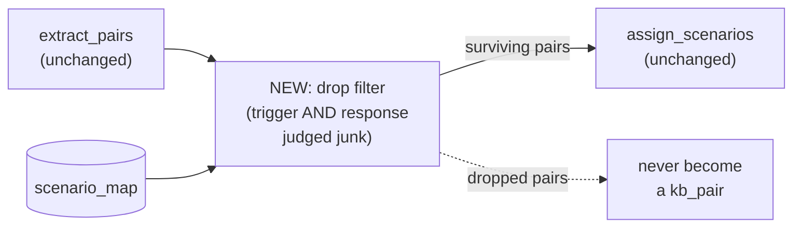

# Trigger-Quality Gate Design — dropping junk pairs before they ever become a kb_pair

**Date:** 2026-08-04
**Status:** Approved, not yet implemented
**Scope:** A new calibration-only module (`shared/trigger_quality.py`), a new ground-truth labeling
script, and a new comparison harness. No changes to `extract_pairs`, `assign_scenarios`, Layer A,
Layer C, storage schema, or the production pipeline call site. Nothing here is wired into
production in this pass — see Rollout.

**Revision note (same day):** the original version of this design also proposed
`route_by_response` and `tag_only` treatments, applied as a separate stage before `assign_scenarios`.
That was redundant — `assign_scenarios` already has `scenario_map` in scope wherever this new stage
would sit, so "route by response instead of trigger" is just a new strategy option *inside*
`assign_scenarios` (exactly sink-rescue's `response_only` shape), not something that needs its own
stage. Dropped both from scope. The one outcome that genuinely cannot be expressed by modifying
`assign_scenarios` — a pair never existing in `kb_pairs` at all, regardless of what it would have
matched — is the only thing this design still does. See "The single treatment: drop" below.

## Problem

`extract_pairs` (`v1/layer_b.py`) already gates every trigger and response on `_is_substantive()`
— at least `_MIN_CONTENT_WORDS = 5` non-stop alphabetic tokens, or the turn never becomes part of a
kb_pair. But that gate is a raw word count, blind to meaning: "I'm fine with whatever you guys
think is the right hook" clears it easily (6 content words) despite being pure hedging/backchannel.
Pairs like this pass extraction fine, then get discarded later at `assign_scenarios`, because the
trigger's embedding best-matches a non-coachable sink scenario — see
`2026-08-04-layer-b-sink-rescue-design.md` and `Brain/PROBLEMS_AND_FIXES.md`'s "Layer B audit"
section for the full measured history (39.7%-45.8% of pairs sink-bound across two production runs,
roughly half of a manual sample judged genuinely coachable).

That existing sink-rescue design attacks this **after** the fact, at scenario assignment, by
*rerouting* a pair to a different scenario. This design attacks a narrower slice of the same
failure mode: build a real, data-derived "is this trigger actually junk" signal (not a word count),
and for pairs where even the *response* doesn't redeem it, drop the pair before it ever becomes a
kb_pair — an outcome sink-rescue's rerouting logic cannot express, since it always assigns a pair
to *some* scenario, real or sink.

## Non-goals

- Curated filler-phrase lists. Every signal below is either reused from existing embeddings/vectors
  or a structural/linguistic property (entity count, question-vs-statement) — never a hand-picked
  word list, per this codebase's own repeated lesson (`JOVEO_SPEAKER_NAMES`, the old backchannel
  filter attempts) that curated lists don't survive scale.
- Replacing the sink-rescue design. The two answer related but different questions — "fix it at
  assignment" vs. "don't let it become ambiguous at extraction" — and adoption of either (or
  neither) is a later, separate decision. **Revised 2026-08-05:** they are no longer independently
  *calibrated*, though — the sink-rescue design's `content_gate_narrow` pivot reuses this design's own
  `label_trigger_quality_sample.py` output, so that script existing and having run is now a real
  build-order dependency for the sibling design, not a parallel/independent track. See that design's
  own "Calibration" section for the dependency, and this doc's "Relationship to the sink-rescue
  design" section below for what stays independent (adoption) versus what doesn't (calibration data).
- Picking a winning signal or threshold on paper. All four signals get built and measured against
  real, labeled data; this design does not presuppose the outcome.
- Dropping a pair on trigger-junk alone. A filler trigger with a substantive response must never be
  dropped by this design — that's the exact content-loss failure the sink-rescue design exists to
  fix, and this design must not reintroduce it through a different code path. See "Combining into a
  drop decision" below.
- Wiring anything into `extract_pairs`/`assign_scenarios`. See Rollout.

## Architecture

A new filter sits **between** `extract_pairs` and `assign_scenarios`, taking the pairs
`extract_pairs` already produces (trigger text, response text, `turn_index`) plus the same
`scenario_map` and the transcript's `turns` list that are already both in scope at that point in
`v2/pipeline.py` (confirmed by reading it: `scenario_map` is built once, corpus-wide, by Layer A
*before* the per-transcript loop that calls `extract_pairs`/`assign_scenarios` — no pipeline
reordering is required). It returns a **shorter or equal-length pairs list** — nothing else about a
kept pair is modified. `extract_pairs` and `assign_scenarios` are both untouched.

## The four signals — `shared/trigger_quality.py`

Pure, testable, no I/O — same style as `shared/cluster_evidence.py`. No threshold decisions live
here; each function returns a continuous (or boolean) score per pair.

- **`sink_real_margin(trigger_vec, sink_centroids, real_centroids) -> float`**
  `max(cos(trigger, sink centroids)) - max(cos(trigger, real centroids))`. Reuses the same
  sink/coachable split `assign_scenarios` already builds via `_build_scenario_vecs`. Higher = more
  filler-like.

- **`trigger_response_coupling(trigger_vec, response_vec) -> float`**
  Plain cosine between the pair's own two embeddings. No dependency on `scenario_map` — a generic
  hedge ("yeah, I think so") followed by a topically unrelated, substantive answer should show
  *low* coupling, since the hedge shares no real content with what follows.

- **`concrete_content_density(text) -> float`** *(renamed from `concrete_entity_density`,
  2026-08-05 revision)*
  `(named_entity_count + noun_chunk_count) / content_word_count`. Requires a second spaCy pass with
  both NER **and the dependency parser** enabled — `_nlp` in `layer_b.py` currently disables both
  for speed in `_is_substantive`; that path is untouched, this is an additional narrow pass run only
  over already-extracted candidate pairs' text, not the corpus-wide clause pool Layer A/C process,
  so the added parser cost is bounded and known upfront. The noun-chunk term was added because
  named-entity count alone misses specific-but-entity-free content (e.g. a process/strategy
  description with no proper nouns or numbers) — caught during the sink-rescue design's pivot review,
  before any calibration happened. **Computed for both the trigger and the response** — this is the
  one signal that directly answers "does the response itself carry concrete content," which is what
  the drop decision actually hinges on.

- **`preceding_turn_is_question(turns, turn_index) -> bool`**
  Looks at `turns[turn_index - 1]`. True if it's a NAREN turn ending in `?` or opening with a
  closed-class interrogative word (a grammatical category, not a curated content list). Neutral/
  false if the prior turn isn't NAREN. Trigger-side only — irrelevant to the response.

### Combining into a drop decision

`sink_real_margin`, `preceding_turn_is_question`, and the trigger's own `concrete_content_density`
describe the **trigger**. None of them are sufficient on their own to drop a pair — a pair with a
junk-scoring trigger and a high `concrete_content_density(response)` must survive, full stop, because
that's precisely the filler-trigger/substantive-response case the original audit found being
wrongly discarded. A pair is a drop *candidate* only when the trigger scores junky **and** the
response's own `concrete_content_density` is also low — i.e. neither side carries content on its
own. `trigger_response_coupling` is a secondary cross-check on that same pair once both sides
already look weak, not a substitute for checking the response directly.

## Ground-truth labeling — `label_trigger_quality_sample.py`

Nothing in the DB today records "is this specific pair's response actually coachable" — only
whether the *scenario* it landed in is coachable, a different thing entirely. A new, one-time
calibration script (mirrors `compare_sink_rescue.py`'s DB-reading style):

1. Pulls a **stratified** sample of ~120-150 currently sink-bound pairs from the live `public`
   schema — stratified across sink scenarios so no single sink (e.g. `client_comparative_filler`,
   which absorbed nearly half of `response_only`'s rescues in the sink-rescue calibration) dominates
   the sample.
2. Batches them 5-at-a-time to a new Gemma prompt, `PROMPT_TRIGGER_QUALITY_JUDGE` (in
   `shared/prompts.py`, same shape as the existing triage/milestone-judge prompts): given the
   trigger, is the response genuinely coachable content? yes/no + one-sentence reason.
3. Computes all four signals (trigger-side and response-side) for the same sample.
4. Reports each signal's **distribution split by label** — not a single correlation number, per
   this codebase's own rule that "how many survived" is the wrong question and "what got
   separated" is the right one — plus prints verbatim pairs at the disagreement edges so a human
   can sanity-check the Gemma labels, not just trust them. Specifically checks that
   `concrete_content_density(response)` is what actually separates "coachable" from "not," since
   that's the field the drop decision depends on most.

Output of this step is a **decision, not code**: where the combined trigger-AND-response threshold
should sit, or whether none of these signals separate well enough to build one at all — no
threshold is chosen in advance of this data.

## The drop filter + comparison harness

One new function in `v1/layer_b.py`, `filter_junk_pairs(pairs, scenario_map, config) -> list[dict]`,
applied between `extract_pairs` and `assign_scenarios`: drops any pair meeting the combined
trigger-AND-response condition from "Combining into a drop decision" above; returns the rest
unchanged.

A new script, `compare_trigger_quality_gate.py` (same shape as `compare_sink_rescue.py` /
`compare_matching_subset.py`), runs the filter against the real, already-embedded corpus and
reports: how many pairs it would drop, how that set overlaps with today's sink-bound pairs, and —
as a mandatory guardrail, not an afterthought — verbatim samples of every dropped pair so a human
can confirm none of them have a substantive response. Aggregate percentages alone are not
sufficient here, per the repeated lesson elsewhere in this codebase that they can hide which answer
is actually better.

## Testing

Pure unit tests for `shared/trigger_quality.py` in `tests/test_trigger_quality.py`, hand-built
vectors/turns (same style as `test_cluster_evidence.py` / `test_layer_b_assignment.py`) — testing
the *rule* each signal implements, not the embedding model's behavior. Must include a test asserting
that a junk-trigger/substantive-response pair is never dropped by the combined rule.

## Relationship to the sink-rescue design

Both designs exist because of the same audit finding, and they still produce genuinely different,
non-overlapping outcomes:

| Aspect | Sink-rescue (2026-08-04) | Trigger-quality gate (this doc) |
| --- | --- | --- |
| Intervenes at | scenario assignment, after the pair exists | between extraction and assignment |
| Outcome | reroutes a pair to a different scenario | removes a pair from `kb_pairs` entirely |
| Only fires when | the pair's *trigger* best-matches a sink | trigger AND response both score as junk |
| Calibration data | **depends on this design's `label_trigger_quality_sample.py`** (2026-08-05 pivot) | produces its own labeled sample, consumed by both designs |

**Revised 2026-08-05:** the two designs are no longer independently calibrated — sink-rescue's
`content_gate_narrow` variant reuses the labeled sample this design plans, so
`label_trigger_quality_sample.py` existing and having run is a real prerequisite for calibrating that
sibling variant, not just a convenience. What stays independent is *adoption*: building and running
this design's labeling script doesn't obligate adopting either this drop filter or sink-rescue's
content gate — those remain separate decisions, made after each design's own results are read.

They compose freely at the mechanism level: a pair that survives this drop filter still flows through
sink-rescue's rerouting logic unchanged. Composing them in production is out of scope until both have
independently cleared their own validation — independent adoption, not independent calibration.

## Rollout

Nothing here is wired into `extract_pairs`, `assign_scenarios`, or any pipeline module in this
pass. The sequence is: build `shared/trigger_quality.py` + tests → run
`label_trigger_quality_sample.py` and read the result → pick a combined threshold (or conclude the
signals don't separate well enough to build one at all) → build `filter_junk_pairs` → run
`compare_trigger_quality_gate.py` → read the dropped-pair samples → decide, separately, whether
it's worth adopting into production. Each step can stop the effort if the data doesn't support
continuing, matching the bar the sink-rescue and two-stage-matching experiments were held to.
