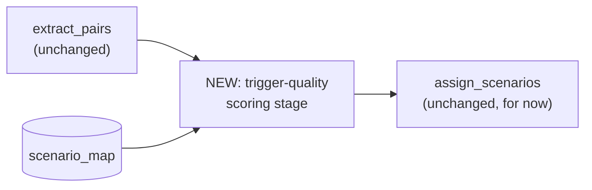

# Trigger-Quality Gate Design — catching junk *before* it becomes a kb_pair, not after

**Date:** 2026-08-04
**Status:** Approved, not yet implemented
**Scope:** A new calibration-only module (`shared/trigger_quality.py`), a new ground-truth labeling
script, and a new comparison harness. No changes to `extract_pairs`, `assign_scenarios`, Layer A,
Layer C, storage schema, or the production pipeline call site. Nothing here is wired into
production in this pass — see Rollout.

## Problem

`extract_pairs` (`v1/layer_b.py`) already gates every trigger and response on `_is_substantive()`
— at least `_MIN_CONTENT_WORDS = 5` non-stop alphabetic tokens, or the turn never becomes part of a
kb_pair. But that gate is a raw word count, blind to meaning: "I'm fine with whatever you guys
think is the right hook" clears it easily (6 content words) despite being pure hedging/backchannel.
Pairs like this pass extraction fine, then get discarded later at `assign_scenarios`, because the
trigger's embedding best-matches a non-coachable sink scenario — see
`2026-08-04-layer-b-sink-rescue-design.md` and `Brain/PROBLEMS_AND_FIXES.md`'s "Layer B audit"
section for the full measured history (39.7%-45.8% of pairs sink-bound across two production runs,
roughly half of a manual sample judged genuinely coachable).

That existing sink-rescue design attacks this **after** the fact, at scenario assignment. This
design attacks the same failure mode **earlier**, at pair extraction: build a real, data-derived
"is this trigger actually junk" signal (not a word count) and decide, per flagged pair, whether to
drop it, keep it but route by the response instead of the trigger, or just tag it for later.

## Non-goals

- Curated filler-phrase lists. Every signal below is either reused from existing embeddings/vectors
  or a structural/linguistic property (entity count, question-vs-statement) — never a hand-picked
  word list, per this codebase's own repeated lesson (`JOVEO_SPEAKER_NAMES`, the old backchannel
  filter attempts) that curated lists don't survive scale.
- Replacing the sink-rescue design. The two are independent, parallel experiments answering
  related but different questions — "fix it at assignment" vs. "don't let it become ambiguous at
  extraction." Both get measured; adoption of either (or neither) is a later, separate decision.
- Picking a winning signal or treatment on paper. All four signals and all three treatments get
  built and measured against real, labeled data; this design does not presuppose the outcome.
- Wiring anything into `extract_pairs`/`assign_scenarios`. See Rollout.

## Architecture

A new stage sits **between** `extract_pairs` and `assign_scenarios`, taking the pairs
`extract_pairs` already produces (trigger text, response text, `turn_index`) plus the same
`scenario_map` and the transcript's `turns` list that are already both in scope at that point in
`v2/pipeline.py` (confirmed by reading it: `scenario_map` is built once, corpus-wide, by Layer A
*before* the per-transcript loop that calls `extract_pairs`/`assign_scenarios` — no pipeline
reordering is required). `extract_pairs` itself is untouched.

## The four signals — `shared/trigger_quality.py`

Pure, testable, no I/O — same style as `shared/cluster_evidence.py`. No threshold decisions live
here; each function returns a continuous (or boolean) score per pair.

- **`sink_real_margin(trigger_vec, sink_centroids, real_centroids) -> float`**
  `max(cos(trigger, sink centroids)) - max(cos(trigger, real centroids))`. Reuses the same
  sink/coachable split `assign_scenarios` already builds via `_build_scenario_vecs`. Higher = more
  filler-like.

- **`trigger_response_coupling(trigger_vec, response_vec) -> float`**
  Plain cosine between the pair's own two embeddings. No dependency on `scenario_map` — a generic
  hedge ("yeah, I think so") followed by a topically unrelated, substantive answer should show
  *low* coupling, since the hedge shares no real content with what follows.

- **`concrete_entity_density(trigger_text) -> float`**
  Count of named entities (spaCy NER) normalized by content-word count. Requires a second,
  NER-enabled spaCy pass on the trigger only — `_nlp` in `layer_b.py` currently disables NER for
  speed in `_is_substantive`; that path is untouched, this is an additional narrow pass. Parser
  stays disabled (noun-chunk detection needs it and is out of scope on cost grounds).

- **`preceding_turn_is_question(turns, turn_index) -> bool`**
  Looks at `turns[turn_index - 1]`. True if it's a NAREN turn ending in `?` or opening with a
  closed-class interrogative word (a grammatical category, not a curated content list). Neutral/
  false if the prior turn isn't NAREN.

## Ground-truth labeling — `label_trigger_quality_sample.py`

Nothing in the DB today records "is this specific pair's response actually coachable" — only
whether the *scenario* it landed in is coachable, a different thing entirely. A new, one-time
calibration script (mirrors `compare_sink_rescue.py`'s DB-reading style):

1. Pulls a **stratified** sample of ~120-150 currently sink-bound pairs from the live `public`
   schema — stratified across sink scenarios so no single sink (e.g. `client_comparative_filler`,
   which absorbed nearly half of `response_only`'s rescues in the sink-rescue calibration) dominates
   the sample.
2. Batches them 5-at-a-time to a new Gemma prompt, `PROMPT_TRIGGER_QUALITY_JUDGE` (in
   `shared/prompts.py`, same shape as the existing triage/milestone-judge prompts): given the
   trigger, is the response genuinely coachable content? yes/no + one-sentence reason.
3. Computes all four `shared/trigger_quality.py` signals for the same sample.
4. Reports each signal's **distribution split by label** — not a single correlation number, per
   this codebase's own rule that "how many survived" is the wrong question and "what got
   separated" is the right one — plus prints verbatim pairs at the disagreement edges so a human
   can sanity-check the Gemma labels, not just trust them.

Output of this step is a **decision, not code**: which signal (or combination) actually separates
the two labels, and roughly where a threshold would sit. That decision feeds the treatment
comparison below — no threshold is chosen in advance of this data.

## The three treatments + comparison harness

Once a combined score and threshold are picked from the labeling step, three new functions in
`v1/layer_b.py` (same `strategy=` argument pattern as `assign_scenarios_with_sink_rescue`), each
acting only on pairs the combined score flags as "junk trigger, substantive response":

- **`strategy="drop"`** — the pair never becomes a kb_pair at all.
- **`strategy="route_by_response"`** — the pair is kept, but scenario assignment for it uses the
  response embedding instead of the trigger embedding.
- **`strategy="tag_only"`** — the pair is kept unchanged, gains a `trigger_is_filler: bool` field;
  no matching-logic change yet.

A new script, `compare_trigger_quality_gate.py` (same shape as `compare_sink_rescue.py` /
`compare_matching_subset.py`), runs all three against the real, already-embedded corpus and
reports: how many pairs each strategy affects, how that compares to today's measured sink-
absorption rate (39.7%/45.8%), and verbatim sample pairs per strategy for reading — aggregate
percentages alone are not sufficient, per the repeated lesson elsewhere in this codebase that they
can hide which answer is actually better (e.g. the two-stage-matching aggregate-agreement numbers
that read fine until the actual disagreement cases were read one by one).

## Testing

Pure unit tests for `shared/trigger_quality.py` in `tests/test_trigger_quality.py`, hand-built
vectors/turns (same style as `test_cluster_evidence.py` / `test_layer_b_assignment.py`) — testing
the *rule* each signal implements, not the embedding model's behavior.

## Relationship to the sink-rescue design

Both designs exist because of the same audit finding and share the same root problem (a decision
made from a single signal when a second one is available and ignored), but they intervene at
different points and are independent experiments:

| | Sink-rescue (2026-08-04) | Trigger-quality gate (this doc) |
|---|---|---|
| Intervenes at | scenario assignment (after the pair exists) | pair extraction (before assignment) |
| New signal | the response's own similarity to scenario vectors | 4 signals: sink-margin, trigger/response coupling, entity density, discourse shape |
| Decision affects | which scenario the pair is filed under | whether the pair is created at all, or how it's routed |

Whichever (if either) survives calibration could compose — e.g. a pair that survives the
extraction-time gate still goes through sink-rescue's assignment-time logic — but that composition
is out of scope until both have independently cleared their own validation.

## Rollout

Nothing here is wired into `extract_pairs`, `assign_scenarios`, or any pipeline module in this
pass. The sequence is: build `shared/trigger_quality.py` + tests → run
`label_trigger_quality_sample.py` and read the result → pick a combined score/threshold (or
conclude none of the four separate well enough) → build the three treatment functions → run
`compare_trigger_quality_gate.py` → read the samples → decide, separately, whether any variant is
worth adopting into production. Each of those steps can stop the effort if the data doesn't support
continuing, matching the bar the sink-rescue and two-stage-matching experiments were held to.
