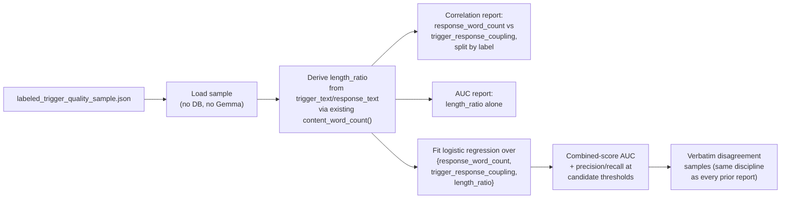

# Layer B Combined-Signal Analysis — checking whether stacking signals beats any single one

**Date:** 2026-08-05
**Status:** Approved, not yet implemented
**Scope:** A new standalone, zero-cost calibration script only. No changes to `v1/layer_b.py`,
`shared/trigger_quality.py`'s existing functions, Layer A, Layer C, storage schema, Pinecone usage,
`tuning.yaml`, or the production pipeline call site.

## Problem

Two prior designs — `2026-08-04-layer-b-sink-rescue-design.md` and
`2026-08-04-layer-b-trigger-quality-gate-design.md` — each tried to build a signal that separates
genuinely coachable content from junk among the ~40-46% of Layer B trigger-response pairs that get
filed to a non-coachable "sink" scenario and permanently excluded from every rubric (see
`Brain/PROBLEMS_AND_FIXES.md`'s "Layer B audit" section for why this matters — roughly half of a
real sample of sink-filed pairs was judged genuinely coachable, not junk).

Every signal tried so far was evaluated **alone**, and every one either failed outright or fell well
short of usable, measured against the same 150-pair Gemma-labeled ground-truth sample
(`Brain/labeled_trigger_quality_sample.json`, 63 coachable / 87 not coachable), using AUC — the
probability a random coachable pair scores higher than a random not-coachable pair (0.5 = no signal,
1.0 = perfect separation):

| Signal | AUC | Verdict |
| --- | --- | --- |
| `concrete_content_density(response)` | 0.523 | chance-level |
| `concrete_content_density(trigger)` | 0.519 | chance-level |
| `sink_real_margin` | 0.437 | correct direction, too weak |
| `trigger_response_coupling` | 0.617 | real but weak |
| `response_word_count` (length) | 0.853 | real signal, but measures verbosity, not what either design set out to detect — left unadopted in both |

No prior round checked whether these signals are **redundant or complementary** with each other, or
whether a **derived** feature (not yet tried) does better than any of the raw ones. That gap is
this design's whole scope.

## Non-goals

- Spending any Gemma calls. Everything here reuses the sample already persisted to
  `labeled_trigger_quality_sample.json` — this design is scoped specifically as the "keep it
  deterministic, no LLM" branch, with a per-pair Gemma judgment explicitly deferred as a last-resort
  option if this and a follow-up signal-family search (see "Escalation" below) both fail.
- Wiring anything into `assign_scenarios`, `tuning.yaml`, or any pipeline module. This is a
  measurement-only pass, exactly like `label_trigger_quality_sample.py` and `compare_sink_rescue.py`
  before it. Whether to build a real gate from any result here is an explicit follow-up decision.
- A curated word/phrase list for any new feature. Every derived feature here is a ratio or
  correlation over signals already measured from structural/embedding properties — never a
  hand-picked list, per this codebase's own repeated lesson that curated lists don't survive scale
  (`JOVEO_SPEAKER_NAMES`, the old backchannel filter attempts).
- A machine-learned model as a production artifact. The logistic regression below is used only to
  answer "can these signals be combined at all," not proposed as a serving-time classifier — if this
  analysis succeeds, a follow-up design would still need to decide what deterministic rule (a fixed
  threshold combination, not a serialized model) actually ships.

## Architecture

One new script, `Brain/analyze_combined_signal.py`, in the same read-only, zero-cost style as
`label_trigger_quality_sample.py --load` and `compare_sink_rescue.py`:

1. **Load.** Read `labeled_trigger_quality_sample.json` directly — no DB connection, no Gemma call.
2. **Derive `length_ratio`.** `content_word_count(response_text) / max(content_word_count(trigger_text), 1)`
   — reuses the existing `shared/trigger_quality.py::content_word_count` function unchanged, computed
   over text already in the persisted sample. This targets the sink-rescue design's own headline
   failure case (a short filler trigger followed by a long substantive response) more directly than
   raw response length alone, since it's the *asymmetry* between the two sides that case describes,
   not just the response's absolute length.
3. **Correlation check, before combining anything.** Pearson correlation between
   `response_word_count` and `trigger_response_coupling`, computed both overall and split by label.
   If the two move together tightly, combining them buys little; if they're weakly correlated, they
   may be catching different slices of the junk population and a combination has real headroom.
4. **`length_ratio`'s own AUC** — reported exactly like every other signal in the prior two designs,
   for direct comparability.
5. **Combined score.** Fit a logistic regression over the three features
   (`response_word_count`, `trigger_response_coupling`, `length_ratio`) against the `coachable`
   label, on the full 150-pair sample (too small to hold out a separate test split meaningfully —
   this is exploratory calibration, not a claim of generalization). The fitted model is a fixed
   formula (deterministic, reproducible given the same input data — no run-to-run stochastic
   process), used here purely to answer "is there headroom in combining these," not as a shipped
   artifact. Report its AUC against the individual-signal AUCs above, plus precision/recall at 2-3
   candidate score thresholds, plus verbatim disagreement samples — a number alone is never
   sufficient in this codebase without reading actual pairs (the same discipline every prior
   calibration effort in this file's history was held to).

## Escalation

Stated explicitly, matching this codebase's own repeated "measured, not guessed, and willing to
stop" discipline:

- **If the combined AUC materially exceeds 0.853 (the best single signal so far) and yields a real
  usable operating point** (not merely "better than chance" — an actual precision/recall trade-off
  worth shipping), that becomes a real candidate gate, to be spec'd out as its own
  `sink_rescue_strategy` variant in a follow-up design. Nothing about *that* design is decided here.
- **If it doesn't clear that bar**, this closes the "combine what we already have" approach. Per
  your own stated sequencing, the next step is approach B — searching for a genuinely new
  deterministic signal family (e.g. conversational-position or structural features) not yet tried —
  scoped as a separate design, not part of this one.
- A Gemma-per-pair judgment (mirroring Layer A's existing per-cluster coachability call) remains the
  explicitly-deferred last resort if both A and B fail to produce a usable deterministic rule.

## Testing

None. This is a one-off calibration script over already-labeled data, not a module other code
imports — same precedent as `label_trigger_quality_sample.py` and `compare_sink_rescue.py`, neither
of which has a test file. If a rule is eventually adopted from this analysis, that follow-up design
would add `shared/trigger_quality.py` unit tests for whichever new function (e.g. a `length_ratio`
helper) actually ships.

## Rollout

Nothing here changes production behavior, `tuning.yaml`, or any pipeline module. The output of this
script is a decision about which approach to pursue next (adopt-worthy combined signal, or escalate
to approach B) — not code that ships on its own.
