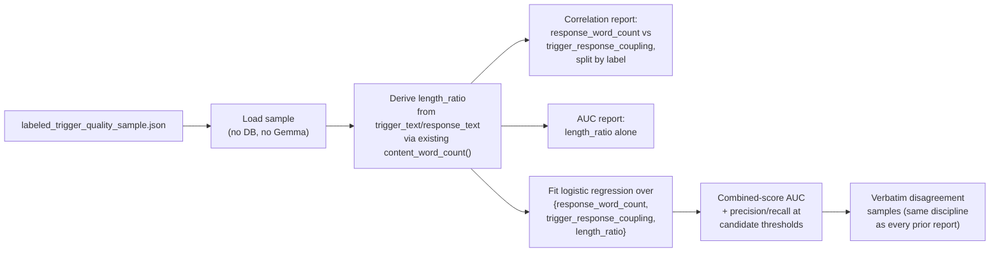

# Layer B Combined-Signal Analysis — checking whether stacking signals beats any single one

**Date:** 2026-08-05
**Status:** Approved, not yet implemented
**Scope:** A new standalone, zero-cost calibration script only. No changes to `v1/layer_b.py`,
`shared/trigger_quality.py`'s existing functions, Layer A, Layer C, storage schema, Pinecone usage,
`tuning.yaml`, or the production pipeline call site.

## Problem

Two prior designs — `2026-08-04-layer-b-sink-rescue-design.md` and
`2026-08-04-layer-b-trigger-quality-gate-design.md` — each tried to build a signal that separates
genuinely coachable content from junk among the ~40-46% of Layer B trigger-response pairs that get
filed to a non-coachable "sink" scenario and permanently excluded from every rubric (see
`Brain/PROBLEMS_AND_FIXES.md`'s "Layer B audit" section for why this matters — roughly half of a
real sample of sink-filed pairs was judged genuinely coachable, not junk).

Every signal tried so far was evaluated **alone**, and every one either failed outright or fell well
short of usable, measured against the same 150-pair Gemma-labeled ground-truth sample
(`Brain/labeled_trigger_quality_sample.json`, 63 coachable / 87 not coachable), using AUC — the
probability a random coachable pair scores higher than a random not-coachable pair (0.5 = no signal,
1.0 = perfect separation):

| Signal | AUC | Verdict |
| --- | --- | --- |
| `concrete_content_density(response)` | 0.523 | chance-level |
| `concrete_content_density(trigger)` | 0.519 | chance-level |
| `sink_real_margin` | 0.437 | correct direction, too weak |
| `trigger_response_coupling` | 0.617 | real but weak |
| `response_word_count` (length) | 0.853 | real signal, but measures verbosity, not what either design set out to detect — left unadopted in both |

No prior round checked whether these signals are **redundant or complementary** with each other, or
whether a **derived** feature (not yet tried) does better than any of the raw ones. That gap is
this design's whole scope.

## Non-goals

- Spending any Gemma calls. Everything here reuses the sample already persisted to
  `labeled_trigger_quality_sample.json` — this design is scoped specifically as the "keep it
  deterministic, no LLM" branch, with a per-pair Gemma judgment explicitly deferred as a last-resort
  option if this and a follow-up signal-family search (see "Escalation" below) both fail.
- Wiring anything into `assign_scenarios`, `tuning.yaml`, or any pipeline module. This is a
  measurement-only pass, exactly like `label_trigger_quality_sample.py` and `compare_sink_rescue.py`
  before it. Whether to build a real gate from any result here is an explicit follow-up decision.
- A curated word/phrase list for any new feature. Every derived feature here is a ratio or
  correlation over signals already measured from structural/embedding properties — never a
  hand-picked list, per this codebase's own repeated lesson that curated lists don't survive scale
  (`JOVEO_SPEAKER_NAMES`, the old backchannel filter attempts).
- A machine-learned model as a production artifact. The logistic regression below is used only to
  answer "can these signals be combined at all," not proposed as a serving-time classifier — if this
  analysis succeeds, a follow-up design would still need to decide what deterministic rule (a fixed
  threshold combination, not a serialized model) actually ships.

## Architecture

One new script, `Brain/analyze_combined_signal.py`, in the same read-only, zero-cost style as
`label_trigger_quality_sample.py --load` and `compare_sink_rescue.py`:

1. **Load.** Read `labeled_trigger_quality_sample.json` directly — no DB connection, no Gemma call.
2. **Derive `length_ratio`.** `content_word_count(response_text) / max(content_word_count(trigger_text), 1)`
   — reuses the existing `shared/trigger_quality.py::content_word_count` function unchanged, computed
   over text already in the persisted sample. This targets the sink-rescue design's own headline
   failure case (a short filler trigger followed by a long substantive response) more directly than
   raw response length alone, since it's the *asymmetry* between the two sides that case describes,
   not just the response's absolute length.
3. **Correlation check, before combining anything.** Pearson correlation between
   `response_word_count` and `trigger_response_coupling`, computed both overall and split by label.
   If the two move together tightly, combining them buys little; if they're weakly correlated, they
   may be catching different slices of the junk population and a combination has real headroom.
4. **`length_ratio`'s own AUC** — reported exactly like every other signal in the prior two designs,
   for direct comparability.
5. **Combined score.** Fit a logistic regression over the three features
   (`response_word_count`, `trigger_response_coupling`, `length_ratio`) against the `coachable`
   label, on the full 150-pair sample (too small to hold out a separate test split meaningfully —
   this is exploratory calibration, not a claim of generalization). The fitted model is a fixed
   formula (deterministic, reproducible given the same input data — no run-to-run stochastic
   process), used here purely to answer "is there headroom in combining these," not as a shipped
   artifact. Report its AUC against the individual-signal AUCs above, plus precision/recall at 2-3
   candidate score thresholds, plus verbatim disagreement samples — a number alone is never
   sufficient in this codebase without reading actual pairs (the same discipline every prior
   calibration effort in this file's history was held to).

## Escalation

Stated explicitly, matching this codebase's own repeated "measured, not guessed, and willing to
stop" discipline:

- **If the combined AUC materially exceeds 0.853 (the best single signal so far) and yields a real
  usable operating point** (not merely "better than chance" — an actual precision/recall trade-off
  worth shipping), that becomes a real candidate gate, to be spec'd out as its own
  `sink_rescue_strategy` variant in a follow-up design. Nothing about *that* design is decided here.
- **If it doesn't clear that bar**, this closes the "combine what we already have" approach. Per
  your own stated sequencing, the next step is approach B — searching for a genuinely new
  deterministic signal family (e.g. conversational-position or structural features) not yet tried —
  scoped as a separate design, not part of this one.
- A Gemma-per-pair judgment (mirroring Layer A's existing per-cluster coachability call) remains the
  explicitly-deferred last resort if both A and B fail to produce a usable deterministic rule.

## Testing

None. This is a one-off calibration script over already-labeled data, not a module other code
imports — same precedent as `label_trigger_quality_sample.py` and `compare_sink_rescue.py`, neither
of which has a test file. If a rule is eventually adopted from this analysis, that follow-up design
would add `shared/trigger_quality.py` unit tests for whichever new function (e.g. a `length_ratio`
helper) actually ships.

## Rollout

Nothing here changes production behavior, `tuning.yaml`, or any pipeline module. The output of this
script is a decision about which approach to pursue next (adopt-worthy combined signal, or escalate
to approach B) — not code that ships on its own.

## Status update (2026-08-05): combining does not beat the best single signal — Approach A closed

`Brain/analyze_combined_signal.py` ran against the persisted 150-pair sample. Full output not
logged to a file (short, reproduced here in full):

- **`response_word_count` and `trigger_response_coupling` are essentially uncorrelated** — Pearson
  r=0.087 overall (p=0.29, not significant), r=-0.087 among coachable pairs, r=0.198 among
  not-coachable pairs. Not redundant; genuinely independent information, exactly the precondition
  that would make combining worthwhile.
- **`length_ratio` (response/trigger content-word-count ratio) is a real signal on its own — AUC
  0.748** — better than `trigger_response_coupling` (0.617), but *weaker* than raw
  `response_word_count` (0.853). The asymmetry hypothesis (short filler trigger → long substantive
  response) is real but the ratio form throws away information the raw count keeps.
- **The combined logistic-regression score does not beat the best single signal — AUC 0.845 vs.
  `response_word_count` alone at 0.853.** Despite the near-zero correlation above, stacking all
  three features produced an *in-sample* fit slightly below plain length. At threshold 0.5 it gives
  precision 0.841 / recall 0.587 (flags 44/150) — a real, usable-looking operating point in
  isolation, but not better than what length alone already offers (precision 0.731 / recall 0.778
  at a raw word-count threshold of 30, or 0.820 / 0.651 at 40 — see below).

**Verdict: Approach A is closed, per its own stated bar** ("if the combined AUC materially exceeds
0.853 ... otherwise escalate to approach B"). It didn't exceed 0.853 — it landed slightly under it.
No new deterministic gate is adopted from this analysis; `length_ratio` is not proposed as a
`shared/trigger_quality.py` addition, since it underperforms a signal already in that module.

**One side-finding surfaced by this exercise, not a result of combining**: `response_word_count`
*alone*, with a plain threshold, produces a precision/recall profile (e.g. 0.731/0.778 at
threshold=30) that reads as materially better in aggregate than anything rounds 1-2 of the
sink-rescue design achieved (round 1: ~95% rescue rate, mostly wrong; round 2's `or_rule`: 39.5%
rescue / 41.9% collateral damage). That prompted a direct re-check on the merits, not just principle
— reading the 18 false positives and 14 false negatives at threshold=30 verbatim (same discipline
every other signal in this effort was held to):

- **False positives (long, flagged not-coachable) are systematically administrative/logistics/small
  talk that happens to run long** — meeting wrap-ups, scheduling, a rambling non-answer to a
  technical workaround request, sports small talk. This is exactly the "long rambling non-answer"
  failure mode the original design predicted for length, now confirmed directly.
- **False negatives (short, flagged coachable) are systematically the sharpest, most valuable
  content in the sample** — tight strategic pivots and discovery questions in 10-20 words ("Would
  that be part of the 200 schools... or is that only for The US?"; "That's not a recommended best
  practice... they do require a city"; a specific quarter-over-quarter growth figure in 10 words).
  Length doesn't just miss noise here — it specifically discards the kind of terse, expert-brevity
  coaching move a rubric most needs to capture, penalizing exactly the skill this whole pipeline
  exists to teach.

**Verdict, superseding the "decision for the next conversation" framing above: length is rejected on
the merits, not just on principle.** The aggregate precision/recall numbers were real, but they hid
a bias that actively works against the pipeline's own purpose — a gate that reliably throws away
concise expertise is worse than one that's merely imprecise. `response_word_count` is not adopted as
a sink-rescue gate. Combined with Approach A's own negative result above, all six signal shapes
tried across this whole effort (absolute cosine floors ×2 rounds, content density, sink_real_margin,
trigger_response_coupling, and now length alone / length_ratio / the combined score) have each
failed a real measurement, most for a specific, named, sample-verified reason rather than merely "AUC
too low."

## Approach B (2026-08-05): turn position in the call — a real signal, still doesn't fix the core problem

Motivated by the false positives above reading as structurally clustered near the end of a call
(wrap-ups, sign-offs), `Brain/analyze_turn_position.py` tested whether a trigger's position within
its call — content-blind, purely structural — separates coachable from junk. Zero Gemma calls;
re-parses each sampled call's transcript (same `transcript_parser` call `label_trigger_quality_sample.py`
already makes) to get each call's total turn count, joins against the persisted sample's own
`call_id`/`turn_index`.

- **`normalized_position`** (0=start, 1=end) alone: AUC 0.479 — no signal, because junk clusters at
  *both* edges (greetings at the start, wrap-up at the end), which a plain monotonic AUC can't see.
- **`edge_distance`** (`min(normalized_position, 1 - normalized_position)`, i.e. distance from the
  *nearest* edge) tests the U-shaped hypothesis directly: **AUC 0.636** — a real signal, on par with
  `trigger_response_coupling`. Reading the 10 pairs with `edge_distance < 0.1` confirmed it
  qualitatively: 8 of 10 were logistics/wrap-up/sign-off/pleasantries exactly as predicted; the 2
  exceptions were genuine content that happened to sit near an edge (an opening self-introduction, a
  late-call product explanation) — real counterexamples, not disqualifying ones.
- **Combining `response_word_count` + `edge_distance`** (near-zero correlation, r=-0.034 — genuinely
  independent information) pushed AUC to **0.876**, the first time in this entire effort that
  combining beat the single best signal (0.853). Two of the exact false positives read in the length
  analysis above were also near-edge, suggesting a real mechanism: `edge_distance` can correct
  long-but-junk wrap-up responses that length alone misclassifies.

**But reading the combined score's false positives/negatives at threshold=0.5 found the aggregate
gain does not fix length's disqualifying flaw.** The false negatives are, to a large degree, the
*same* terse strategic pivots and discovery questions found before (13-40 words: "would this be for a
particular skill intersection?"; "do you think the brand safety aspect... is gonna be an overkill?";
several pair IDs literally recur from the length-only false-negative list) — `edge_distance` doesn't
help these, since they aren't necessarily near an edge, and length still dominates the fitted score
enough to sink them. Several false positives also survive (technical-workaround requests,
agenda-setting, wrap-up) — including one case (pair 26411) where `edge_distance` correctly flagged
near-edge risk (0.04) but the response's raw word count (87) was still enough to push the combined
score above threshold anyway.

**Verdict: `edge_distance` is a real, qualitatively-confirmed signal, but combining it with length
does not rescue length's core problem — it improves the aggregate number while leaving the specific,
named failure mode (discarding concise expert coaching) largely intact.** This is not adopted as a
sink-rescue gate. Eight signal shapes have now been measured across this whole effort (absolute
cosine floors ×2 rounds, content density, `sink_real_margin`, `trigger_response_coupling`, length /
length_ratio / length-margin-combo, `edge_distance` alone, and length+`edge_distance` combined); each
failed for a specific, sample-verified reason. Whether to keep searching for a further positional/
structural signal, accept a version of length+edge_distance despite its known bias, or reconsider the
previously-deferred Gemma-per-pair option (the one thing in this whole effort proven to actually
understand what a response says, rather than approximate it structurally) is the open decision for
the next step — not resolved here.
