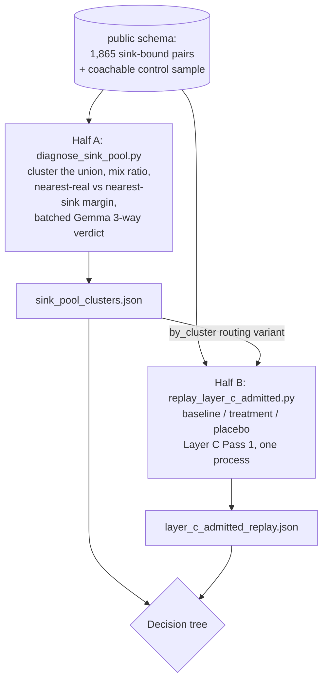

# Sink-Pool Population Diagnostic — changing the unit of decision instead of searching for a ninth signal

**Date:** 2026-08-05
**Status:** Approved, not yet implemented
**Scope:** Two new standalone, read-only calibration scripts, one new Gemma prompt, and one
behavior-preserving extraction refactor in `v2/layer_c.py`. No changes to `v1/layer_b.py`,
`assign_scenarios`, Layer A, the storage schema, Pinecone usage, `tuning.yaml`, or any pipeline
call site. Nothing here ships; the deliverable is a decision about which architecture the data
implies.

## Problem

~40-46% of Layer B trigger-response pairs are filed to a non-coachable "sink" scenario and
permanently excluded from every rubric. Reading real samples judged roughly half of those to be
genuinely coachable content, wrongly discarded (`Brain/PROBLEMS_AND_FIXES.md`, "Layer B audit").

Three prior designs attacked this and all three closed:

- `2026-08-04-layer-b-sink-rescue-design.md` — reroute a sink-bound pair using the response's
  embedding. Absolute cosine floors (rounds 1-2), then `concrete_content_density`, then
  `sink_real_margin` / `trigger_response_coupling`. All failed.
- `2026-08-04-layer-b-trigger-quality-gate-design.md` — drop a junk pair before it becomes a
  `kb_pair`. Closed at its own second checkpoint: the signal its combining rule hinges on scored
  AUC 0.523.
- `2026-08-05-layer-b-combined-signal-analysis-design.md` — combine the strongest signals, then
  `edge_distance` (turn position). Length alone (AUC 0.853) and length + `edge_distance`
  (AUC 0.876) were both rejected on reading: they systematically discard terse expert coaching
  moves, the exact skill this pipeline exists to teach.

**Eight signal shapes, each measured, each failed.** Every one of them shared a single shape:
*score one pair, alone, and threshold it.* This design does not add a ninth. It asks whether the
unit of decision, not the signal, is what is wrong.

## Three facts read out of the code, which reframe the problem

**1. Sink-filing is not deletion. It is one SQL predicate.**
`storage.get_naren_responses_for_scenario` (`shared/storage.py:270-279`) builds Layer C's response
pool with `WHERE p.scenario_key = %s`. That predicate is the *entire* mechanism by which a
sink-bound pair is excluded from every rubric. Nothing else downstream depends on it — Layer C
never reads the `scenario_keys` array at all. The content loss is not structural; it is the choice
to gate Layer C's intake on Layer B's per-pair verdict.

**2. Layer C already contains four aggregate junk defenses, and one exists specifically to fix the
contamination the sink gate is justified by.**
`v2/layer_c._relevance_filter`'s own docstring names its motivating failure: *"thanks so much for
your time"* and *"sorry, can you hear me"* becoming milestones of `job_board_advertising_strategy`.
After it come `min_cluster_size`, the distinct-call support gate, and the sink-similarity Gemma
judge. The belief "junk must be stopped at Layer B or it poisons rubrics" is pre-rework — it dates
from `min_cluster_size=2` and the 95-milestone bug. Today Layer B's sink short-circuit is the
**weakest** junk filter in the pipeline (one pair, ~50 words, one embedding, no repetition to lean
on) guarding a threat three stronger filters downstream already handle — at a cost of 40-46%
content loss at roughly 50% false-positive rate.

**3. Layer A builds the taxonomy from CLIENT clauses only.**
`v2/layer_a.py:34` skips every non-CLIENT turn; line 409 raises if none are found. Naren's
*responses* never vote on which scenarios exist. So a coaching behavior whose client-side cues are
consistently short or filler-like has **no scenario it could ever be routed to** — it is
sink-bound by construction, permanently, regardless of how good the matcher becomes.

Fact 3 is why the eight signals may have been asked an unanswerable question. Each was asked
"which existing scenario does this pair belong to, or is it junk?" for a population where some
fraction has no correct answer available. No signal can separate real content from junk when the
taxonomy offers no third bucket.

**And the meta-pattern:** every round optimized a per-pair proxy (AUC against a per-pair label)
when the pipeline's objective is rubric quality. Nobody measured what admitting the sink pool
actually does to milestones — and Layer C's Pass 1 is Gemma-free, so that measurement is nearly
free.

## The reframe

This codebase has twice proven that judging a **population** works where judging an **item** does
not: Layer A adjudicates ~200 clusters instead of 74k clauses; Layer C requires distinct-call
support instead of trusting any single clause. Layer B is the only layer that makes a content
judgment per item, and it makes it with an embedding argmax. Neither proven unit — the cluster, or
the downstream evidence gate — has ever been applied to the sink pool.

**Is this signal #9 wearing a new name?** No, by a stated test: signal #9 would be a scalar
computed per pair and thresholded. Half A below produces a *three-way categorical verdict per
cluster*, and one of its three outcomes (`new_coachable_topic` — real content with no scenario to
route to) is not expressible in any per-pair scoring scheme. There is no threshold to tune in
either half. What this is, stated honestly rather than dressed up: Layer A's own proven pattern
applied to a population that has only ever been examined pair-by-pair. The novelty is not the
mechanism; it is noticing the sink pool is a population.

## Non-goals

- A ninth per-pair scoring signal, or any new `tuning.yaml` key.
- Adopting an architecture. This pass produces the evidence that *selects* one. Whether to change
  Layer C's intake, Layer A's taxonomy construction, or nothing at all is an explicit follow-up
  decision.
- Wiring anything into `assign_scenarios`, `extract_pairs`, or any pipeline module.
- Curated word or phrase lists, per this codebase's repeated lesson that they do not survive scale.

## Adoption bar (set before the data exists)

**Hard constraint:** no milestone present in a good rubric today may be lost or degraded.
**Soft constraint:** net-new milestones must read as genuine coaching content on verbatim
inspection, not merely raise a count.

This is deliberately the same bar that killed `blended` (47.6% churn on already-correct pairs) and
`or_rule` round 2 (41.9%) — both had defensible aggregate numbers and were rejected on collateral
damage. Holding this round to the same standard keeps it consistent, and it means recovering less
content rather than trading away rubric quality to recover more.

## Architecture

| Built | Untouched |
| --- | --- |
| `Brain/diagnose_sink_pool.py` (Half A) | `v1/layer_b.py` — `assign_scenarios`, the sink short-circuit, all sink-rescue strategies |
| `Brain/replay_layer_c_admitted.py` (Half B) | `v2/pipeline.py`, `v1/pipeline.py`, `main.py`, Layer A |
| `shared/prompts.py`: `PROMPT_SINK_POOL_TRIAGE` | `tuning.yaml` — no new keys, no changed values |
| `v2/layer_c.build_clause_pool` extraction + its test | Postgres schema; both scripts are read-only, zero DB writes |

### The one production-code change, and why it is not scope creep

`_pass1_cluster_scenario` (`v2/layer_c.py:152-161`) inlines its clause-pool assembly. Half B must
reproduce Pass 1 *exactly* or its diff is worthless, and this codebase has already been burned by a
dry run that reimplemented production logic and disagreed with it by 99.7% vs 14%.
`dry_run_layer_c_clustering.py` repeats that mistake today with its own private `_relevance_filter`
copy.

Extract `build_clause_pool(responses) -> (clauses, positions, calls)` out of
`_pass1_cluster_scenario`; have production call it; have Half B import it alongside the existing
`_relevance_filter` and `_cluster_milestones`. Behavior-preserving, ~10 lines moved, and it is the
difference between a faithful replay and a parallel implementation that will drift.

## Half A — `diagnose_sink_pool.py`

Answers: *what is actually in the sink pool, and does the existing taxonomy have a home for it?*

**Population.** Every pair in the live `public` schema whose `scenario_key` resolves to
`is_coachable = false` (1,865 pairs across ~76 sinks today), **plus a volume-matched random sample
of pairs currently filed to coachable scenarios** as a control.

**Unit.** The response — one vector per pair, via `embed_document` (document-vs-document, matching
how Layer C embeds clauses and how scenario vectors are built). The question is whether a coherent
coaching *behavior* is present, and a behavior is a whole response, not a clause. Clause-level
clustering is Half B's job, where it must mirror production. Warm `embed_cache.db`, so effectively
free.

**Clustering.** The union of both populations in **one** run via the imported
`v2.layer_c._cluster_milestones` (UMAP `metric=cosine, random_state=42` → HDBSCAN), with
`min_cluster_size` from `cluster_evidence.milestone_min_cluster_size` at the existing
`min_cluster_size_fraction: 0.02` / floor 3 / ceiling 25. The resolved value is printed, not
assumed.

**Per cluster, reported:**

- **Mix ratio** — the fraction of members drawn from the sink pool versus the coachable control.
  *This is the discriminating statistic, and the reason the control exists.* Naren's responses are
  long and topical nearly everywhere, so any random subset of them clusters into topics — cluster
  coherence alone proves nothing, which is exactly the trap `response_only` fell into with its 95%
  rescue rate and gravity wells. A cluster that is 90%+ sink-pool members is a distinctive junk
  family the gate correctly caught. A cluster near 50/50 means its sink-bound members are
  statistically indistinguishable from content already feeding rubrics — direct evidence of
  wrongful exclusion, far stronger than a human judging a cluster "coherent".
- Size, **distinct-call support**, and call coverage — the same evidence triple Layer A's triage
  already uses.
- **Nearest coachable scenario** + cosine, **nearest sink** + cosine (reusing
  `layer_c._sink_centroids` and `scenario_vectors.build_scenario_vecs`), and **the margin between
  them**: closer to a real scenario than to any sink ⇒ mis-routed; closer to a sink ⇒ genuine junk;
  far from *both* ⇒ homeless, the taxonomy-gap case.
- Which sinks its members currently sit in (top 3 by count).
- 5 verbatim (trigger, response) samples.

**Then batched Gemma adjudication per cluster.** New `PROMPT_SINK_POOL_TRIAGE` in
`shared/prompts.py`, modeled on `PROMPT_LAYER_A_V2_TRIAGE`'s shape and its 5-per-call batching. It
sees the cluster's sample responses, its evidence stats, its nearest coachable scenario and its
nearest sink, and returns one of **three** verdicts plus a one-sentence reason:

- `belongs_to_existing` + which scenario → a routing failure
- `new_coachable_topic` + a proposed label/description → a taxonomy gap
- `genuine_sink` → the gate was right

Expected ~40-90 clusters → 8-18 batched calls, comparable to one run's Layer A triage spend. **The
three-way verdict is the point**: it is the distinction no per-pair scalar could express, and the
reason this is not round nine.

**Two free validations:**

1. **Cross-check against the existing labeled sample.** `labeled_trigger_quality_sample.json`
   carries `pair_id` and a persisted `response_vec` for all 150 pairs. Map each into its cluster
   and compare the per-cluster Gemma verdict against the per-pair labels. Agreement makes both
   ground truths more trustworthy; sharp disagreement means one is wrong, and we learn that before
   building anything. Zero DB, zero Gemma.
2. **Noise rate.** HDBSCAN `-1` members are un-judgeable singletons. Their count is a hard upper
   bound on how much of the pool *any* cluster-based approach can ever reach.

**Escape hatch, stated before the data exists** (same discipline the density pivot was held to):
if the noise rate exceeds **60% of the sink pool**, or if mix ratios sit near 50/50 across
essentially every cluster (meaning the clustering separates nothing), the cluster framing is as
stuck as the per-pair framing. Report it as a dead end rather than push forward.

## Half B — `replay_layer_c_admitted.py`

Answers: *what does admitting the sink pool actually do to rubrics?* — the objective all eight
prior rounds substituted a per-pair proxy for.

**Three arms, all in one process, one warm cache:**

| Arm | Clause pool per coachable scenario |
| --- | --- |
| `baseline` | exactly what production pulls today via `get_naren_responses_for_scenario` |
| `treatment` | baseline **+** sink-bound pairs routed in |
| `placebo` | baseline **+** a volume-matched pool of clauses drawn at random from *other* coachable scenarios (topically wrong content, matched clause count per scenario) |

**Why one process, and why the placebo is load-bearing.** Layer C's UMAP+HDBSCAN is documented
non-reproducible across separate process launches — 241 versus ~400 milestones on an identical
corpus. Two arms in two launches would be swamped by that variance. Within one process at
`random_state=42` on identical input, UMAP is deterministic, so the only remaining variance source
is that treatment's input differs from baseline's *in volume*. The placebo perturbs input by the
same volume using content known to be topically wrong. **If treatment's milestone gain is
indistinguishable from placebo's, the gain is a pool-size clustering artifact, not content.** No
delta is believed without that comparison.

**Three routing variants for the treatment arm, all free:**

- **`by_trigger_nonsink`** — the true null hypothesis: today's `assign_scenarios` with the sink
  short-circuit deleted, i.e. the trigger's best *coachable* match. One `if` removed is the
  cheapest production change that could exist, so it is the one most worth knowing about.
- **`by_response`** — the response's own best coachable match.
- **`by_cluster`** — route only pairs from clusters Half A adjudicated `belongs_to_existing`, to
  their adjudicated scenario. Precision-targeted, most likely to clear the adoption bar, and
  sequenced after Half A since it consumes its verdicts.

**Matching milestones across arms without inventing a threshold.** Candidate clusters have no
stable IDs across runs, and centroid-similarity matching would require a new tuned number.
Instead, match by **clause-set overlap**: treatment's pool is a strict superset of baseline's, so
every baseline clause is present in the treatment arm and overlap matching is exact. Each baseline
milestone gets exactly one of three outcomes, and the distinction matters because conflating the
middle one with the last would over-report regression:

- **`matched`** — some single treatment cluster contains a majority of its clauses.
- **`split`** — no single treatment cluster does, but two or more together do. The evidence survived;
  it fragmented. Reported and read, but **not** automatically a regression.
- **`lost`** — a majority of its clauses fell into HDBSCAN noise, in no treatment cluster at all.
  This is the outcome the hard adoption bar forbids.

A treatment milestone is **gained** if its members are majority admitted-clauses.

**Reported, per scenario and in aggregate:**

1. Clause pool size before/after, and **how many admitted clauses survive `_relevance_filter`** —
   printed *before* any milestone number, because it is the cheap early tell: if Layer C's own p40
   relevance cut already discards the admitted clauses, ungating is a no-op and the whole question
   moves to taxonomy.
2. Candidate milestones before / after / **lost** / **gained**.
3. For surviving milestones, the change in `support_calls` — the same milestone with thicker
   evidence is the *best* available outcome and is invisible in a lost/gained count alone.
4. **Verbatim clauses for every lost and every gained milestone.** This is what the adoption bar is
   adjudicated on, not the counts — consistent with every prior calibration effort in this
   codebase, each of which was settled by reading pairs rather than by a rate.

**Zero Gemma in Half B.** Pass 1 is Gemma-free by construction; milestone *descriptions* need
Gemma but candidate *clusters* do not, and the clauses are enough to read.

## Decision tree

| Half A says | Half B says | Conclusion |
| --- | --- | --- |
| mostly `genuine_sink`, high sink-pool mix ratios | treatment ≈ placebo | **The sink gate is correct and the "~half is coachable" premise was wrong.** Close the effort — on a clustered, controlled, quantified basis instead of a 30-pair manual read. A legitimate outcome, not a failure. |
| mostly `belongs_to_existing` | treatment beats placebo, zero baseline milestones `lost` | **Routing problem.** Follow-up spec: ungate Layer C's intake (`by_trigger_nonsink` minimal, or `by_cluster` targeted). No Layer A work needed. |
| `new_coachable_topic` clusters with real distinct-call support | little gain — nowhere for the content to land | **Taxonomy-coverage problem**, and confirmation that no amount of Layer B work could ever have fixed it, which retro-explains all eight failed signals. Follow-up is a Layer A change: responses participate in building the scenario set. |
| any | admitted clauses mostly cut by `_relevance_filter` | Layer C already rejects this content. Ungating is a no-op; the question moves entirely to taxonomy. |
| noise > 60%, or mix ratios ~50/50 everywhere | — | **Escape hatch fires.** Report as a dead end and stop. |
| any | any baseline milestone `lost` | **Adoption bar fails** for that routing variant. Name the variant and why, rather than softening the bar. (`split` outcomes do not fail it automatically — they get read.) |

## Testing

Both scripts are one-off calibration harnesses over already-persisted data — the same precedent as
`label_trigger_quality_sample.py`, `compare_sink_rescue.py`, and `analyze_combined_signal.py`, none
of which has a test file.

**One exception:** `build_clause_pool` touches production, so `tests/test_layer_c_clause_pool.py`
asserts it returns identical clauses, positions, and call attributions for a hand-built response
list. Half B's entire validity rests on the replay being faithful, so the refactor must be provably
behavior-preserving.

## Persistence

Both scripts write their full output to JSON — `sink_pool_clusters.json` (cluster records, mix
ratios, margins, Gemma verdicts and reasons, member `pair_id`s) and
`layer_c_admitted_replay.json` (per-arm, per-scenario milestone records and their clauses) — and
both accept `--load PATH` to re-report at zero cost. This is the discipline Status update 5 added
to `label_trigger_quality_sample.py` only *after* Status update 4 had to re-spend Gemma for want of
it; adopting it up front here means any follow-up analysis against this same data is free.

## Rollout

Nothing ships. `sink_rescue_strategy` stays `none`; `matching_strategy` stays `flat`; no
`tuning.yaml` value changes. The output is a decision about which of the three architectures the
data implies, recorded as a status update in this document — and, if the escape hatch fires, a
documented close of the whole line of inquiry on a quantified basis rather than a sample read.

## Status update (2026-08-05): both halves ran — the reframe worked, and it reversed the recommended fix

Both halves executed against the live `public` schema. Logs: `Brain/diagnose_sink_pool_20260805.log`,
`Brain/replay_layer_c_admitted_20260805.log`. Artifacts: `Brain/sink_pool_clusters.json`,
`Brain/layer_c_admitted_replay.json` — both re-reportable with `--load` at zero cost.

### Half A: the cluster unit separates what eight per-pair signals could not

1,865 sink-bound pairs clustered against a volume-matched control of 1,865 coachable-filed pairs
(3,730 responses). `min_cluster_size` resolved to 25 **by hitting the tuning ceiling** (0.02 × 3730 =
74.6, clamped). 9 clusters, 983 sink pairs clustered, **882 (47.3%) HDBSCAN noise** — the 60% escape
hatch did not fire.

| Verdict | Clusters | Sink pairs | Labeled-sample agreement |
| --- | --- | --- | --- |
| `genuine_sink` | 2 | 609 | 21% coachable |
| `belongs_to_existing` | 5 | 199 | 71% coachable |
| `new_coachable_topic` | 2 | 175 | 80% coachable |

**The agreement column is the result.** It comes from the independent 150-pair per-pair labeled
sample — different prompt, different run, one pair at a time. Two independently-constructed ground
truths converge in the predicted direction, which no single per-pair signal ever achieved. The junk
also concentrates rather than smearing: one cluster holds 535 sink pairs at **9%** coachable
(verbatim samples: holiday greetings, "you might be on mute", leave-planning chatter).

Two `new_coachable_topic` clusters carry real recurring support — `strategic_performance_consulting`
(94 pairs / 115 calls / 28% coverage) and `technical_operational_alignment` (81 pairs / 113 calls /
27%). **This is direct confirmation of fact 3:** Layer A builds the taxonomy from CLIENT clauses
only, so these expert behaviours never got a scenario and no Layer B matcher could ever have routed
them.

**`real_minus_sink_margin` has no relationship to the verdict even at cluster level** — the best
margin of any cluster (+0.036) is `genuine_sink`, and a negative one (−0.015) is
`belongs_to_existing`. Cluster-level averaging was the strongest remaining embedding idea. It is dead
too. This closes the embedding-signal search rather than leaving it open.

**Correction to this design's own escape hatch #2.** The `|mix - 0.5| <= 0.10` condition would have
fired on this data (5/9 clusters in band) and been wrong — the separation was real, just not expressed
by the mix ratio. Mix does point the right way in aggregate (the junk cluster is the most
sink-enriched at 0.67; the coachable ones run 0.28–0.48) but misorders `cluster_4` (0.48, judged
`genuine_sink`) against `cluster_8` (0.36, judged `new_coachable_topic`). **The mix ratio
underperformed its billing as "the discriminating statistic"; the LLM verdict and the labeled
cross-check carried the decision.** The control was still worth building — it is what proves the
clusters are not merely coherent-looking — it just is not the deciding number.

### Half B: two of the three fixes are actively harmful; the third works

Baseline replay reproduced **385 candidate milestones** across 74 clustered scenarios — inside the
documented ~[350, 450] band and close to production's 398/404, validating that `build_clause_pool`
plus the imported `_relevance_filter`/`_cluster_milestones` reproduce Pass 1 faithfully.

| Arm | matched | split | lost | gained | thickened | thinned |
| --- | --- | --- | --- | --- | --- | --- |
| `by_trigger_nonsink` | 255 | 48 | **82** | 84 | 180 | 22 |
| `placebo:by_trigger_nonsink` | 249 | 53 | 83 | **98** | 186 | 24 |
| `by_response` | 264 | 34 | **87** | 71 | 184 | 22 |
| `placebo:by_response` | 255 | 35 | 95 | 67 | 176 | 31 |
| `by_cluster` | **383** | 1 | **1** | 4 | 14 | 2 |
| `placebo:by_cluster` | 378 | 1 | **6** | 0 | 9 | 2 |

**Deleting the sink short-circuit — the cheapest imaginable fix, and the null hypothesis this design
named as most worth knowing about — destroys 82 of 385 milestones (21% of the working rubric set), and
its placebo gained MORE than it did (98 vs 84).** Its entire apparent gain is a pool-size clustering
artifact. `by_response` is the same story at 87 lost. **So the sink gate is doing real work, and the
eight-round search for a better rescue *score* was optimising a lever that damages what it was meant
to improve.**

**`by_cluster` appeared to be the only viable method** — it touches 4 of 81 scenarios, its single
`lost` milestone's lead clause reappears in a `gained` cluster at support 6 instead of 8, and its
placebo lost 6 while gaining 0. **This reading was falsified the same day; see "Correction (2026-08-05,
same day)" below. Do not treat `by_cluster` as validated.**

**Correction to this design's own adoption bar.** "Zero baseline milestones lost" is unachievable in
principle: the placebo shows that perturbing a clause pool *at all* costs ~6 milestones through
UMAP/HDBSCAN sensitivity, independent of content quality. The bar as written would have rejected a fix
that performs better than the noise floor. **The placebo, not the bar, is what makes a loss count
interpretable** — that is the methodological finding, and any future Layer C A/B should carry one.

**The apparent payoff was evidence thickening, not new milestones** —
`client_requests_operational_visualization` 22 → 133 calls, 28 → 133, 112 → 133, 39 → 63;
`media_channel_and_retargeting_discovery` 6 → 36, 7 → 36, 8 → 36; `ai_capability_discovery` 9 → 33,
47 → 68. **These numbers are real but do not mean what they appear to mean — see the Correction
section below.**

**Unplanned side-finding: Layer C's relevance filter barely discriminates by topic.** Deliberately
wrong placebo clauses survived the p40 cut at 53.9–57.2%, versus 57.7–63.0% for real rescued content —
a ~6-point gap. A filter the pipeline leans on to keep off-topic clauses out of rubrics is much weaker
than assumed. Not investigated further; recorded as a separate open finding.

### Decisions taken

- **Nothing is wired into production.** `sink_rescue_strategy` stays `none`, `matching_strategy` stays
  `flat`, no `tuning.yaml` value changed, no scenario added, no pair rerouted. This pass was
  measurement and it stayed measurement.
- **`by_trigger_nonsink` and `by_response` are rejected on measured evidence**, not on principle. This
  survives the correction below: their losses are counted directly, and merge-blindness can only
  *understate* damage, never invent it.
- **`by_cluster` was recommended, and that recommendation is WITHDRAWN** — see the Correction section.
  No rescue method is validated.
- **A reversal that has itself been reversed:** this session first argued against recurring per-cluster
  LLM adjudication in production (Layer A's own per-cluster verdicts flip ~5–6% between runs), then
  overturned that on Half B's evidence, then withdrew the overturn when that evidence was falsified.
  Recorded in full rather than tidied, because the tidied version would read as a settled
  recommendation that no longer exists.
- **The two proposed scenarios are NOT adopted, and Half B could not test them** — routing can only
  place content into scenarios that already exist, so their payoff is unmeasured.
- **Sufficiency, stated plainly:** adding those two scenarios alone would capture nothing. Layer B
  matches on the CLIENT trigger, and these pairs were sunk precisely because their triggers look like
  filler, so a new scenario would attract nothing. They are necessary but not sufficient, and Half B
  identifies the only viable pairing: cluster-verdict routing, which does not depend on trigger
  matching at all.

### Open, not addressed here

- **47.3% of the sink pool is HDBSCAN noise**, capping any cluster-based fix at ~53% of the problem.
  `min_cluster_size` hit the tuning ceiling, so this clustering is coarse; a finer rerun would likely
  split the 535-pair junk cluster and cut noise. Untested.
- Whether the two proposed scenarios earn their place, which needs a Layer A change plus a rerun.
- Layer C's weak relevance filter, above.

## Correction (2026-08-05, same day): the "evidence thickening" result was a merge artifact — `by_cluster` is not validated

The status update above recommended `by_cluster` on the strength of 383/385 milestones matched, 1 lost,
and large support jumps read as evidence thickening. **The very check that recommendation flagged as
mandatory before shipping ("read the thickened milestones' clauses") was then run, and it falsified the
reading.** New script: `Brain/check_milestone_thickening.py` (zero Gemma, imports
`replay_layer_c_admitted`'s own `_pass1`/`_route` so it measures the same thing that arm measured).

### `_match_milestones` is merge-blind

It maps each baseline milestone to its best-overlapping arm cluster **independently**, with no check for
whether several baseline milestones land in the *same* arm cluster. So an N-into-1 collapse is scored as
N clean `matched` outcomes, each with a large positive `support_delta`, when what actually happened was
one destructive merge.

Measured in `client_requests_operational_visualization`:

| Baseline milestone | Clauses | Support | Matched arm cluster |
| --- | --- | --- | --- |
| A | 45 | 22 calls | the **same** 532-clause cluster, support 133 |
| B | 54 | 28 calls | the **same** 532-clause cluster, support 133 |
| C | 337 | 112 calls | the **same** 532-clause cluster, support 133 |

Their printed clause lists are byte-identical. Three distinct coaching moves fused into one blob, and
the report called it three thickened milestones.

### Three compounding traps, all of them mine

1. **The merge was not caused by the rescued content.** Admitted clauses are only **15%** of that
   532-clause cluster. The clause pool grew 2,315 → 3,239 and UMAP re-partitioned — the *same* mechanism
   that destroyed 82 milestones in `by_trigger_nonsink`, just silent here because the milestone count
   went 6 → 7 and looked healthy.
2. **Raw support is not comparable across arms.** The 112 → 133 jump is **73% → 72%** as a fraction of
   the scenario's own calls, because 31 new calls arrive with the admitted pairs. The denominator moved
   and the report only printed the numerator.
3. **The dilution indicator that was coded looked in the wrong place.** `support >= 90% of all calls`
   returned 0/7 and missed this completely. The correct indicator is *"do multiple baseline milestones
   map to the same arm cluster"* — a check the matching rule made structurally impossible to see.

### What survives and what does not

| Finding | Status |
| --- | --- |
| Half A in full — pool composition, 21%/71%/80% agreement with the independent labels, the taxonomy gap, embedding signals dead at cluster level | **Stands.** Independent of the matching rule |
| Baseline replay fidelity (385 milestones, inside the documented band) | **Stands** |
| `by_trigger_nonsink` rejected (82 lost), `by_response` rejected (87 lost) | **Stands.** Losses are counted directly; merge-blindness can only understate damage, never invent it |
| `by_cluster` "383/385 matched, 1 lost" | **Withdrawn.** Merges counted as matches, so damage is understated by an unknown amount |
| "Evidence thickening" as the payoff | **Withdrawn.** It is cluster merging |
| The correction to the adoption bar (zero-lost is unachievable; the placebo sets the noise floor) | **Stands** — and is now doubly important, since the placebo is the only reason the mechanism was suspected at all |

**Net: no rescue method is validated, and nothing is recommended for production.** The diagnostic did
its job — it caught this before anything shipped, at the checkpoint it had itself declared mandatory —
but the fix it recommended is unsupported until re-measured.

### Required next step (zero Gemma, ~30 min local)

`_match_milestones` gains a fourth outcome, **`merged`**: after mapping baseline milestones to arm
clusters, any arm cluster claimed by two or more baseline milestones marks all of them `merged` rather
than `matched`. Support must additionally be reported as a fraction of each arm's own scenario call
count, never as a raw delta. Then Half B is re-run and all three arms re-read — including
`by_trigger_nonsink` and `by_response`, whose `matched` counts (255 and 264) are inflated by the same
bug even though their rejections do not depend on it.

## Status update (2026-08-06/07): merge-blindness fixed, Half B re-run — `by_cluster` is far cleaner but still not a clean win

`_match_milestones` now has a fourth outcome, `merged`: after mapping each baseline milestone to its
best-overlapping arm cluster, any arm cluster claimed by 2+ baseline milestones marks all of them
`merged` instead of `matched`, and support is reported as a fraction of each arm's own scenario call
count rather than a raw delta. Sanity-tested against synthetic merge/match/lost/split cases (including
the exact 45/54/337-clause → 532-clause example above) before re-running against real data. Full log:
`Brain/replay_layer_c_admitted_postfix.log`; payload: `Brain/layer_c_admitted_replay_postfix.json`.

**The fix reproduces the exact inflation the prior update predicted, byte for byte.** `matched + merged`
equals the old (buggy) `matched` count in both rejected arms: `by_trigger_nonsink` 172 + 83 = 255,
`by_response` 172 + 92 = 264. This is strong internal evidence the fix is measuring the right thing
rather than introducing a new artifact.

| Arm | matched | merged | split | lost | gained | (old buggy "matched") |
| --- | --- | --- | --- | --- | --- | --- |
| `by_trigger_nonsink` | 172 | 83 | 48 | 82 | 84 | 255 |
| placebo | 151 | 98 | 53 | 83 | 98 | 249 |
| `by_response` | 172 | 92 | 34 | 87 | 71 | 264 |
| placebo | 174 | 81 | 35 | 95 | 67 | 255 |
| `by_cluster` | 375 | 8 | 1 | 1 | 4 | 383 |
| placebo | 378 | 0 | 1 | 6 | 0 | 378 |

(385 baseline candidate milestones total, 81 coachable scenarios replayed, 74 clustered / 7 fallback —
same as the original Half B run, confirming the replay is still faithful.)

**`by_trigger_nonsink` and `by_response` are now rejected more decisively, not just still-rejected.**
Roughly a third of what looked like clean matches (83/255, 92/264) were secretly destructive merges.
Reading samples confirms the same collapse pattern as the withdrawn `by_cluster` finding, and it is
worse in magnitude: `budget_and_spend_disclosure` under `by_response` fuses a literal filler exchange
("So, for example, if I'm looking at stem." / "What are you trialing?" / "Does that answer your
question?") together with real spend-strategy content into one cluster, and the multiplicity
distribution shows clusters absorbing as many as **10 baseline milestones at once**
(`by_trigger_nonsink`: {2:36, 3:9, 4:4, 5:10, 7:14, 10:10}; `by_response`: {2:40, 3:15, 4:16, 6:12,
9:9}) — a bigger "gravity well" than anything seen in `by_cluster`.

**`by_cluster` is genuinely far cleaner than the other two (8 merges out of 385 vs. 83–92), but it is
still not a clean win, and the fix surfaced a merge the original write-up never caught.** Its own worst
case is a **5-into-1** collapse in `media_channel_and_retargeting_discovery` (support 6/18/7/10/8 → 36
calls each, 14–41% → 73% of scenario calls) — a previously undetected instance of the identical pattern
as the documented `client_requests_operational_visualization` 3-into-1 case (which reproduces exactly:
22/28/112 → 133 calls, now correctly shown as 14%/18%/73% → 72% of scenario calls). Read verbatim, the
`media_channel` merge fuses genuinely distinct sub-topics (which job boards are in the mix, whether
applications flow back to the ATS, a cost-per-applied pricing model, and a generic "we can optimize
further" claim) into one blob — the same "N distinct coaching moves read as one" failure, just smaller
in scale (2% of milestones vs. ~22–24%).

**`by_cluster` beats its own placebo on every other axis.** lost: treatment 1 vs. placebo 6. gained: 4
vs. 0 (new content — Scale AI partnership, LinkedIn CPC/CPA specifics, landing-page follow-up — read
verbatim and it is genuine, on-topic, distinct from existing milestones). merged: treatment 8 vs.
placebo 0 — the one axis where `by_cluster` is *worse* than its placebo, meaning the real (not random)
content it admits causes more genuine fusions than topically-wrong volume does. That is a real, if
small, cost, not noise.

**Verdict: no rescue method is validated for production, and none is recommended — this stands, not
softened.** `by_cluster` is the least-damaging of the three by a wide margin and the only one whose
placebo comparison reads unambiguously in its favor on lost/gained, but a strict reading of the
adoption bar (zero baseline milestones lost or destructively merged) still fails: 1 lost, 8 merged,
both nonzero. Whether "far cleaner than the alternatives, wins vs. its own placebo everywhere except
merge count" clears a *revised* bar is a product decision this diagnostic does not make on its own —
it was scoped to measure, not to decide. `sink_rescue_strategy` stays `none`; `matching_strategy` stays
`flat`; no `tuning.yaml` change; no scenario added; no pair rerouted.

### Open, still not addressed here

Unchanged from the prior "Open, not addressed here" list — the 47.3% HDBSCAN noise ceiling, the
untested two new scenarios, and Layer C's weak relevance filter are all orthogonal to the merge-scoring
bug fixed here and were not touched by this pass.
