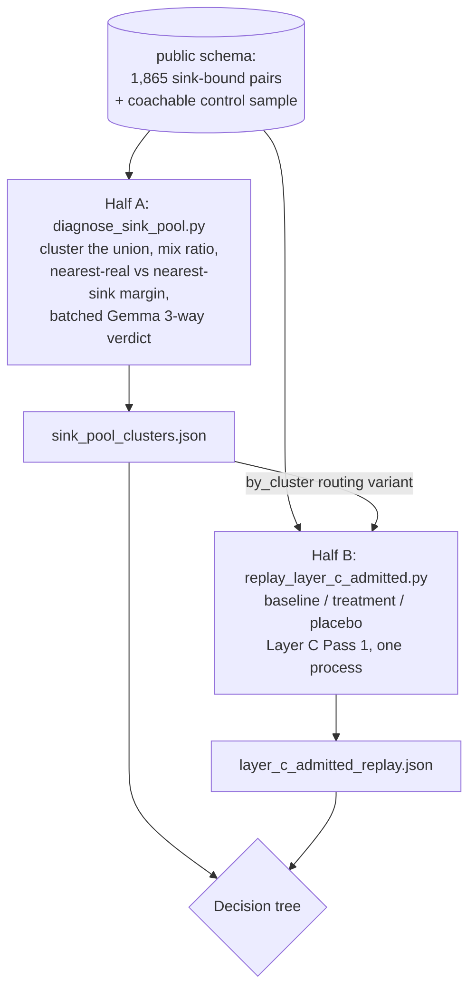

# Sink-Pool Population Diagnostic — changing the unit of decision instead of searching for a ninth signal

**Date:** 2026-08-05
**Status:** Approved, not yet implemented
**Scope:** Two new standalone, read-only calibration scripts, one new Gemma prompt, and one
behavior-preserving extraction refactor in `v2/layer_c.py`. No changes to `v1/layer_b.py`,
`assign_scenarios`, Layer A, the storage schema, Pinecone usage, `tuning.yaml`, or any pipeline
call site. Nothing here ships; the deliverable is a decision about which architecture the data
implies.

## Problem

~40-46% of Layer B trigger-response pairs are filed to a non-coachable "sink" scenario and
permanently excluded from every rubric. Reading real samples judged roughly half of those to be
genuinely coachable content, wrongly discarded (`Brain/PROBLEMS_AND_FIXES.md`, "Layer B audit").

Three prior designs attacked this and all three closed:

- `2026-08-04-layer-b-sink-rescue-design.md` — reroute a sink-bound pair using the response's
  embedding. Absolute cosine floors (rounds 1-2), then `concrete_content_density`, then
  `sink_real_margin` / `trigger_response_coupling`. All failed.
- `2026-08-04-layer-b-trigger-quality-gate-design.md` — drop a junk pair before it becomes a
  `kb_pair`. Closed at its own second checkpoint: the signal its combining rule hinges on scored
  AUC 0.523.
- `2026-08-05-layer-b-combined-signal-analysis-design.md` — combine the strongest signals, then
  `edge_distance` (turn position). Length alone (AUC 0.853) and length + `edge_distance`
  (AUC 0.876) were both rejected on reading: they systematically discard terse expert coaching
  moves, the exact skill this pipeline exists to teach.

**Eight signal shapes, each measured, each failed.** Every one of them shared a single shape:
*score one pair, alone, and threshold it.* This design does not add a ninth. It asks whether the
unit of decision, not the signal, is what is wrong.

## Three facts read out of the code, which reframe the problem

**1. Sink-filing is not deletion. It is one SQL predicate.**
`storage.get_naren_responses_for_scenario` (`shared/storage.py:270-279`) builds Layer C's response
pool with `WHERE p.scenario_key = %s`. That predicate is the *entire* mechanism by which a
sink-bound pair is excluded from every rubric. Nothing else downstream depends on it — Layer C
never reads the `scenario_keys` array at all. The content loss is not structural; it is the choice
to gate Layer C's intake on Layer B's per-pair verdict.

**2. Layer C already contains four aggregate junk defenses, and one exists specifically to fix the
contamination the sink gate is justified by.**
`v2/layer_c._relevance_filter`'s own docstring names its motivating failure: *"thanks so much for
your time"* and *"sorry, can you hear me"* becoming milestones of `job_board_advertising_strategy`.
After it come `min_cluster_size`, the distinct-call support gate, and the sink-similarity Gemma
judge. The belief "junk must be stopped at Layer B or it poisons rubrics" is pre-rework — it dates
from `min_cluster_size=2` and the 95-milestone bug. Today Layer B's sink short-circuit is the
**weakest** junk filter in the pipeline (one pair, ~50 words, one embedding, no repetition to lean
on) guarding a threat three stronger filters downstream already handle — at a cost of 40-46%
content loss at roughly 50% false-positive rate.

**3. Layer A builds the taxonomy from CLIENT clauses only.**
`v2/layer_a.py:34` skips every non-CLIENT turn; line 409 raises if none are found. Naren's
*responses* never vote on which scenarios exist. So a coaching behavior whose client-side cues are
consistently short or filler-like has **no scenario it could ever be routed to** — it is
sink-bound by construction, permanently, regardless of how good the matcher becomes.

Fact 3 is why the eight signals may have been asked an unanswerable question. Each was asked
"which existing scenario does this pair belong to, or is it junk?" for a population where some
fraction has no correct answer available. No signal can separate real content from junk when the
taxonomy offers no third bucket.

**And the meta-pattern:** every round optimized a per-pair proxy (AUC against a per-pair label)
when the pipeline's objective is rubric quality. Nobody measured what admitting the sink pool
actually does to milestones — and Layer C's Pass 1 is Gemma-free, so that measurement is nearly
free.

## The reframe

This codebase has twice proven that judging a **population** works where judging an **item** does
not: Layer A adjudicates ~200 clusters instead of 74k clauses; Layer C requires distinct-call
support instead of trusting any single clause. Layer B is the only layer that makes a content
judgment per item, and it makes it with an embedding argmax. Neither proven unit — the cluster, or
the downstream evidence gate — has ever been applied to the sink pool.

**Is this signal #9 wearing a new name?** No, by a stated test: signal #9 would be a scalar
computed per pair and thresholded. Half A below produces a *three-way categorical verdict per
cluster*, and one of its three outcomes (`new_coachable_topic` — real content with no scenario to
route to) is not expressible in any per-pair scoring scheme. There is no threshold to tune in
either half. What this is, stated honestly rather than dressed up: Layer A's own proven pattern
applied to a population that has only ever been examined pair-by-pair. The novelty is not the
mechanism; it is noticing the sink pool is a population.

## Non-goals

- A ninth per-pair scoring signal, or any new `tuning.yaml` key.
- Adopting an architecture. This pass produces the evidence that *selects* one. Whether to change
  Layer C's intake, Layer A's taxonomy construction, or nothing at all is an explicit follow-up
  decision.
- Wiring anything into `assign_scenarios`, `extract_pairs`, or any pipeline module.
- Curated word or phrase lists, per this codebase's repeated lesson that they do not survive scale.

## Adoption bar (set before the data exists)

**Hard constraint:** no milestone present in a good rubric today may be lost or degraded.
**Soft constraint:** net-new milestones must read as genuine coaching content on verbatim
inspection, not merely raise a count.

This is deliberately the same bar that killed `blended` (47.6% churn on already-correct pairs) and
`or_rule` round 2 (41.9%) — both had defensible aggregate numbers and were rejected on collateral
damage. Holding this round to the same standard keeps it consistent, and it means recovering less
content rather than trading away rubric quality to recover more.

## Architecture

| Built | Untouched |
| --- | --- |
| `Brain/diagnose_sink_pool.py` (Half A) | `v1/layer_b.py` — `assign_scenarios`, the sink short-circuit, all sink-rescue strategies |
| `Brain/replay_layer_c_admitted.py` (Half B) | `v2/pipeline.py`, `v1/pipeline.py`, `main.py`, Layer A |
| `shared/prompts.py`: `PROMPT_SINK_POOL_TRIAGE` | `tuning.yaml` — no new keys, no changed values |
| `v2/layer_c.build_clause_pool` extraction + its test | Postgres schema; both scripts are read-only, zero DB writes |

### The one production-code change, and why it is not scope creep

`_pass1_cluster_scenario` (`v2/layer_c.py:152-161`) inlines its clause-pool assembly. Half B must
reproduce Pass 1 *exactly* or its diff is worthless, and this codebase has already been burned by a
dry run that reimplemented production logic and disagreed with it by 99.7% vs 14%.
`dry_run_layer_c_clustering.py` repeats that mistake today with its own private `_relevance_filter`
copy.

Extract `build_clause_pool(responses) -> (clauses, positions, calls)` out of
`_pass1_cluster_scenario`; have production call it; have Half B import it alongside the existing
`_relevance_filter` and `_cluster_milestones`. Behavior-preserving, ~10 lines moved, and it is the
difference between a faithful replay and a parallel implementation that will drift.

## Half A — `diagnose_sink_pool.py`

Answers: *what is actually in the sink pool, and does the existing taxonomy have a home for it?*

**Population.** Every pair in the live `public` schema whose `scenario_key` resolves to
`is_coachable = false` (1,865 pairs across ~76 sinks today), **plus a volume-matched random sample
of pairs currently filed to coachable scenarios** as a control.

**Unit.** The response — one vector per pair, via `embed_document` (document-vs-document, matching
how Layer C embeds clauses and how scenario vectors are built). The question is whether a coherent
coaching *behavior* is present, and a behavior is a whole response, not a clause. Clause-level
clustering is Half B's job, where it must mirror production. Warm `embed_cache.db`, so effectively
free.

**Clustering.** The union of both populations in **one** run via the imported
`v2.layer_c._cluster_milestones` (UMAP `metric=cosine, random_state=42` → HDBSCAN), with
`min_cluster_size` from `cluster_evidence.milestone_min_cluster_size` at the existing
`min_cluster_size_fraction: 0.02` / floor 3 / ceiling 25. The resolved value is printed, not
assumed.

**Per cluster, reported:**

- **Mix ratio** — the fraction of members drawn from the sink pool versus the coachable control.
  *This is the discriminating statistic, and the reason the control exists.* Naren's responses are
  long and topical nearly everywhere, so any random subset of them clusters into topics — cluster
  coherence alone proves nothing, which is exactly the trap `response_only` fell into with its 95%
  rescue rate and gravity wells. A cluster that is 90%+ sink-pool members is a distinctive junk
  family the gate correctly caught. A cluster near 50/50 means its sink-bound members are
  statistically indistinguishable from content already feeding rubrics — direct evidence of
  wrongful exclusion, far stronger than a human judging a cluster "coherent".
- Size, **distinct-call support**, and call coverage — the same evidence triple Layer A's triage
  already uses.
- **Nearest coachable scenario** + cosine, **nearest sink** + cosine (reusing
  `layer_c._sink_centroids` and `scenario_vectors.build_scenario_vecs`), and **the margin between
  them**: closer to a real scenario than to any sink ⇒ mis-routed; closer to a sink ⇒ genuine junk;
  far from *both* ⇒ homeless, the taxonomy-gap case.
- Which sinks its members currently sit in (top 3 by count).
- 5 verbatim (trigger, response) samples.

**Then batched Gemma adjudication per cluster.** New `PROMPT_SINK_POOL_TRIAGE` in
`shared/prompts.py`, modeled on `PROMPT_LAYER_A_V2_TRIAGE`'s shape and its 5-per-call batching. It
sees the cluster's sample responses, its evidence stats, its nearest coachable scenario and its
nearest sink, and returns one of **three** verdicts plus a one-sentence reason:

- `belongs_to_existing` + which scenario → a routing failure
- `new_coachable_topic` + a proposed label/description → a taxonomy gap
- `genuine_sink` → the gate was right

Expected ~40-90 clusters → 8-18 batched calls, comparable to one run's Layer A triage spend. **The
three-way verdict is the point**: it is the distinction no per-pair scalar could express, and the
reason this is not round nine.

**Two free validations:**

1. **Cross-check against the existing labeled sample.** `labeled_trigger_quality_sample.json`
   carries `pair_id` and a persisted `response_vec` for all 150 pairs. Map each into its cluster
   and compare the per-cluster Gemma verdict against the per-pair labels. Agreement makes both
   ground truths more trustworthy; sharp disagreement means one is wrong, and we learn that before
   building anything. Zero DB, zero Gemma.
2. **Noise rate.** HDBSCAN `-1` members are un-judgeable singletons. Their count is a hard upper
   bound on how much of the pool *any* cluster-based approach can ever reach.

**Escape hatch, stated before the data exists** (same discipline the density pivot was held to):
if the noise rate exceeds **60% of the sink pool**, or if mix ratios sit near 50/50 across
essentially every cluster (meaning the clustering separates nothing), the cluster framing is as
stuck as the per-pair framing. Report it as a dead end rather than push forward.

## Half B — `replay_layer_c_admitted.py`

Answers: *what does admitting the sink pool actually do to rubrics?* — the objective all eight
prior rounds substituted a per-pair proxy for.

**Three arms, all in one process, one warm cache:**

| Arm | Clause pool per coachable scenario |
| --- | --- |
| `baseline` | exactly what production pulls today via `get_naren_responses_for_scenario` |
| `treatment` | baseline **+** sink-bound pairs routed in |
| `placebo` | baseline **+** a volume-matched pool of clauses drawn at random from *other* coachable scenarios (topically wrong content, matched clause count per scenario) |

**Why one process, and why the placebo is load-bearing.** Layer C's UMAP+HDBSCAN is documented
non-reproducible across separate process launches — 241 versus ~400 milestones on an identical
corpus. Two arms in two launches would be swamped by that variance. Within one process at
`random_state=42` on identical input, UMAP is deterministic, so the only remaining variance source
is that treatment's input differs from baseline's *in volume*. The placebo perturbs input by the
same volume using content known to be topically wrong. **If treatment's milestone gain is
indistinguishable from placebo's, the gain is a pool-size clustering artifact, not content.** No
delta is believed without that comparison.

**Three routing variants for the treatment arm, all free:**

- **`by_trigger_nonsink`** — the true null hypothesis: today's `assign_scenarios` with the sink
  short-circuit deleted, i.e. the trigger's best *coachable* match. One `if` removed is the
  cheapest production change that could exist, so it is the one most worth knowing about.
- **`by_response`** — the response's own best coachable match.
- **`by_cluster`** — route only pairs from clusters Half A adjudicated `belongs_to_existing`, to
  their adjudicated scenario. Precision-targeted, most likely to clear the adoption bar, and
  sequenced after Half A since it consumes its verdicts.

**Matching milestones across arms without inventing a threshold.** Candidate clusters have no
stable IDs across runs, and centroid-similarity matching would require a new tuned number.
Instead, match by **clause-set overlap**: treatment's pool is a strict superset of baseline's, so
every baseline clause is present in the treatment arm and overlap matching is exact. Each baseline
milestone gets exactly one of three outcomes, and the distinction matters because conflating the
middle one with the last would over-report regression:

- **`matched`** — some single treatment cluster contains a majority of its clauses.
- **`split`** — no single treatment cluster does, but two or more together do. The evidence survived;
  it fragmented. Reported and read, but **not** automatically a regression.
- **`lost`** — a majority of its clauses fell into HDBSCAN noise, in no treatment cluster at all.
  This is the outcome the hard adoption bar forbids.

A treatment milestone is **gained** if its members are majority admitted-clauses.

**Reported, per scenario and in aggregate:**

1. Clause pool size before/after, and **how many admitted clauses survive `_relevance_filter`** —
   printed *before* any milestone number, because it is the cheap early tell: if Layer C's own p40
   relevance cut already discards the admitted clauses, ungating is a no-op and the whole question
   moves to taxonomy.
2. Candidate milestones before / after / **lost** / **gained**.
3. For surviving milestones, the change in `support_calls` — the same milestone with thicker
   evidence is the *best* available outcome and is invisible in a lost/gained count alone.
4. **Verbatim clauses for every lost and every gained milestone.** This is what the adoption bar is
   adjudicated on, not the counts — consistent with every prior calibration effort in this
   codebase, each of which was settled by reading pairs rather than by a rate.

**Zero Gemma in Half B.** Pass 1 is Gemma-free by construction; milestone *descriptions* need
Gemma but candidate *clusters* do not, and the clauses are enough to read.

## Decision tree

| Half A says | Half B says | Conclusion |
| --- | --- | --- |
| mostly `genuine_sink`, high sink-pool mix ratios | treatment ≈ placebo | **The sink gate is correct and the "~half is coachable" premise was wrong.** Close the effort — on a clustered, controlled, quantified basis instead of a 30-pair manual read. A legitimate outcome, not a failure. |
| mostly `belongs_to_existing` | treatment beats placebo, zero baseline milestones `lost` | **Routing problem.** Follow-up spec: ungate Layer C's intake (`by_trigger_nonsink` minimal, or `by_cluster` targeted). No Layer A work needed. |
| `new_coachable_topic` clusters with real distinct-call support | little gain — nowhere for the content to land | **Taxonomy-coverage problem**, and confirmation that no amount of Layer B work could ever have fixed it, which retro-explains all eight failed signals. Follow-up is a Layer A change: responses participate in building the scenario set. |
| any | admitted clauses mostly cut by `_relevance_filter` | Layer C already rejects this content. Ungating is a no-op; the question moves entirely to taxonomy. |
| noise > 60%, or mix ratios ~50/50 everywhere | — | **Escape hatch fires.** Report as a dead end and stop. |
| any | any baseline milestone `lost` | **Adoption bar fails** for that routing variant. Name the variant and why, rather than softening the bar. (`split` outcomes do not fail it automatically — they get read.) |

## Testing

Both scripts are one-off calibration harnesses over already-persisted data — the same precedent as
`label_trigger_quality_sample.py`, `compare_sink_rescue.py`, and `analyze_combined_signal.py`, none
of which has a test file.

**One exception:** `build_clause_pool` touches production, so `tests/test_layer_c_clause_pool.py`
asserts it returns identical clauses, positions, and call attributions for a hand-built response
list. Half B's entire validity rests on the replay being faithful, so the refactor must be provably
behavior-preserving.

## Persistence

Both scripts write their full output to JSON — `sink_pool_clusters.json` (cluster records, mix
ratios, margins, Gemma verdicts and reasons, member `pair_id`s) and
`layer_c_admitted_replay.json` (per-arm, per-scenario milestone records and their clauses) — and
both accept `--load PATH` to re-report at zero cost. This is the discipline Status update 5 added
to `label_trigger_quality_sample.py` only *after* Status update 4 had to re-spend Gemma for want of
it; adopting it up front here means any follow-up analysis against this same data is free.

## Rollout

Nothing ships. `sink_rescue_strategy` stays `none`; `matching_strategy` stays `flat`; no
`tuning.yaml` value changes. The output is a decision about which of the three architectures the
data implies, recorded as a status update in this document — and, if the escape hatch fires, a
documented close of the whole line of inquiry on a quantified basis rather than a sample read.
